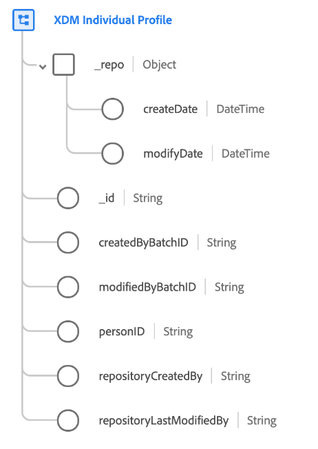

# [!DNL XDM Individual Profile] class

[!DNL XDM Individual Profile] 是一个标准XDM类，它构成了已识别和部分已识别个人的属性和兴趣的单一表示(或“用户档案”)。

用户档案可以包括匿名行为信号（如浏览器cookie）和包含详细信息（如姓名、出生日期、位置和电子邮件地址）的高度识别的用户档案。 随着用户档案的增长，它将成为个人个人信息、身份、联系信息和通信首选项的可靠存储库。 有关在平台生态系统中使用此类的详细信息，请参阅[ XDM概述](../home.md#data-behaviors)。

[!DNL XDM Individual Profile]类本身提供了几个系统生成的值，这些值在摄取数据时自动填充，而所有其他字段必须通过使用[兼容的mixins](#mixins)来添加：

| 属性 | 描述 |
| --- | --- |
| `_repo` | 包含以下[!UICONTROL DateTime]字段的对象： <ul><li>`createDate`:在数据存储中创建资源的日期和时间，例如首次摄取数据的时间。</li><li>`modifyDate`:上次修改资源的日期和时间。</li></ul> |
| `_id` | 记录的唯一、由系统生成的字符串标识符。 此字段用于跟踪单个记录的唯一性、防止重复数据并在下游服务中查找该记录。 由于此字段是系统生成的，因此在数据获取过程中不应提供显式值。  必须指出的是，这一 **领域** 不代表与个人有关的身份，而是数据本身的记录。应将与个人有关的身份数据归入[身份字段](../schema/composition.md#identity)。 |
| `createdByBatchID` | 导致创建记录的所摄取批的ID。 |
| `modifiedByBatchID` | 导致记录更新的上次收录批的ID。 |
| `repositoryCreatedBy` | 创建记录的用户的ID。 |
| `repositoryLastModifiedBy` | 上次修改记录的用户的ID。 |

## 兼容混音{#mixins}

>[!NOTE]
>
>几个混音的名称已经更改。 有关详细信息，请参阅[mixin name updates](../mixins/name-updates.md)上的文档。

Adobe提供多个标准混音以用于[!DNL XDM Individual Profile]类。 以下是类最常用混合的列表:

* [[!UICONTROL IdentityMap]](../mixins/profile/identitymap.md)
* [[!UICONTROL Demographic Details]](../mixins/profile/person-details.md)
* [[!UICONTROL Personal Contact Details]](../mixins/profile/personal-details.md)
* [[!UICONTROL Work Contact Details]](../mixins/profile/work-details.md)
* [[!UICONTROL Segment Membership Details]](../mixins/profile/segmentation.md)
