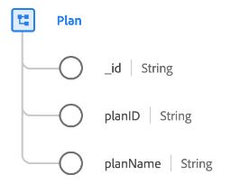

# [!UICONTROL 计划]类

在Experience Data Model (XDM)中，[!UICONTROL 计划]类捕获定义计划（如健康计划或保险计划）的最小属性集。

| 属性 | 数据类型 | 描述 |
| --- | --- | --- |
| `_id` | [!UICONTROL 字符串] | 系统为记录生成的唯一字符串标识符。 此字段用于跟踪单个记录的唯一性，防止数据重复，并在下游服务中查找该记录。  由于此字段是系统生成的，因此在数据摄取期间不会向其提供显式值。 但是，如果您愿意，仍然可以选择提供自己的唯一ID值。 |
| `planId` | [!UICONTROL 字符串] | 计划的唯一标识符。 |
| `planName` | [!UICONTROL 字符串] | 计划的名称。 |

{style="table-layout:auto"}

可以使用[[!UICONTROL 医疗保健计划详细信息]字段组](../field-groups/plan/healthcare-plan-details.md)来扩展该类，以便描述有关医疗保险计划的更多详细信息。
