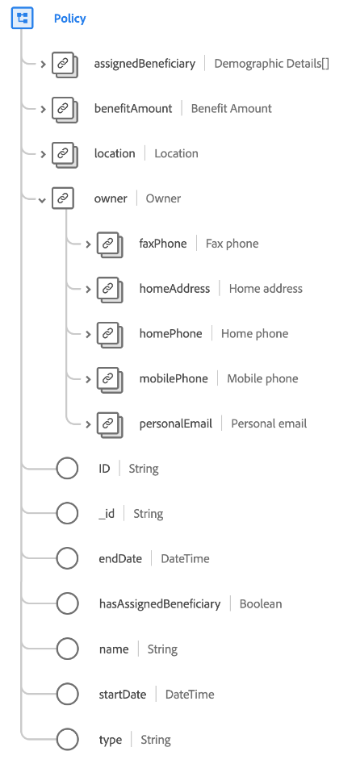

# [!UICONTROL 策略] 类

在Experience Data Model(XDM)中， [!UICONTROL 策略] 类可捕获定义保险单的最小属性集。

| 属性 | 数据类型 | 描述 |
| --- | --- | --- |
| `assignedBeneficiary` | 数组 [[!UICONTROL 人员]](../data-types/person.md) 数据类型 | 捕获分配给政策的受益人（或受益人）。 |
| `benefitAmount` | [[!UICONTROL 货币]](../data-types/currency.md) | 根据政策条款支付的金额。 |
| `location` | [[!UICONTROL 邮政地址]](../data-types/postal-address.md) | 发放保险单的位置。 |
| `owner` | [!UICONTROL 对象] | 捕获策略持有者的用户档案信息。 |
| `owner.faxPhone` | [[!UICONTROL 电话号码]](../data-types/phone-number.md) | 房主的传真号码。 |
| `owner.homeAddress` | [[!UICONTROL 邮政地址]](../data-types/postal-address.md) | 房主的住址。 |
| `owner.homePhone` | [[!UICONTROL 电话号码]](../data-types/phone-number.md) | 房主的家电话号码。 |
| `owner.mobilePhone` | [[!UICONTROL 电话号码]](../data-types/phone-number.md) | 业主的手机号码。 |
| `owner.personalEmail` | [[!UICONTROL 电子邮件地址]](../data-types/email-address.md) | 所有者的个人电子邮件地址。 |
| `ID` | [!UICONTROL 字符串] | 保险单的标识符。 |
| `_id` | [!UICONTROL 字符串] | 记录的唯一、系统生成的字符串标识符。 此字段用于跟踪单个记录的唯一性，防止重复数据，并在下游服务中查找该记录。  由于此字段是系统生成的，因此在数据摄取期间不会为其提供显式值。 但是，如果您愿意，您仍可以选择提供您自己的唯一ID值。 |
| `endDate` | [!UICONTROL DateTime] | 保单保险范围结束（或结束）的日期。 |
| `hasAssignedBeneficiary` | [!UICONTROL 布尔型] | 指示是否为政策分配了受益人。 |
| `name` | [!UICONTROL 字符串] | 保险单的名称。 |
| `startDate` | [!UICONTROL DateTime] | 保险单保险开始（或开始）的日期。 |
| `type` | [!UICONTROL 字符串] | 保险单的类型，如家庭、汽车、租赁者或船。 |

{style=&quot;table-layout:auto&quot;}
