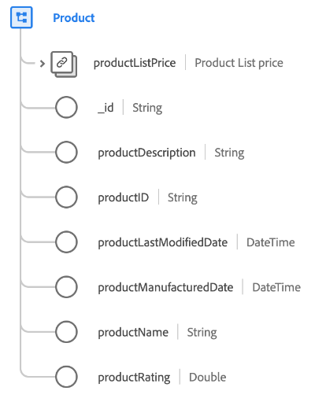

# [!UICONTROL 产品]类

在体验数据模型(XDM)中，[!UICONTROL Product]类捕获定义零售产品的最小属性集。

| 属性 | 数据类型 | 描述 |
| --- | --- | --- |
| `productListPrice` | [货币](../data-types/currency.md) | 描述产品在销售和折扣前的默认价格。 |
| `_id` | 字符串 | 系统为记录生成的唯一字符串标识符。 此字段用于跟踪单个记录的唯一性，防止数据重复，并在下游服务中查找该记录。  由于此字段是系统生成的，因此在数据摄取期间不会向其提供显式值。 但是，如果您愿意，仍然可以选择提供自己的唯一ID值。 |
| `productDescription` | 字符串 | 产品的描述。 |
| `productID` | 字符串 | 产品的唯一标识符。 |
| `productLastModifiedDate` | 日期时间 | 上次修改此产品以进行任何更新的[RFC3339](https://datatracker.ietf.org/doc/html/rfc3339)时间戳。 |
| `productManufacturedDate` | 日期时间 | 创建此产品时的[RFC3339](https://datatracker.ietf.org/doc/html/rfc3339)时间戳。 |
| `productName` | 字符串 | 产品的名称。 |
| `productRating` | 字符串 | 产品的客户审核评级。 |

{style="table-layout:auto"}

## 兼容的字段组 {#field-groups}

Adobe提供了多个标准字段组以用于[!UICONTROL Product]类。 以下是类的一些常用字段组的列表：

* [[!UICONTROL 产品目录]](../field-groups/product/product-catalog.md)
* [[!UICONTROL 产品类别]](../field-groups/product/product-category.md)
