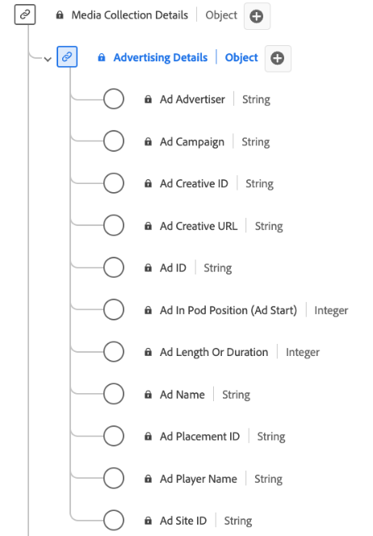

# [!UICONTROL Advertising详细信息]收藏集数据类型

[!UICONTROL Advertising详细信息]集合是标准的体验数据模型(XDM)数据类型，可捕获与播发相关的关键属性。 其中包括广告ID、广告商和促销活动ID、长度、序列中的位置、有关播放器呈现广告的详细信息等信息。 您可以使用此数据类型跟踪和分析广告效果和参与度的各个方面，并提供受众如何与不同广告进行交互和做出响应的洞察。 您提供的此信息用于跟踪您的流数据。

+++选择以显示Advertising详细信息收集数据类型的图表。

+++

>[!NOTE]
>
>每个显示名称都包含一个链接，指向有关其音频和视频参数的更多信息。 链接的页面包含有关Adobe收集的视频广告数据、实现值、网络参数、报表和重要注意事项的详细信息。

| 显示名称 | 属性 | 数据类型 | 必需 | 描述 |
|-----------------------------------------------------------------------------------------------------------------------------------------------------------------|-----------------|-----------|----------|-----------------------------------------------------------------------------------------------------------------------|
| [[!UICONTROL 广告商]](https://experienceleague.adobe.com/docs/media-analytics/using/implementation/variables/ad-parameters.html?lang=zh-Hans#advertiser) | `advertiser` | 字符串 | 否 | 广告中展现的产品所属的公司或品牌。 |
| [[!UICONTROL 广告营销活动]](https://experienceleague.adobe.com/docs/media-analytics/using/implementation/variables/ad-parameters.html?lang=zh-Hans#campaign-id) | `campaignID` | 字符串 | 否 | 广告营销活动的ID。 |
| [[!UICONTROL 广告创意ID]](https://experienceleague.adobe.com/docs/media-analytics/using/implementation/variables/ad-parameters.html?lang=zh-Hans#creative-id) | `creativeID` | 字符串 | 否 | 广告创意的 ID。 |
| [[!UICONTROL 广告创意URL]](https://experienceleague.adobe.com/docs/media-analytics/using/implementation/variables/ad-parameters.html?lang=zh-Hans#creative-url) | `creativeURL` | 字符串 | 否 | 广告创意的 URL。 |
| [[!UICONTROL 面板中的广告位置（广告开始）]](https://experienceleague.adobe.com/docs/media-analytics/using/implementation/variables/ad-parameters.html?lang=zh-Hans#ad-start) | `podPosition` | 整数 | 是 | 父广告开始内部的广告索引，例如，第一个广告的索引为0，第二个广告的索引为1。 |
| [[!UICONTROL 广告时长或持续时间]](https://experienceleague.adobe.com/docs/media-analytics/using/implementation/variables/ad-parameters.html?lang=zh-Hans#ad-length) | `length` | 整数 | 是 | 视频广告的长度，以秒为单位。 |
| [[!UICONTROL 广告名称]](https://experienceleague.adobe.com/docs/media-analytics/using/implementation/variables/ad-parameters.html?lang=zh-Hans#ad-name) | `friendlyName` | 字符串 | 是 | 易于用户识别的广告名称。 在报表中，“广告名称”是分类，“广告名称（变量）”是eVar。 |
| [[!UICONTROL 广告投放ID]](https://experienceleague.adobe.com/docs/media-analytics/using/implementation/variables/ad-parameters.html?lang=zh-Hans#placement-id) | `placementID` | 字符串 | 否 | 广告的版面ID。 |
| [[!UICONTROL 广告播放器名称]](https://experienceleague.adobe.com/docs/media-analytics/using/implementation/variables/ad-parameters.html?lang=zh-Hans#ad-player-name) | `playerName` | 字符串 | 是 | 负责呈现广告的播放器的名称。 |
| [[!UICONTROL 广告站点ID]](https://experienceleague.adobe.com/docs/media-analytics/using/implementation/variables/ad-parameters.html?lang=zh-Hans#site-id) | `siteID` | 字符串 | 否 | 广告网站的ID。 |

{style="table-layout:auto"}
