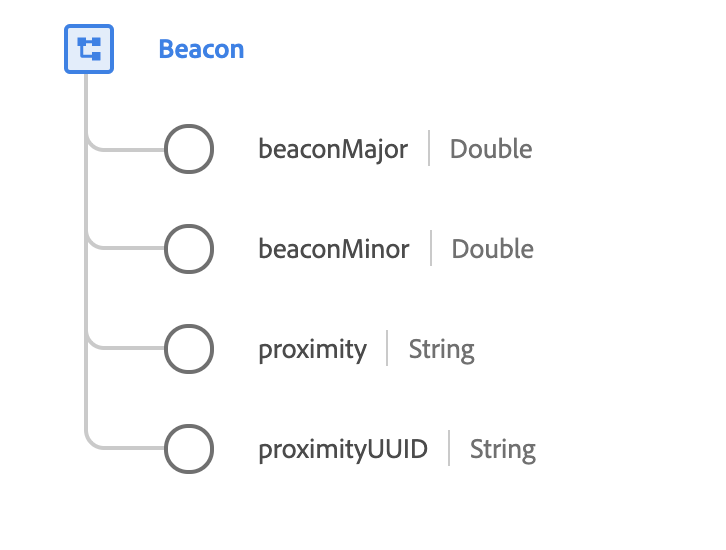

# [!UICONTROL 信标] 数据类型

[!UICONTROL Beacons是] 一种标准XDM数据类型，用于描述当移动设备在范围内时向移动应用程序传送身份信息的无线设备。

 

| 属性 | 数据类型 | 描述 |
| --- | --- | --- |
| `beaconMajor` | 双精度 | 主要值标识和区分1到65,535之间的组和无符号整数值。 |
| `beaconMinor` | 双精度 | 次要值标识和区分介于1和65,535之间的单个和无符号整数值。 |
| `proximity` | 字符串 | 估计与信标的距离。 请参见[附录](#proximity)，了解已接受的值和定义。 |
| `proximityUUID` | 字符串 | 邻近UUID(Unerally Unique Identifier)是一种特殊类型的标识符，用于区分网络中的信标和控制外网络中的所有其他信标。 邻近UUID被配置成信标，被传输到范围内的移动设备以标识组织的信标。 |

有关数据类型的详细信息，请参阅公共XDM存储库：

* [填充示例](https://github.com/adobe/xdm/blob/master/components/datatypes/beacon-interaction-details.example.1.json)
* [完整模式](https://github.com/adobe/xdm/blob/master/components/datatypes/beacon-interaction-details.schema.json)

## 附录

以下部分包含有关[!UICONTROL Beacon]数据类型的其他信息。

## 接近{#proximity}的已接受值

下表概述了`proximity`的已接受值及其相关含义：

| 值 | 描述 |
| --- | --- |
| `immediate` | 几厘米内。 |
| `near` | 不到10米外。 |
| `far` | 距离酒店超过10米。 |
| `unknown` | 距离无法确定，可能是由于信号弱。 |