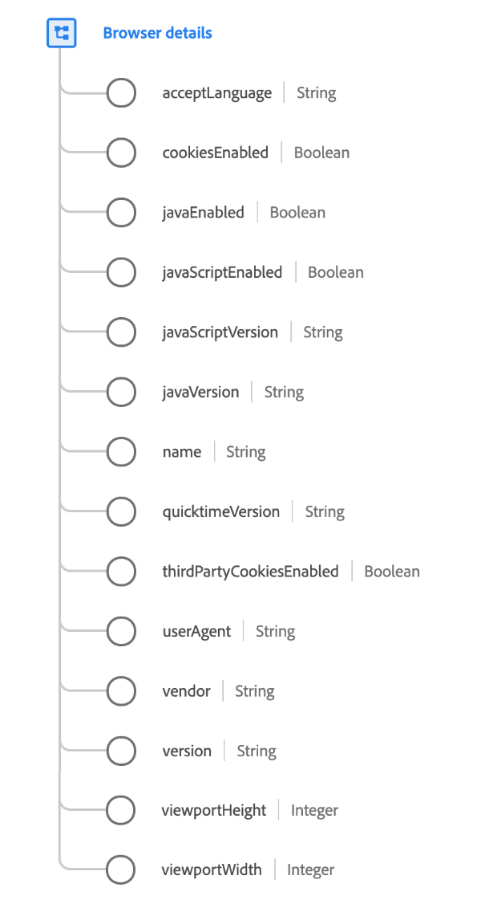

# [!UICONTROL 浏览器详细信息]数据类型

[!UICONTROL 浏览器详细信息]是描述与浏览器或应用程序相关的详细信息的标准XDM数据类型。

{width=450}

| 属性 | 数据类型 | 描述 |
| --- | --- | --- |
| `acceptLanguage` | 字符串 | IETF语言标记([RFC 5646](https://tools.ietf.org/html/rfc5646))。 |
| `cookiesEnabled` | 布尔值 | 指示用户的设置是否允许写入Cookie。 |
| `javaEnabled` | 布尔值 | 指示从中进行观察的设备中是否启用了Java。 |
| `javaScriptEnabled` | 布尔值 | 指示从中进行观察的设备中是否启用了JavaScript。 |
| `javaScriptVersion` | 字符串 | 观察期间支持的 JavaScript 版本。 |
| `javaVersion` | 字符串 | 观察期间支持的 Java 版本。 |
| `name` | 字符串 | 应用程序或浏览器名称。 |
| `quicktimeVersion` | 字符串 | 观察期间支持的 Apple Quicktime 版本。 |
| `thirdPartyCookiesEnabled` | 布尔值 | 指示进行观察的设备中是否启用了第三方Cookie。 |
| `userAgent` | 字符串 | 来自客户端请求的 HTTP user-agent 字符串。 |
| `vendor` | 字符串 | 应用程序或浏览器供应商。 |
| `version` | 字符串 | 应用程序或浏览器版本。 |
| `viewportHeight` | 整数 | 显示事件的窗口的垂直大小（像素）。 对于Web视图事件，这是浏览器视区高度。 |
| `viewportWidth` | 整数 | 显示事件的窗口的水平大小（像素）。 对于Web视图事件，这是浏览器视区宽度。 |

{style="table-layout:auto"}

有关数据类型的更多详细信息，请参阅公共XDM存储库：

* [填充示例](https://github.com/adobe/xdm/blob/master/components/datatypes/browserdetails.example.1.json)
* [完整架构](https://github.com/adobe/xdm/blob/master/components/datatypes/browserdetails.schema.json)
