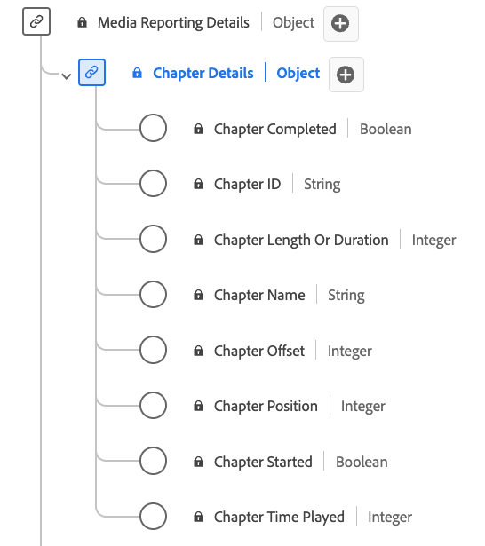

# [!UICONTROL Chapter Details]报告数据类型

[!UICONTROL Chapter Details]报表是一种标准的体验数据模型(XDM)数据类型，用于描述与媒体内容中的章节或区段相关的各种属性。 使用[!UICONTROL Chapter Details]报表数据类型捕获章节名称、持续时间、位置、ID、播放状态（已启动/已完成）和每个章节逗留时间等详细信息。 媒体报告字段由Adobe服务用于分析用户发送的媒体收集字段。 此数据以及其他特定用户量度一起进行计算和报告。

>[!NOTE]
>
>每个显示名称都包含一个链接，指向有关其音频和视频参数的更多信息。 链接的页面包含有关Adobe收集的视频广告数据、实施值、网络参数、报表和重要注意事项的详细信息。

| 显示名称 | 属性 | 数据类型 | 描述 |
|-------------------------------------------------------------------------------------------------------------------------------------------------------------------------|---------------|-----------|--------------------------------------------------------------|
| [[!UICONTROL Chapter Completed]](https://experienceleague.adobe.com/docs/media-analytics/using/implementation/variables/chapter-parameters.html#chapter-complete) | `isCompleted` | 布尔 | 章节是否已完成。 |
| [[!UICONTROL Chapter ID]](https://experienceleague.adobe.com/docs/media-analytics/using/implementation/variables/chapter-parameters.html#chapter) | `ID` | 字符串 | 自动生成的章节ID。 |
| [[!UICONTROL Chapter Length Or Duration]](https://experienceleague.adobe.com/docs/media-analytics/using/implementation/variables/chapter-parameters.html#chapter-length) | `length` | 整数 | 章节的长度，以秒为单位。 |
| [[!UICONTROL Chapter Name]](https://experienceleague.adobe.com/docs/media-analytics/using/implementation/variables/chapter-parameters.html#chapter-name) | `friendlyName` | 字符串 | 章节和/或区段的名称。 |
| [[!UICONTROL Chapter Offset]](https://experienceleague.adobe.com/docs/media-analytics/using/implementation/variables/chapter-parameters.html#chapter-offset) | `offset` | 整数 | 内容中章节从开始起的偏移（以秒为单位）。 |
| [[!UICONTROL Chapter Position]](https://experienceleague.adobe.com/docs/media-analytics/using/implementation/variables/chapter-parameters.html#chapter-position) | `index` | 整数 | 章节在内容中的位置（索引、整数）。 |
| [[!UICONTROL Chapter Started]](https://experienceleague.adobe.com/docs/media-analytics/using/implementation/variables/chapter-parameters.html#chapter-start) | `isStarted` | 布尔 | 章节是否开始。 |
| [[!UICONTROL Chapter Time Played]](https://experienceleague.adobe.com/docs/media-analytics/using/implementation/variables/chapter-parameters.html#chapter-time-spent) | `timePlayed` | 整数 | 章节花费的时间，以秒为单位。 |
