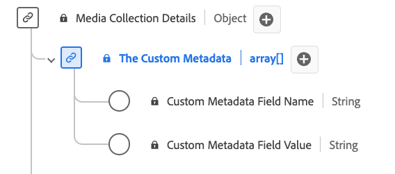

# [!UICONTROL 自定义元数据详细信息]集合数据类型

[!UICONTROL 自定义元数据详细信息]集合是标准体验数据模型(XDM)数据类型，定义了用于存储自定义元数据的结构。 使用[!UICONTROL 自定义元数据详细信息]集合数据类型捕获详细信息，例如与内容或交互关联的自定义元数据的名称和值。

| 显示名称 | 属性 | 数据类型 | 必需 | 描述 |
|--------------------------------------------|------------------|-----------|----------|-------------------------------|
| [!UICONTROL 自定义元数据字段名称] | `name` | 字符串 | 否 | 自定义字段的名称。 |
| [!UICONTROL 自定义元数据字段值] | `value` | 字符串 | 否 | 自定义字段的值。 |

{style="table-layout:auto"}
