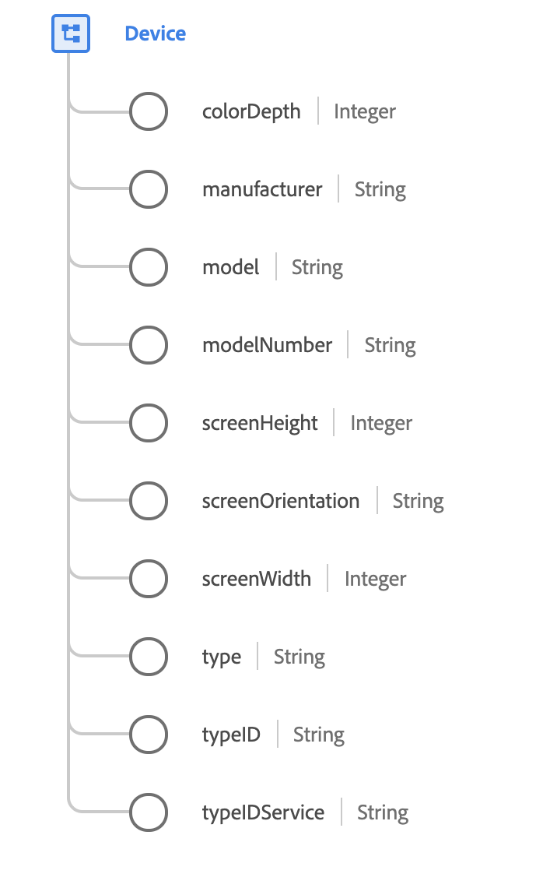

# [!UICONTROL 设备]数据类型

[!UICONTROL 设备]是描述已识别设备的标准XDM数据类型。 设备是通常可通过Cookie跨会话跟踪的应用程序或浏览器实例。

{width=450}

| 属性 | 数据类型 | 描述 |
| --- | --- | --- |
| `colorDepth` | 整数 | 显示器能够表示的颜色的数量。 |
| `manufacturer` | 字符串 | 负责设备设计和创建的组织的名称。 |
| `model` | 字符串 | 设备的型号名称。这是设备的通用名称、易于用户识别的名称或营销名称。 例如，“iPhone 6S”是一种特殊的手机型号。 |
| `modelNumber` | 字符串 | 制造商为此设备指定的唯一型号编号。型号不是版本，而是标识特定型号配置的唯一标识符。 |
| `screenHeight` | 整数 | 设备在默认方向上的有效显示区的垂直像素数。 |
| `screenOrientation` | 字符串 | 当前屏幕方向。 接受的值包括`portrait`和`landscape`。 |
| `screenWidth` | 字符串 | 设备在默认方向上的活动显示的水平像素数。 |
| `type` | 字符串 | 被跟踪的设备类型。 接受的值包括： <ul><li>`mobile`</li><li>`tablet`</li><li>`desktop`</li><li>`ereader`</li><li>`gaming`</li><li>`television`</li><li>`settop`</li><li>`mediaplayer`</li><li>`computers`</li><li>`tv screens`</li></ul> |
| `typeID` | 字符串 | 设备的标识符。 这可能是来自DeviceAtlas或其他服务的标识符，用于标识正在使用的硬件。 |
| `typeIDService` | 字符串 | 用于标识设备类型的服务的命名空间。 有关接受值的详细信息，请参阅[附录](#typeIDService)。 |

{style="table-layout:auto"}

有关字段组的更多详细信息，请参阅公共XDM存储库：

* [填充示例](https://github.com/adobe/xdm/blob/master/components/datatypes/device.example.1.json)
* [完整架构](https://github.com/adobe/xdm/blob/master/components/datatypes/device.schema.json)

## 附录

以下部分包含有关[!UICONTROL 设备]数据类型的其他信息。

## typeIDService的接受值 {#typeIDService}

下表概述了`typeIDService`的接受值及其相关含义：

| 值 | 描述 |
| --- | --- |
| `https://ns.adobe.com/xdm/external/deviceatlas` | 已使用DeviceAtlas识别设备。 |
| `https://ns.adobe.com/xdm/external/adobecampaign` | 已使用Adobe Campaign识别了设备。 |
