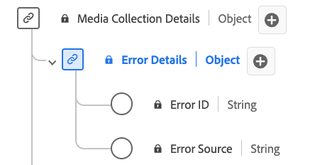

# [!UICONTROL Error Details]收藏集数据类型

[!UICONTROL Error Details]集合是描述错误详细信息的标准体验数据模型(XDM)数据类型。 使用[!UICONTROL Error Details]集合数据类型捕获错误源和标识的详细信息。 错误ID标识错误，并且错误源指定它来自播放器还是外部源。

| 显示名称 | 属性 | 数据类型 | 必需 | 描述 |
|----------------------------|--------------|-----------|----------|-----------------------------------------------|
| [!UICONTROL Error ID] | `name` | 字符串 | 否 | 错误ID |
| [!UICONTROL Error Source] | `source` | 字符串 | 否 | 错误源。 已枚举：“player”、“external”以及各自的含义。 |

{style="table-layout:auto"}
