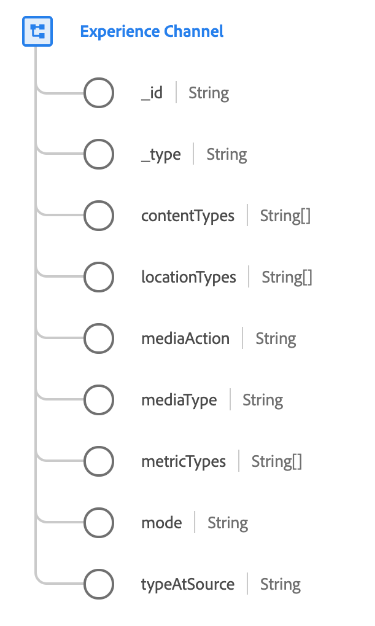

# [!UICONTROL 体验渠道] 数据类型

[!UICONTROL 体验渠道] 是描述体验渠道的标准体验数据模型(XDM)数据类型。 体验渠道表示数字体验的使用方法或路径。

有多个体验渠道，每个渠道在内容的交付方式、客户交互的观察方式以及数据收集方式等方面存在不同的限制。 在渠道中，体验可以交付到特定位置。 渠道中存在的位置和位置类型因渠道而异。

| 属性 | 数据类型 | 描述 |
| --- | --- | --- |
| `_id` | 字符串 | 唯一标识渠道的ID。 每个特定体验渠道定义一个常量 `@id`. |
| `_type` | 字符串 | 为具有相似属性的渠道提供粗略分类标签。 |
| `contentTypes` | 字符串数组 | 此渠道可交付的内容类型。 |
| `locationTypes` | 字符串数组 | 此渠道包含并可向其交付内容的位置类型（虚拟位置）。 |
| `mediaAction` | 字符串 | 描述体验事件媒体操作（如果适用）。 |
| `mediaType` | 字符串 | 描述媒体类型是付费、自有还是免费。 |
| `metricTypes` | 字符串数组 | 可在此渠道中收集的量度。 |
| `mode` | 字符串 | 如何在此渠道中提供体验。 |
| `typeAtSource` | 字符串 | 渠道的自定义名称。 |

{style=&quot;table-layout:auto&quot;}

有关数据类型的更多详细信息，请参阅公共XDM存储库：

* [填充的示例](https://github.com/adobe/xdm/blob/master/components/datatypes/channels/channel.example.1.json)
* [完整模式](https://github.com/adobe/xdm/blob/master/components/datatypes/channels/channel.schema.json)
