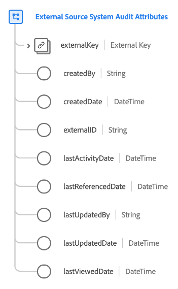

# [!UICONTROL 外部源系统审核属性] 数据类型

>[!NOTE]
>
>此数据类型仅适用于有权访问Adobe Real-time Customer Data Platform B2B版的组织。

[!UICONTROL 外部源系统审核属性] 是一种标准的体验数据模型(XDM)数据类型，可捕获有关外部源系统的审核详细信息。

| 属性 | 数据类型 | 描述 |
| --- | --- | --- |
| `externalKey` | [[!UICONTROL B2B源]](./b2b-source.md) | 用于审核的源的组合标识符。 |
| `createdBy` | 字符串 | 创建此记录的用户的名称。 |
| `createdDate` | DateTime | 创建此记录的日期。 |
| `externalID` | 字符串 | 源的外部唯一标识符。 此值用于帮助识别和删除需要时的重复项。 |
| `lastActivityDate` | DateTime | 源系统的上次活动日期。 |
| `lastReferencedDate` | DateTime | 源系统的上次引用日期。 |
| `lastUpdatedBy` | 字符串 | 上次更新此记录的人员的姓名。 |
| `lastUpdatedDate` | DateTime | 源系统的上次更新日期。 |
| `lastViewedDate` | DateTime | 源系统的上次查看日期。 |

{style=&quot;table-layout:auto&quot;}

有关数据类型的更多详细信息，请参阅公共XDM存储库：

* [填充的示例](https://github.com/adobe/xdm/blob/master/components/datatypes/auditing/external-source-system-audit.example.1.json)
* [完整模式](https://github.com/adobe/xdm/blob/master/components/datatypes/auditing/external-source-system-audit.schema.json)
