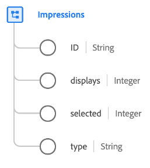

# [!UICONTROL 展示次数]数据类型

[!UICONTROL 展示次数]是描述营销展示的标准XDM数据类型，该指标用于量化一段内容（如广告、数字帖子或网页）的数字查看次数或参与次数。

| 属性 | 数据类型 | 描述 |
| --- | --- | --- |
| `ID` | 字符串 | 展示的唯一ID。 |
| `displays` | 整数 | 展示项目已向客户显示的次数。 |
| `selected` | 整数 | 选择或单击展示项目的次数。 |
| `type` | 字符串 | 印象的类型。 |

{style="table-layout:auto"}

有关字段组的更多详细信息，请参阅公共XDM存储库：

* [填充示例](https://github.com/adobe/xdm/blob/master/components/datatypes/industry-verticals/impressions.example.1.json)
* [完整架构](https://github.com/adobe/xdm/blob/master/components/datatypes/industry-verticals/impressions.schema.json)
