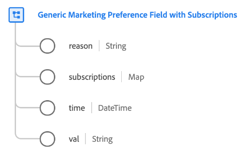

# [!UICONTROL 具有订阅的通用营销偏好设置字段] 数据类型

[!UICONTROL 具有订阅的通用营销偏好设置字段] 是一个标准XDM数据类型，描述客户为特定营销偏好所做的选择。

>[!NOTE]
>
>此数据类型旨在用于使用自定义组织同意模式的结构。 [[!UICONTROL 同意和偏好设置] 字段组](../field-groups/profile/consents.md) 作为基线。
>
>如果您不需要 `subscriptions` 映射特定营销偏好设置字段，您可以使用 [基本营销字段数据类型](./marketing-field.md) 而是。



| 属性 | 数据类型 | 描述 |
| --- | --- | --- |
| `reason` | 字符串 | 当客户选择退出营销用例时，此字符串字段表示客户选择退出的原因。 |
| `subscriptions` | 地图 | 特定订阅的客户营销偏好设置地图。 请参阅以下部分： [订阅](#subscriptions) 了解更多信息。 |
| `time` | 日期时间 | 营销偏好设置更改时间的ISO 8601时间戳（如果适用）。 |
| `val` | 字符串 | 此营销用例的客户提供的偏好设置选择。 请参阅 [下一节](#val) 以获取接受的值和定义。 |

{style="table-layout:auto"}

## `val` {#val}

下表概述了接受的值 `val`：

| 值 | 标题 | 描述 |
| --- | --- | --- |
| `y` | 是（选择加入） | 客户已选择使用偏好设置。 换句话说，他们 **do** 同意使用相关偏好设置所指示的数据。 |
| `n` | 否（选择退出） | 客户已选择退出偏好设置。 换句话说，他们 **不要** 同意使用相关偏好设置所指示的数据。 |
| `p` | 等待验证 | 系统尚未收到最终首选项值。 这通常用作需要两步验证的同意的一部分。 例如，如果客户选择接收电子邮件，则该同意将设置为 `p` 直到他们选择电子邮件中的链接以验证他们提供了正确的电子邮件地址，届时同意将更新为 `y`.<br><br>如果此首选项不使用两集验证过程，则 `p` 选项可用于指示客户尚未响应同意提示。 例如，您可以自动将值设置为 `p` 在网站第一页上，客户尚未响应同意提示。 在不要求明确同意的管辖区，您还可以使用它来表示客户没有明确选择退出（换言之，假定同意）。 |
| `u` | 未知 | 客户的首选项信息未知。 |
| `dy` | 默认为“是（选择启用）” | 客户自己未提供同意值，默认情况下会被视为选择加入（“是”）。 换言之，在客户表示不同意见之前，将假定客户同意。<br><br>请注意，如果法律或公司隐私策略的更改导致某些或所有用户的默认值发生更改，则必须手动更新包含默认值的所有用户档案。 |
| `dn` | 默认为“否”（选择退出） | 客户本身未提供同意值，并默认被视为选择退出（“否”）。 换言之，在客户表示不同意见之前，我们假定客户已拒绝同意。<br><br>请注意，如果法律或公司隐私策略的更改导致某些或所有用户的默认值发生更改，则必须手动更新包含默认值的所有用户档案。 |
| `LI` | 合法利益 | 为特定目的收集和处理此数据的合法商业利益超过了它对个人造成的潜在伤害。 |
| `CT` | 合同 | 为特定目的收集数据是履行与个人的合同义务所必需的。 |
| `CP` | 遵守法律义务 | 为特定目的收集数据是履行业务的法律义务所必需的。 |
| `VI` | 个人切身利益 | 为了保护个人的切身利益，需要为特定目的收集数据。 |
| `PI` | 公共利益 | 为了公众利益或行使官方权力，需要为特定目的收集数据。 |

{style="table-layout:auto"}

## `subscriptions` {#subscriptions}

某些企业允许客户选择加入与特定营销渠道关联的不同订阅。 例如，银行公司可能允许客户订阅超额账户的电话提醒，或接收忠诚度计划优惠的销售拜访。

以下JSON表示电话营销渠道的一个营销字段示例，该渠道包含 `subscriptions` 映射。 中的各个键 `subscriptions` 对象表示营销渠道的单个订阅。 反过来，每个订阅都包含一个选择加入值(`val`)。

```json
"email-marketing-field": {
  "val": "y",
  "time": "2019-01-01T15:52:25+00:00",
  "subscriptions": {
    "loyalty-offers": {
      "val": "y",
      "type": "sales",
      "topics": ["discounts", "early-access"],
      "subscribers": {
        "jdoe@example.com": {
          "time": "2019-01-01T15:52:25+00:00",
          "source": "website"
        }
      }
    },
    "newsletters": {
      "val": "y",
      "type": "advertising",
      "topics": ["hardware"],
      "subscribers": {
        "jdoe@example.com": {
          "time": "2021-01-01T08:32:53+07:00",
          "source": "website"
        },
        "tparan@example.com": {
          "time": "2020-02-03T07:54:21+07:00",
          "source": "call center"
        }
      }
    }
  }
}
```

| 属性 | 描述 |
| --- | --- |
| `val` | 此 [同意值](#val) 用于订阅。 |
| `type` | 订阅类型。 这可以是任何描述性字符串，但前提是长度不超过15个字符。 |
| `topics` | 一组字符串，表示客户订阅的感兴趣区域，可用于向他们发送相关内容。 |
| `subscribers` | 表示已订阅特定订阅的一组标识符（如电子邮件地址或电话号码）的可选映射类型字段。 此对象中的每个键都表示相关标识符，并包含两个子属性： <ul><li>`time`：身份订阅时间的ISO 8601时间戳（如果适用）。</li><li>`source`：订阅服务器源自的源。 这可以是任何描述性字符串，但前提是长度不超过15个字符。</li></ul> |

{style="table-layout:auto"}

## 其他资源

有关数据类型的更多详细信息，请参阅公共XDM存储库：

* [填充示例](https://github.com/adobe/xdm/blob/master/components/datatypes/consent/marketing-field-basic.example.1.json)
* [完整模式](https://github.com/adobe/xdm/blob/master/components/datatypes/consent/marketing-field-basic.schema.json)
