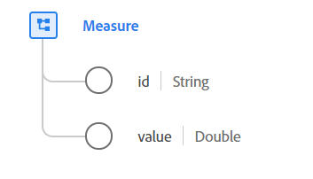

# [!UICONTROL 测] 量数据类型

[!UICONTROL Measure是] 一种标准的体验数据模型(XDM)数据类型，包含特定度量的具体可量化数据点。度量由唯一标识符和值组成。

 

| 属性 | 数据类型 | 描述 |
| --- | --- | --- |
| `id` | 字符串 | 此度量的唯一标识符。 如果使用有损通信渠道（如具有脱机功能的移动应用程序或网站）进行数据收集，则无法确保测量的传输，此属性包含客户端生成的所采用测量的唯一ID。 最好让这个时间足够长，以确保足够的随机性。    如果在生成时加入了时间戳、设备ID、IP、MAC地址或其他潜在用户识别值等信息，则 `id`应对结果进行散列处理。这可确保没有在值中对PII进行编码，因为目标不是识别用户或设备，而是确定特定的时间度量。 |
| `value` | 双精度 | 此度量的可量化价值。 |

有关数据类型的详细信息，请参阅公共XDM存储库：

* [填充示例](https://github.com/adobe/xdm/blob/master/components/datatypes/data/measure.example.1.json)
* [完整模式](https://github.com/adobe/xdm/blob/master/components/datatypes/data/measure.schema.json)