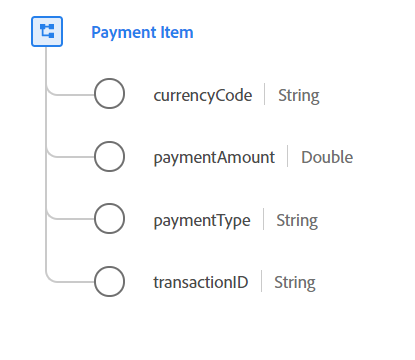

# [!UICONTROL 付款项] 数据类型

[!UICONTROL 付款] 项是标准体验数据模型(XDM)数据类型，它描述与订单关联的付款，订单定义付款类型、金额和关联币种。

 

| 属性 | 数据类型 | 描述 |
| --- | --- | --- |
| `currencyCode` | 字符串 | 用于订单合计的ISO 4217货币代码。 所有实例都必须符合常规表达式`^[A-Z]{3}$`。 示例包括 `USD` 和 `EUR`。 |
| `paymentAmount` | 双精度 | 付款的值。 |
| `paymentType` | 字符串 | 此订单的付款方式。 接受的枚举值包括： <li> `cash` </li> <li> `credit_card` </li> <li> `debit_card` </li> <li> `gift_card` </li> <li> `check` </li> <li> `paypal` </li> <li> `wire_transfer` </li> <li> `credit_card_reference` </li> <li> `other` </li> |
| `transactionID` | 字符串 | 此付款项的唯一事务处理标识符。 |

有关数据类型的详细信息，请参阅公共XDM存储库：

* [填充示例](https://github.com/adobe/xdm/blob/master/components/datatypes/data/paymentitem.example.1.json)
* [完整模式](https://github.com/adobe/xdm/blob/master/components/datatypes/data/paymentitem.schema.json)