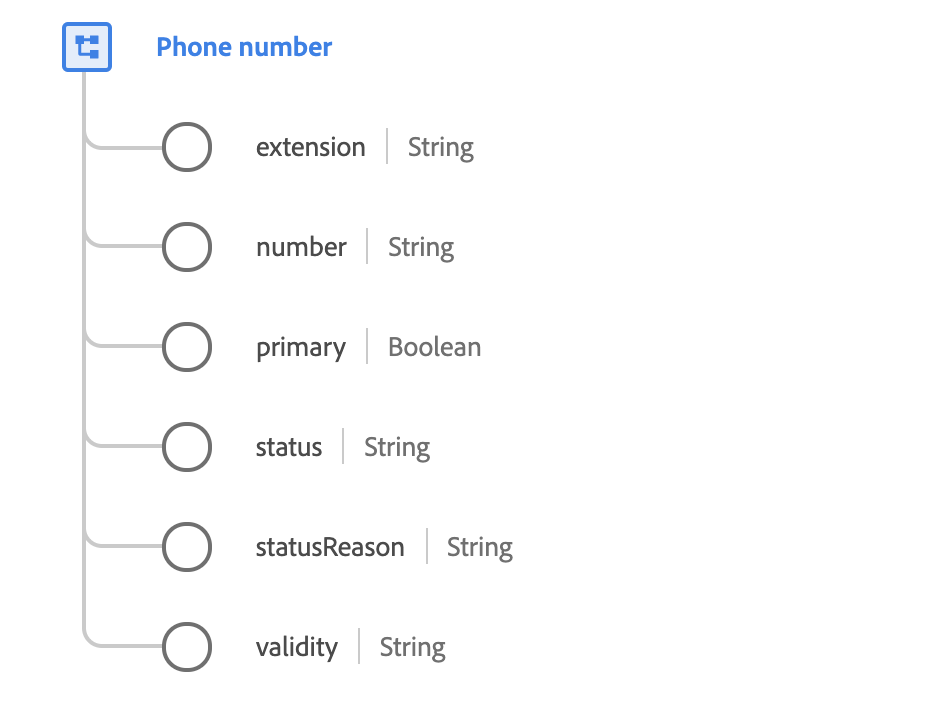

# [!UICONTROL 电话号码] ，数据类型

[!UICONTROL 电话号码] 是描述电话号码详细信息的标准XDM数据类型。

 

| 属性 | 描述 |
| --- | --- |
| `extension` | 用于从私人交换机、运营商或交换机进行呼叫的内部拨号。 |
| `number` | 电话号码。 请注意，电话号码是字符串，可能包含有意义的字符(如括号、连 `()`字符或 `-`字符)，以指示子拨号标识符(如扩 `x` 展名), `1-353(0)18391111` 或 `+613 9403600x1234`。 |
| `primary` | 一个布尔值，它指示这是否是个人的主要电话号码。 与地址或电子邮件地址不同，可以有多个主电话号码；每个通信渠道一个。 通信渠道由类型（由父属性的名称指示）定义： `textMessaging`、 `mobile`、 `phone`、 `home`、 `work`和 `unknown``fax`。 |
| `status` | 指示当前是否可以使用电话号码。 |
| `statusReason` | 当前状态的描述。 |
| `validity` | 电话号码的技术正确性级别。 |

有关电话号码数据类型的详细信息，请参阅公共XDM存储库：

* [填充示例](https://github.com/adobe/xdm/blob/master/components/datatypes/phonenumber.example.1.json)
* [完整模式](https://github.com/adobe/xdm/blob/master/components/datatypes/phonenumber.schema.json)