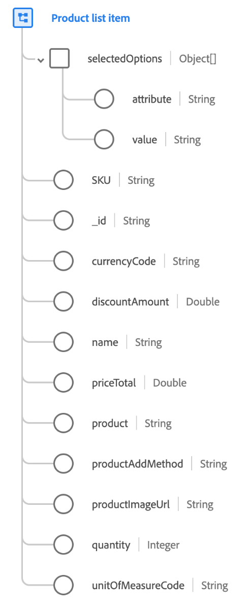

# [!UICONTROL 产品列表项] 数据类型

[!UICONTROL 产品列表项] 是一个标准XDM数据类型，描述客户选择的具有特定时间点的具体选项、定价和使用上下文的产品。

在此数据类型中捕获的值可能与产品记录不同。 例如，产品记录包含产品信息系统中所有客户一致的详细信息，其中产品列表项目具有在购买时提供给客户的实际价格，该价格可能因销售活动或季节性定价而有所不同。

| 属性 | 数据类型 | 描述 |
| --- | --- | --- |
| `selectedOptions` | 对象数组 | 包含为可配置产品选择的自定义选项。 每个列表项都是一个对象，具有以下属性：<ul><li>`attribute`：可配置属性的名称。</li><li>`value`：属性的值。</li></ul> |
| `SKU` | [!UICONTROL 字符串] | 库存单位(SKU)，供应商定义的产品的唯一标识符。 |
| `_id` | [!UICONTROL 字符串] | 此产品条目的行项目标识符。 通过标识产品本身 `product`. |
| `currencyCode` | [!UICONTROL 字符串] | 此 [ISO 4217](https://www.iso.org/iso-4217-currency-codes.html) 用于为产品定价的字母货币代码。 |
| `discountAmount` | [!UICONTROL 双精度] | 如果产品打折，这表示产品的正常价格和特价之间的差额。 |
| `name` | [!UICONTROL 字符串] | 在此产品视图中向用户显示的产品显示名称。 |
| `priceTotal` | [!UICONTROL 双精度] | 产品行项目的总价。 |
| `product` | [!UICONTROL 字符串] (URI) | URI `$id` 捕获产品本身的XDM架构的ID。 |
| `productAddMethod` | [!UICONTROL 字符串] | 访客用来将产品项目添加到列表的方法。 |
| `productImageUrl` | [!UICONTROL 字符串] | 产品主图像的URL。 |
| `quantity` | [!UICONTROL 整数] | 客户表明的产品需求单位数。 |
| `unitOfMeasureCode` | [!UICONTROL 字符串] | 标准 [度量单位代码](https://ucum.org/ucum) 与相关的产品 `quantity` 属性。 |

{style="table-layout:auto"}

有关邮政地址数据类型的更多详细信息，请参阅公共XDM存储库：

* [填充示例](https://github.com/adobe/xdm/blob/master/components/datatypes/productlistitem.example.1.json)
* [完整模式](https://github.com/adobe/xdm/blob/master/components/datatypes/productlistitem.schema.json)
