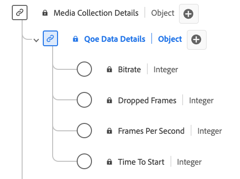

# QoE（体验质量）数据详细信息收集数据类型

[!UICONTROL QoE数据详细信息]集合是标准的体验数据模型(XDM)数据类型，它提供了与媒体播放期间的体验质量(QoE)相关的详细量度。 使用[!UICONTROL QoE数据详细信息]收集数据类型捕获比特率信息、帧率、缓冲事件、丢帧等详细信息。 媒体收集字段会捕获数据并将其发送到其他Adobe服务以供进一步处理。 此数据类型支持播放质量分析，从而可以深入了解流性能、用户体验以及播放会话期间遇到的潜在问题。

+++选择以显示QoE数据详细信息数据类型。

+++

>[!NOTE]
>
>每个显示名称都包含一个链接，指向有关其音频和视频参数的更多信息。 链接的页面包含有关Adobe收集的视频广告数据、实现值、网络参数、报表和重要注意事项的详细信息。

| 显示名称 | 属性 | 数据类型 | 必需 | 描述 |
|-------------------------------------------------------------------------------------------------------------------------------------------------------------------|--------------------------|-----------|-----------|---------------------------------------------------------------------------------------|
| [[!UICONTROL 比特率]](https://experienceleague.adobe.com/docs/media-analytics/using/implementation/variables/quality-parameters.html?lang=zh-Hans#average-bitrate) | `bitrate` | 整数 | 否 | 比特率值（以kbps为单位）。 |
| [[!UICONTROL 丢帧]](https://experienceleague.adobe.com/docs/media-analytics/using/implementation/variables/quality-parameters.html?lang=zh-Hans#dropped-frames) | `droppedFrames` | 整数 | 否 | 播放期间丢帧的总数。 |
| 每秒[[!UICONTROL 帧数]](https://experienceleague.adobe.com/docs/media-analytics/using/implementation/variables/quality-parameters.html?lang=zh-Hans#frames-per-second) | `framesPerSecond` | 整数 | 否 | 当前流帧速率（以每秒帧数为单位）。 |
| [[!UICONTROL 开始时间]](https://experienceleague.adobe.com/docs/media-analytics/using/implementation/variables/quality-parameters.html?lang=zh-Hans#time-to-start-1) | `timeToStart` | 整数 | 否 | 视频加载与开始之间的持续时间（以秒为单位）。 |

{style="table-layout:auto"}
