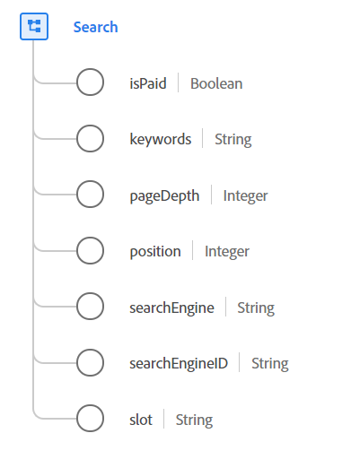

# [!UICONTROL 搜] 索数据类型

[!UICONTROL Search是] 一种标准的体验数据模型(XDM)数据类型，包含有关Web搜索活动的信息。

 

| 属性 | 数据类型 | 描述 |
| --- | --- | --- |
| `isPaid` | 布尔值 | 用于指示搜索是否已付款。 |
| `keywords` | 字符串 | 搜索的关键字。 |
| `pageDepth` | 整数 | 搜索结果中的页面深度。 |
| `position` | 整数 | 列表在搜索结果页面中的位置或排名。 |
| `searchEngine` | 字符串 | 搜索使用的搜索引擎。 |
| `searchEngineID` | 字符串 | 用于标识搜索引擎的应用程序特定标识符。 |
| `slot` | 字符串 | 显示搜索结果的页面的已命名部分。 此属性的值必须等于您定义的已知枚举值之一，如`top`、`side`或`bottom`。 |

有关数据类型的详细信息，请参阅公共XDM存储库：

* [填充示例](https://github.com/adobe/xdm/blob/master/components/datatypes/search.example.1.json)
* [完整模式](https://github.com/adobe/xdm/blob/master/components/datatypes/search.schema.json)