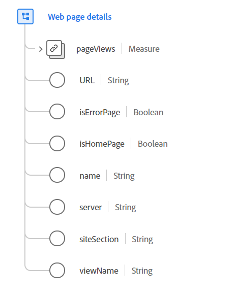

# [!UICONTROL 网页详细信息] 数据类型

[!UICONTROL 网页详细信息] 是一种标准的体验数据模型(XDM)数据类型，用于描述由ExperienceEvent记录的有关刚刚加载和查看的网页的详细信息。

数据类型适用于单页Web应用程序(SPA)的完整页面详细信息和初始页面加载。 对于在加载的页面上发生的不触发新页面加载的交互，请参阅 [Web交互](./web-interaction.md) 数据类型。

 

| 属性 | 数据类型 | 描述 |
| --- | --- | --- |
| `pageViews` | [[!UICONTROL 测量]](./measure.md) | 网页上的查看次数。 |
| `URL` | 字符串 | 网页的规范URL或常用URL。 这可能是用于访问页面的实际URL，也可能不是。 记录用于访问页面使用的URL `webLink`. URI格式应遵循 [RFC 3986](https://tools.ietf.org/html/rfc3986) 标准。 |
| `isErrorPage` | 布尔型 | 此属性使用标记来指示页面是否为错误页面。 此标记用于对Web交互进行广泛分类。 错误由应用程序定义，可以与带有HTTP错误代码的页面对应。 |
| `isHomePage` | 布尔型 | 此属性使用标记来指示页面是否为主页。 此标记用于对Web交互进行广泛分类。 主页的定义由应用程序决定。 |
| `name` | 字符串 | 网页的规范名称。 此名称不一定是页面标题或与页面内容直接关联，但可用于组织网站页面以进行分类。 |
| `server` | 字符串 | 托管网页的规范性服务器或常用服务器。 这可能是实际提供页面交互的主机或服务器，也可能不是。 |
| `siteSection` | 字符串 | 此网页所在站点区域的规范名称。 这可用于对交互进行分类或分类。 |
| `viewName` | 字符串 | 页面中的视图名称。 此属性通常用于单页应用程序或具有可更改大多数页面布局的选项卡或控件的页面。 |

{style=&quot;table-layout:auto&quot;}

有关数据类型的更多详细信息，请参阅公共XDM存储库：

* [填充的示例](https://github.com/adobe/xdm/blob/master/components/datatypes/deprecated/webpagedetails.example.2.json)
* [完整模式](https://github.com/adobe/xdm/blob/master/components/datatypes/deprecated/webpagedetails.schema.json)
