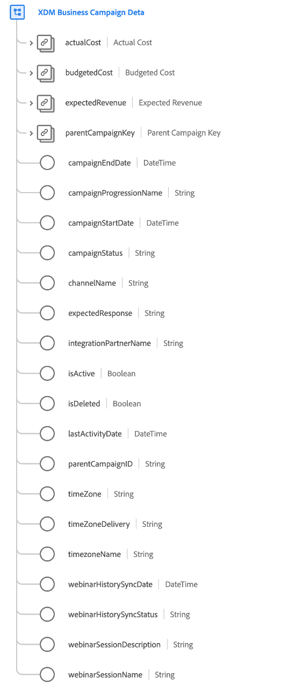

# [!UICONTROL XDM Business Campaign详细信息] 架构字段组

[!UICONTROL XDM Business Campaign详细信息] 是的标准架构字段组 [[!UICONTROL XDM Business Campaign] 类](../../classes/b2b/business-campaign.md)，可捕获有关业务活动的详细信息。

| 属性 | 数据类型 | 描述 |
| --- | --- | --- |
| `actualCost` | [[!UICONTROL 货币]](../../data-types/currency.md) | 表示业务活动的实际成本。 |
| `budgetedCost` | [[!UICONTROL 货币]](../../data-types/currency.md) | 表示业务活动的预算成本。 |
| `expectedRevenue` | [[!UICONTROL 货币]](../../data-types/currency.md) | 表示业务活动预期产生的收入。 |
| `parentCampaignKey` | [[!UICONTROL B2B源]](../../data-types/b2b-source.md) | 父营销活动的复合ID（如果适用）。 |
| `campaignEndDate` | [!UICONTROL DateTime] | 营销活动结束或将结束的ISO 8601时间戳。 |
| `campaignProgressionName` | [!UICONTROL 字符串] | 促销活动进度名称。 |
| `campaignStartDate` | [!UICONTROL DateTime] | 营销活动开始或将开始的ISO 8601时间戳。 |
| `campaignStatus` | [!UICONTROL 字符串] | 营销活动的当前状态。 |
| `channelName` | [!UICONTROL 字符串] | 与此营销活动关联的渠道名称。 |
| `expectedResponse` | [!UICONTROL 字符串] | 营销活动的预期响应。 |
| `integrationPartnerName` | [!UICONTROL 字符串] | 与此营销活动集成的合作伙伴的名称。 |
| `isActive` | [!UICONTROL 布尔型] | 指示此营销活动是否处于活动状态。 |
| `isDeleted` | [!UICONTROL 布尔型] | 指示此营销活动是否已在Marketo Engage中删除。  使用 [Marketo源连接器](../../../sources/connectors/adobe-applications/marketo/marketo.md)，则在Marketo中删除的任何记录都会自动反映在实时客户资料中。 但是，与这些用户档案相关的记录仍可能会保留在数据湖中。 通过设置 `isDeleted` to `true`，则可以使用字段在查询数据湖时过滤掉已从源中删除的记录。 |
| `lastActivityDate` | [!UICONTROL DateTime] | 与营销活动关联的最后一个活动的ISO 8601时间戳。 |
| `timeZone` | [!UICONTROL 字符串] | 营销活动所在的时区。 |
| `timeZoneDelivery` | [!UICONTROL 字符串] | 营销活动所在的投放时区。 |
| `timeZoneName` | [!UICONTROL 字符串] | 营销活动所在时区的名称。 |
| `webinarHistorySyncDate` | [!UICONTROL DateTime] | 此营销活动的上次网络研讨会历史同步的ISO 8601时间戳。 |
| `webinarHistorySyncStatus` | [!UICONTROL 字符串] | 此营销活动的网络研讨会历史同步状态。 |
| `webinarSessionDescription` | [!UICONTROL 字符串] | 与此营销活动关联的网络研讨会会话的描述。 |
| `webinarSessionName` | [!UICONTROL 字符串] | 与此营销活动关联的网络研讨会会话的名称。 |

{style=&quot;table-layout:auto&quot;}

有关字段组的更多详细信息，请参阅 [公共XDM存储库](https://github.com/adobe/xdm/blob/master/components/fieldgroups/campaign/campaign-details.schema.json).
