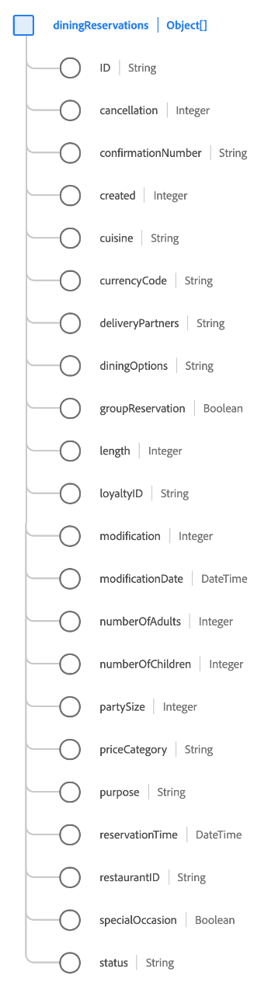

# [!UICONTROL 餐饮预订] 架构字段组

[!UICONTROL 餐饮预订] 是的标准架构字段组 [[!DNL XDM ExperienceEvent] 类](../../classes/experienceevent.md) 用于捕获有关餐饮预订的信息。

字段组是 [!UICONTROL 预订详细信息] 字段组，并在单个对象类型字段下包含所有相同的字段， `reservations`. 除了这些通用字段之外， [!UICONTROL 餐饮预订] 还包括 `diningReservations` 数组。 此对象数组用于描述具有餐厅特定属性的一个或多个预订。

>[!NOTE]
>
>本文档介绍 `diningReservations` 数组。 有关 `reservations` 对象，请参阅 [[!UICONTROL 预订详细信息] 字段组引用](./reservation-details.md).

## `diningReservations`

`diningReservations` 是一个对象数组，表示餐饮预订列表。 例如，如果预订事件涉及在一天中的不同时间在多个不同的餐厅进行预订，则这些预订可作为 `diningReservations` 就为了一个事件。

下面提供的每个对象的结构 `diningReservations` 具体内容如下。

| 属性 | 数据类型 | 描述 |
| --- | --- | --- |
| `ID` | 字符串 | 预订编号或标识符。 |
| `cancellation` | 整数 | 此值在取消预订后捕获。 |
| `confirmationNumber` | 字符串 | 预订确认号或标识符。 |
| `created` | 整数 | 此值在创建预订后捕获。 |
| `cuisine` | 整数 | 餐厅的菜肴类型。 |
| `currencyCode` | 字符串 | 用于进行购买的ISO 4217货币代码。 |
| `deliveryPartners` | 字符串 | 餐厅可提供外卖合作伙伴。 |
| `diningOptions` | 字符串 | 餐厅提供外送和用餐选择。 |
| `groupReservation` | 布尔值 | 指示是否为团体进行预订。 |
| `length` | 整数 | 预订的总天数。 |
| `loyaltyID` | 字符串 | 预订中列出的来宾的忠诚度计划ID。 |
| `modification` | 整数 | 此值在修改预订后捕获。 |
| `modificationDate` | 日期时间 | 上次修改预订的时间。 |
| `numberOfAdults` | 整数 | 与预订关联的成人数量。 |
| `numberOfChildren` | 整数 | 与预订关联的子项数。 |
| `numberOfRooms` | 整数 | 与预订关联的房间数。 |
| `partySize` | 整数 | 就餐人数。 |
| `priceCategory` | 字符串 | 正在进行预订的价格类别。 |
| `purpose` | 字符串 | 预订的目的，通常是商业目的或个人目的。 |
| `reservationTime` | 日期时间 | 预订餐饮的时间。 |
| `restaurantID` | 字符串 | 餐厅或就餐位置的标识符。 |
| `reservationStatus` | 字符串 | 预订的状态。 |
| `specialOccasion` | 布尔值 | 指示预订是否为特殊场合所做。 |
| `status` | 整数 | 餐饮预订的状态。 |

{style="table-layout:auto"}

有关字段组的更多详细信息，请参阅公共XDM存储库：

* [填充示例](https://github.com/adobe/xdm/blob/master/components/fieldgroups/experience-event/industry-verticals/experienceevent-dining-reservation.example.1.json)
* [完整模式](https://github.com/adobe/xdm/blob/master/components/fieldgroups/experience-event/industry-verticals/experienceevent-dining-reservation.schema.json)
