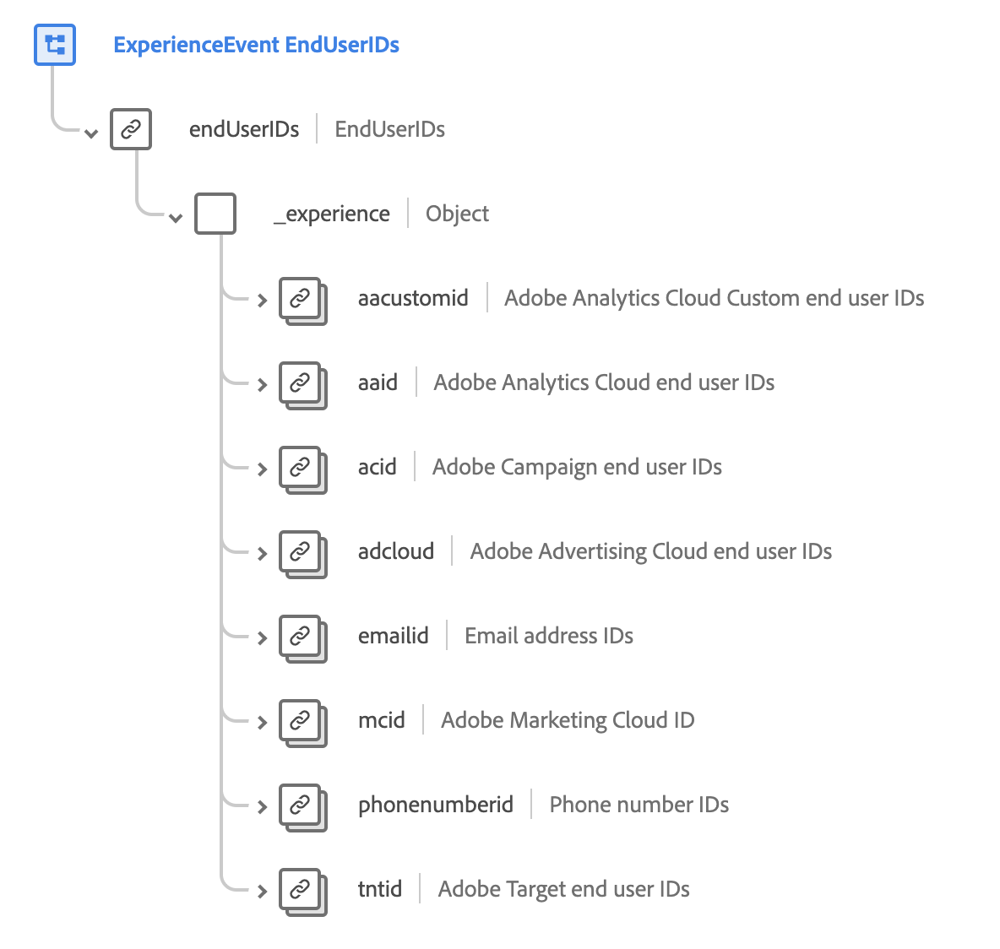

# [!UICONTROL 最终用户ID详细信息]架构字段组

>[!NOTE]
>
>多个架构字段组的名称已更改。 有关详细信息，请参阅有关[字段组名称更新](../name-updates.md)的文档。

[!UICONTROL 最终用户ID详细信息]是[[!DNL XDM ExperienceEvent] 类](../../classes/experienceevent.md)的标准架构字段组，用于描述跨多个Adobe应用程序的个人身份信息。 字段组提供了一个根级别`endUserIDs`对象，该对象本身包含一个只读`_experience`字段，其值会在摄取数据时自动更新。

{width=700}

| 属性 | 数据类型 | 描述 |
| --- | --- | --- |
| `aacustomid` | [身份标识](../../data-types/identity.md) | Adobe Analytics Cloud的自定义最终用户ID。 |
| `aaid` | [身份标识](../../data-types/identity.md) | Adobe Analytics Cloud的最终用户ID。 |
| `acid` | [身份标识](../../data-types/identity.md) | Adobe Campaign的最终用户ID。 |
| `adcloud` | [身份标识](../../data-types/identity.md) | Adobe Advertising Cloud的最终用户ID。 |
| `emailid` | [身份标识](../../data-types/identity.md) | 电子邮件地址ID。 |
| `mcid` | [身份标识](../../data-types/identity.md) | Adobe Marketing Cloud ID (MCID)。MCID 现在称为 Experience Cloud ID (ECID)。 |
| `phonenumberid` | [身份标识](../../data-types/identity.md) | 电话号码ID |
| `tntid` | [身份标识](../../data-types/identity.md) | Adobe Target的最终用户ID。 |

{style="table-layout:auto"}

有关字段组的更多详细信息，请参阅公共XDM存储库：

* [填充示例](https://github.com/adobe/xdm/blob/master/components/fieldgroups/experience-event/experienceevent-enduserids.example.1.json)
* [完整架构](https://github.com/adobe/xdm/blob/master/components/fieldgroups/experience-event/experienceevent-enduserids.schema.json)
