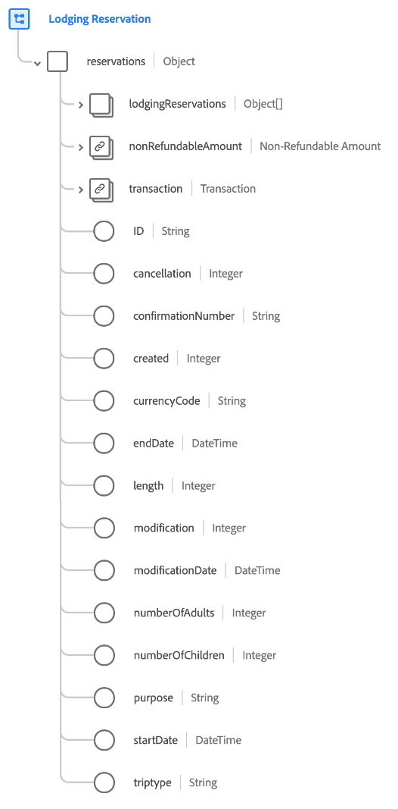

# [!UICONTROL 住宿预订]架构字段组

[!UICONTROL 住宿预订]是[[!DNL XDM ExperienceEvent] 类](../../classes/experienceevent.md)的标准架构字段组，用于捕获有关住宿预订的信息。

该字段组是[!UICONTROL 保留详细信息]字段组的扩展，它包含单个对象类型字段`reservations`下的所有相同字段。 除了这些通用字段外，[!UICONTROL 住宿预订]还包含`lodgingReservations`数组。 此对象数组用于描述一个或多个具有住宿专用属性的预订。

>[!NOTE]
>
>本文档介绍`lodgingReservations`阵列的详细信息。 有关`reservations`对象下提供的其他字段的信息，请参阅[[!UICONTROL 保留详细信息]字段组引用](./reservation-details.md)。

## `lodgingReservations`

`lodgingReservations`是一个表示住宿预订列表的对象数组。 例如，如果预订事件涉及在旅行路线上的多个不同酒店的预订，则这些预订可以作为单个事件的`lodgingReservations`下的单个对象列出。

下面提供了在`lodgingReservations`下提供的每个对象的结构。

| 属性 | 数据类型 | 描述 |
| --- | --- | --- |
| `averageDailyPrice` | [[!UICONTROL 货币]](../../data-types/currency.md) | 酒店房间的平均每日价格。 |
| `lodgingCheckIn` | 对象 | 描述住宿登记详细信息的对象。 包括以下值：<ul><li>`digitalKey`： （整数）指示访客在签入时何时选择使用数字密钥。</li><li>`earlyCheckInRequested`： （整数）指示访客请求签入的时间早于正常签入时间（小时）。</li><li>`lateCheckInRequested`： （整数）指示访客请求签入的时间晚于正常签入时间（以小时为单位）。</li><li>`noRoomCheckIn`： （整数）当来宾完成签入且当时没有可用房间时捕获此值。</li><li>`oneRoomCheckIn`： （整数）当来宾完成签入时，如果当时只有一个房间可用，则会捕获此值。</li><li>`roomKeys`： （整数）签到时提供的标准房间钥匙数。</li><li>`userSelectedRoom`： （布尔值）指示访客在签到时是否选择了他们的房间。</li></ul> |
| `rackrate` | [[!UICONTROL 货币]](../../data-types/currency.md) | 未经事先预订安排的当天预订费用。 |
| `ID` | 字符串 | 预订编号或标识符。 |
| `agentID` | 字符串 | 与酒店预订关联的代理ID。 |
| `basePrice` | 字符串 | 添加任何折扣前的基价。 |
| `bookingID` | 字符串 | 与酒店预订关联的预订ID。 |
| `cancellation` | 整数 | 此值在取消预订后捕获。 |
| `checkInDate` | 日期时间 | 房间预订的入住日期。 |
| `checkOutDate` | 日期时间 | 房间预订的结账日期。 |
| `confirmationNumber` | 字符串 | 预订确认号或标识符。 |
| `couponCode` | 字符串 | 与酒店预订关联的优惠券代码。 |
| `created` | 整数 | 此值在创建预订后捕获。 |
| `currencyCode` | 字符串 | 用于进行购买的ISO 4217货币代码。 |
| `discountPercent` | 两次 | 与预订关联的折扣百分比。 |
| `freeCancelation` | 布尔值 | 指示文件室是否具有免费取消政策。 |
| `guestID` | 字符串 | 与酒店预订关联的客人ID。 |
| `length` | 整数 | 预订的总天数。 |
| `loyaltyID` | 字符串 | 预订中列出的来宾的忠诚度计划ID。 |
| `modification` | 整数 | 此值在修改预订后捕获。 |
| `modificationDate` | 日期时间 | 上次修改预订的时间。 |
| `numberOfAdults` | 整数 | 与预订关联的成人数量。 |
| `numberOfChildren` | 整数 | 与预订关联的子项数。 |
| `numberOfRooms` | 整数 | 与预订关联的房间数。 |
| `propertyID` | 字符串 | 预订的酒店或度假村的标识符。 |
| `propertyName` | 字符串 | 预订的酒店或度假村的名称。 |
| `purpose` | 字符串 | 预订的目的，通常是商业目的或个人目的。 |
| `ratePlan` | 字符串 | 房间出售的价格。 |
| `refundable` | 布尔值 | 指示房间是否可退款。 |
| `reservationStatus` | 字符串 | 预订的状态。 |
| `roomAccessibilityType` | 字符串 | 房间的无障碍类型，例如移动性、听力或其他。 |
| `roomCapacity` | 整数 | 酒店房间容纳的人数。 |
| `roomType` | 字符串 | 预订的房间类型。 |
| `smoking` | 布尔值 | 指示房间是否允许吸烟。 |
| `tripType` | 字符串 | 指示预订是单程旅行、往返还是多城市旅行。 |

{style="table-layout:auto"}

有关字段组的更多详细信息，请参阅公共XDM存储库：

* [填充示例](https://github.com/adobe/xdm/blob/master/components/fieldgroups/experience-event/industry-verticals/experienceevent-lodging-reservation.example.1.json)
* [完整架构](https://github.com/adobe/xdm/blob/master/components/fieldgroups/experience-event/industry-verticals/experienceevent-lodging-reservation.schema.json)
