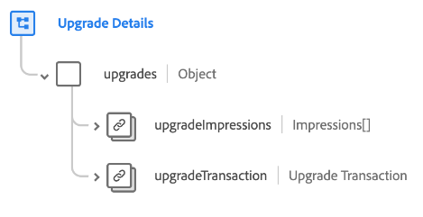

# [!UICONTROL 升级详] 细信息架构字段组

[!UICONTROL 升级] 详细信息类的标准架构字段组 [[!DNL XDM ExperienceEvent] ](../../classes/experienceevent.md) ，用于捕获有关升级营销事件的信息，包括有关交易的详细信息以及向客户显示选件的不同方式。

字段组提供单个对象类型字段`upgrades`。 此对象中包含的属性说明如下。

| 属性 | 数据类型 | 描述 |
| --- | --- | --- |
| `upgradeImpressions` | [展示次数](../../data-types/impressions.md)的数组 | 一个数组，列出客户记录的展示次数（数字查看次数或升级选件的参与次数）。 |
| `upgradeTransaction` | [交易](../../data-types/transaction.md) | 描述升级的货币交易记录。 |

{style=&quot;table-layout:auto&quot;}

有关字段组的更多详细信息，请参阅公共XDM存储库：

* [填充的示例](https://github.com/adobe/xdm/blob/master/components/fieldgroups/experience-event/industry-verticals/experienceevent-upgrade-details.example.1.json)
* [完整模式](https://github.com/adobe/xdm/blob/master/components/fieldgroups/experience-event/industry-verticals/experienceevent-upgrade-details.schema.json)
