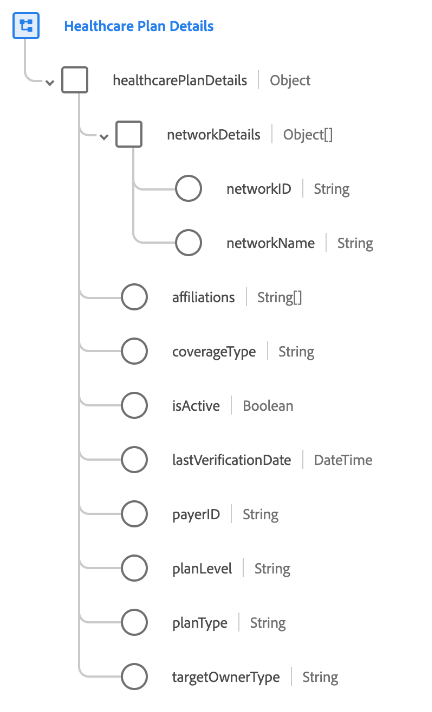

# [!UICONTROL 医疗保健计划详细信息] 架构字段组

[!UICONTROL 医疗保健计划详细信息] 是的标准架构字段组 [[!UICONTROL 计划] 类](../../classes/plan.md). 它提供单个对象类型字段 `healthcarePlanDetails` 用于捕获与医疗计划相关的属性。

| 属性 | 数据类型 | 描述 |
| --- | --- | --- |
| `networkDetails` | 对象数组 | 列出受益人可能寻求治疗的保险商定义的提供商网络的详细信息，并将按“网络内”费率提供。 每个对象包含以下属性： <ul><li>`networkID`:（字符串）网络的保险商特定ID。</li><li>`networkName`:（字符串）网络的保险人特定名称。</li></ul> |
| `affiliations` | 字符串数组 | 与计划关联的业务实体列表。 |
| `coverageType` | 字符串 | 计划覆盖类型。 接受的值包括：<ul><li>`medical`</li><li>`dental`</li><li>`vision`</li><li>`accident`</li></ul> |
| `isActive` | 布尔型 | 指示计划是否处于活动状态。 |
| `lastVerificationDate` | DateTime | 计划上次验证的日期。 |
| `payerID` | 字符串 | 付款人的唯一标识符（即计划的保险提供商）。 |
| `planLevel` | 字符串 | 指示计划级别。 接受的值包括：<ul><li>`primary`</li><li>`secondary`</li><li>`tertiary`</li><li>`quaternary`</li></ul> |
| `planType` | 字符串 | 指示计划类型。 接受的值包括：<ul><li>`hmo`</li><li>`epo`</li><li>`pos`</li><li>`hdhp`</li></ul> |
| `targetOwnerType` | 字符串 | 计划所适用的所有者类型。 示例包括个人、组、组织等。 |

{style=&quot;table-layout:auto&quot;}

有关字段组的更多详细信息，请参阅 [公共XDM存储库](https://github.com/adobe/xdm/blob/master/docs/reference/fieldgroups/plan/healthcare-plan-details.schema.json).
