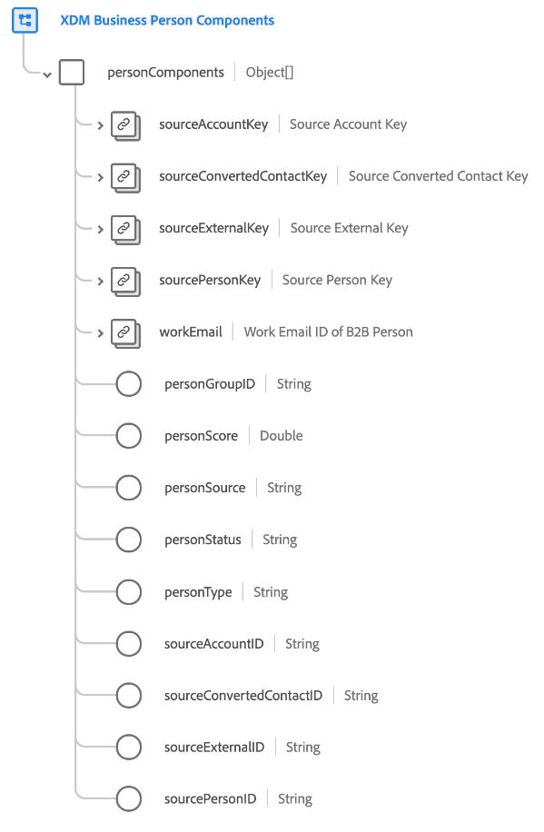

# [!UICONTROL XDM业务人员组件] 架构字段组

[!UICONTROL XDM业务人员组件] 是的标准架构字段组 [[!DNL XDM Individual Profile] 类](../../classes/individual-profile.md) 用于为人员捕获多个源记录以及人员分段所需的其他属性。

通过为人员创建用户档案时 [实时客户资料](../../../profile/home.md) 在Real-Time CDP的B2B版本中，用于创建该用户档案的信息可能来自许多源记录。 例如，如果一个人为两个不同的公司工作，则许多CRM系统会创建该人的特意副本，以便一个副本链接到公司A，而另一个副本链接到公司B。将该数据导入Adobe Experience Platform时，此字段组用于将这些不同的源记录合并到单个表示中。

字段组提供根级别 `personComponents` 字段，对象数组。 数组中的每个对象表示不同的源记录。

>[!IMPORTANT]
>
>您必须遵循 [源文档](../../../rtcdp/sources/b2b.md). 其他字段映射方法无法保证有效。
>
>例如， `personComponents` 阵列是在标准摄取模式期间单独提交的，然后由平台添加到阵列中。 将对象数组手动添加到业务人员组件将返回错误。
>在为B2B数据创建架构时，您应使用自动生成实用程序。 有关如何使用 [B2B命名空间和模式自动生成实用程序](../../../sources/connectors/adobe-applications/marketo/marketo-namespaces.md). 如果您未使用自动生成实用程序并打算手动映射您的数据模型，请务必阅读 [Adobe Real-time Customer Data Platform B2B版XDM类](../../../rtcdp/schemas/b2b.md) 映射数据之前。
>
>请参阅 [端到端教程](../../../rtcdp/b2b-tutorial.md) 以了解有关B2B数据推荐工作流的信息。

| 属性 | 数据类型 | 描述 |
| --- | --- | --- |
| `sourceAccountKey` | [[!UICONTROL B2B源]](../../data-types/b2b-source.md) | 与人员关联的帐户的复合标识符。 |
| `sourceConvertedContactKey` | [[!UICONTROL B2B源]](../../data-types/b2b-source.md) | 如果此潜在客户已转换，则相关联系人的复合标识符。 |
| `sourceExternalKey` | [[!UICONTROL B2B源]](../../data-types/b2b-source.md) | 源系统的人员数据源的复合标识符。 |
| `sourcePersonKey` | [[!UICONTROL B2B源]](../../data-types/b2b-source.md) | 人员的组合标识符。 |
| `workEmail` | [[!UICONTROL 电子邮件地址]](../../data-types/b2b-source.md) | 人员的工作电子邮件ID。 |
| `personGroupID` | 字符串 | 人员的组标识符。 |
| `personScore` | 字符串 | 由CRM系统为人员生成的分数。 |
| `personSource` | 字符串 | 源系统的基于字符串的唯一标识符，即人员数据源自的。 |
| `personStatus` | 字符串 | 人员的当前营销或销售状态。 |
| `personType` | 字符串 | B2B上下文中的人员类型。 |
| `sourceAccountID` | 字符串 | 源系统中与人员关联的帐户基于字符串的唯一标识符。 系统会将此字段用作外键，以查找此人员工作的不同公司。 |
| `sourceConvertedContactID` | 字符串 | 如果转换了此潜在客户，则相关联系人的基于字符串的唯一标识符。 |
| `sourceExternalID` | 字符串 | 人员数据源自的源系统基于字符串的唯一标识符。 |
| `sourcePersonID` | 字符串 | 人员的基于字符串的唯一标识符。 |

{style=&quot;table-layout:auto&quot;}

有关字段组的更多详细信息，请参阅公共XDM存储库：

* [填充的示例](https://github.com/adobe/xdm/blob/master/components/fieldgroups/profile/b2b-person-components.example.1.json)
* [完整模式](https://github.com/adobe/xdm/blob/master/components/fieldgroups/profile/b2b-person-components.schema.json)
