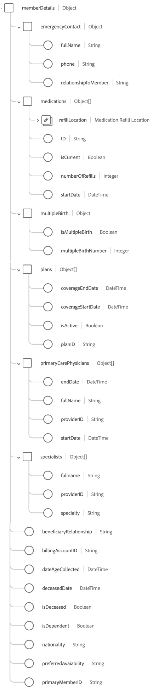

# [!UICONTROL 医疗保健会员详细信息] 架构字段组

[!UICONTROL 医疗保健会员详细信息] 是的标准架构字段组 [[!DNL XDM Individual Profile] 类](../../classes/individual-profile.md) 捕获已经或将接受医疗服务或护理的人员的详细信息，例如联系信息、初级护理医生和计划信息。

| 属性 | 数据类型 | 描述 |
| --- | --- | --- |
| `billingAddress` | [[!UICONTROL 邮政地址]](../../data-types/postal-address.md) | 人员的帐单地址。 |
| `faxPhone` | [[!UICONTROL 电话号码]](../../data-types/phone-number.md) | 人员的传真电话号码。 |
| `homeAddress` | [[!UICONTROL 邮政地址]](../../data-types/postal-address.md) | 人员的家庭地址。 |
| `homePhone` | [[!UICONTROL 电话号码]](../../data-types/phone-number.md) | 人员的住宅电话号码。 |
| `mailingAddress` | [[!UICONTROL 邮政地址]](../../data-types/postal-address.md) | 人员的电子邮件地址。 |
| `memberDetails` | 对象 | 一个对象，其中包含有关人员的医疗保健相关属性和关系的详细信息。 请参阅 [以下子部分](#memberDetails) 以了解有关对象结构的更多信息。 |
| `mobilePhone` | [[!UICONTROL 电话号码]](../../data-types/phone-number.md) | 人员的手机号码。 |
| `person` | [[!UICONTROL 人员]](../../data-types/person.md) | 与个人的医疗保健会员资格相关的个人行为者、联系人或所有者。 |
| `personalEmail` | [[!UICONTROL 电子邮件地址]](../../data-types/email-address.md) | 人员的个人电子邮件地址。 |
| `shippingAddress` | [[!UICONTROL 邮政地址]](../../data-types/postal-address.md) | 人员的送货地址。 |

{style="table-layout:auto"}

## `memberDetails` {#memberDetails}

`memberDetails` 是一个对象，其中包含有关人员的医疗保健相关属性和关系的详细信息。 的结构 `memberDetails` 如下所述。

| 属性 | 数据类型 | 描述 |
| --- | --- | --- |
| `emergencyContact` | 对象 | 捕获人员的以下紧急联系人详细信息： <ul><li>`fullName`：（字符串）紧急联系人的全名。</li><li>`phone`：（字符串）紧急联系人的电话号码。</li><li>`relationshipToMember`：（字符串）紧急联系人与人员的关系。</li></ul> |
| `medications` | 对象数组 | 列出与人员关联的当前和过去药物的详细信息。 每个数组项都是一个对象，可捕获以下详细信息： <ul><li>`refillLocation`：([[!UICONTROL 邮政地址]](../../data-types/postal-address.md))药品的补充位置。</li><li>`ID`：（字符串）药物ID。</li><li>`isCurrent`：（布尔值）指示药物是当前药物还是过去药物。</li><li>`numberOfRefills`：（整数）此药物的提供商规定的填充次数。</li><li>`startDate`：（日期时间）人员开始服药的日期。</li></ul> |
| `multipleBirth` | 对象 | 捕获与多胞胎相关的详细信息： <ul><li>`isMultipleBirth`：（布尔值）指示人员是否生育多胎。</li><li>`multipleBirthNumber`：（整数）在以下情况下出生的婴儿数： `isMultipleBirth` 为true。</li></ul> |
| `plans` | 对象数组 | 列出与人员关联的当前和过去医疗计划的详细信息。 每个数组项都是一个对象，可捕获以下详细信息： <ul><li>`coverageEndDate`：（日期时间）计划覆盖范围的结束日期。</li><li>`coverageStartDate`：（日期时间）计划覆盖范围的开始日期。</li><li>`isActive`：（布尔值）指示计划是否处于活动状态。</li><li>`planId`：（字符串）计划ID。</li></ul> |
| `primaryCarePhysicians` | 对象数组 | 列出与该人员相关联的初级保健医生的详细信息。 每个数组项都是一个对象，可捕获以下详细信息： <ul><li>`endDate`：（日期时间）初级保健医生结束对个人的护理的日期。</li><li>`fullname`：（字符串）医生的全名。</li><li>`providerId`：（字符串）医生的唯一标识符。</li><li>`startDate`：（日期时间）初级保健医生开始护理该人的日期。</li></ul> |
| `specialists` | 对象数组 | 列出与该人员关联的医疗保健专家的详细信息。 每个数组项都是一个对象，可捕获以下详细信息： <ul><li>`fullname`：（字符串）专家的全名。</li><li>`providerId`：（字符串）专家的唯一标识符。</li><li>`specialty`：（字符串）提供商的专长（例如麻醉学、泌尿学、放射学、皮肤病学等）。</li></ul> |
| `beneficiaryRelationship` | 字符串 | 如果人员是受抚养人（例如自己、配偶、子女等），则为与医疗保健成员之间的受益人关系。 |
| `billingAccountID` | 字符串 | 人员计费帐户的唯一标识符。 |
| `dateAgeCollected` | 日期时间 | 收集人员年龄的日期。 |
| `deceasedDate` | 日期时间 | 如果人员死亡，则为死亡日期。 |
| `isDeceased` | 布尔值 | 指示人员是否已死亡。 |
| `isDependent` | 布尔值 | 指示人员是否为受抚养人。 |
| `nationality` | 字符串 | 个人与其国家之间的法律关系，使用ISO 3166-1 Alpha-2代码表示。 |
| `preferredAvailability` | 字符串 | 预约的首选日期和时间。 |
| `primaryMemberID` | 字符串 | 如果人员是从属人员，则为主要订阅者的唯一标识符。 |

{style="table-layout:auto"}

有关字段组的更多详细信息，请参阅公共XDM存储库：

* [填充示例](https://github.com/adobe/xdm/blob/master/components/fieldgroups/profile/profile-healthcare-member.example.1.json)
* [完整模式](https://github.com/adobe/xdm/blob/master/components/fieldgroups/profile/profile-healthcare-member.schema.json)

有关如何使用此字段组来提供常见服务的更多信息，请参阅行业架构文档 [医疗保健行业用例](../../schema/industries/healthcare.md).
