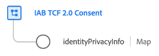

# [!UICONTROL IAB TCF 2.0同意] 架构字段组

>[!NOTE]
>
>本文档介绍XDM个人配置文件类的[!UICONTROL IAB TCF 2.0 Consent]架构字段组。 对于用于XDM ExperienceEvent类的字段组，请改为参阅以下[document](../event/iab.md)。

[!UICONTROL IAB TCF 2.0同意] 是类的标准架构字段组，用 [[!DNL XDM Individual Profile] ](../../classes/individual-profile.md) 于捕获带有时间戳的系列IAB同意字符串，以跟踪随时间推移的同意更改模式。



| 属性 | 数据类型 | 描述 |
| --- | --- | --- |
| `identityPrivacyInfo` | 地图 | 映射类型对象，用于将客户的个人身份值与不同的TCF同意字符串相关联。 下面提供了此对象结构的示例。 |

{style=&quot;table-layout:auto&quot;}

以下JSON演示了`identityPrivacyInfo`映射的结构。

```json
{
  "identityPrivacyInfo": {
    "ECID": {
      "13782522493631189": {
        "identityIABConsent": {
          "consentTimestamp": "2020-04-11T05:05:05Z",
          "consentString": {
            "consentStandard": "IAB TCF",
            "consentStandardVersion": "2.0",
            "consentStringValue": "BObdrPUOevsguAfDqFENCNAAAAAmeAAA.PVAfDObdrA.DqFENCAmeAENCDA",
            "gdprApplies": true,
            "containsPersonalData": false
          }
        }
      }
    }
  }
}
```

如示例所示，`xdm:identityPrivacyInfo`的每个根级别键都与Identity Service识别的身份命名空间相对应。 反过来，每个namespace属性必须至少具有一个子属性，其键值与该命名空间的客户相应标识值相匹配。 在此示例中，Experience Cloud的ID(`ECID`)值为`13782522493631189`。

>[!NOTE]
>
>虽然上述示例使用单个命名空间/值对来表示客户的身份，但您可以为其他命名空间添加其他键，并且每个命名空间可以具有多个身份值，每个值具有各自的TCF同意首选项集。

对于每个标识值，必须提供`identityIABConsent`属性，该属性为标识提供TCF同意值。 此属性的值必须符合[[!UICONTROL Consent String]数据类型](../../data-types/consent-string.md)。

有关此字段组用例的更多信息，请参阅Platform](../../../landing/governance-privacy-security/consent/iab/overview.md)中[IAB TCF 2.0支持指南。 有关字段组本身的更多详细信息，请参阅公共XDM存储库：

* [填充的示例](https://github.com/adobe/xdm/blob/master/components/fieldgroups/profile/profile-privacy.example.1.json)
* [完整模式](https://github.com/adobe/xdm/blob/master/components/fieldgroups/profile/profile-privacy.schema.json)
