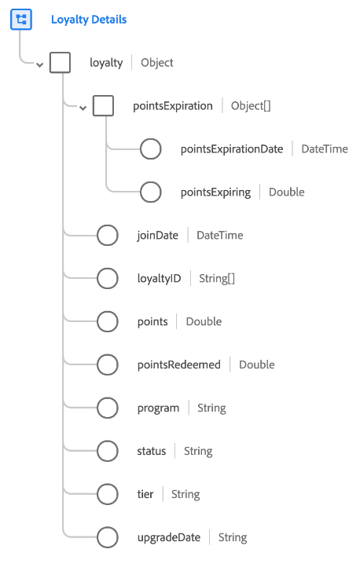

# [!UICONTROL 忠诚度详细信息]架构字段组

>[!NOTE]
>
>多个架构字段组的名称已更改。 有关详细信息，请参阅有关[字段组名称更新](../name-updates.md)的文档。

[!UICONTROL 忠诚度详细信息]是[[!DNL XDM Individual Profile] 类](../../classes/individual-profile.md)的标准架构字段组。 字段组提供单个对象类型字段`loyalty`，用于捕获与客户忠诚度计划中的人员成员资格相关的信息。

| 属性 | 数据类型 | 描述 |
| --- | --- | --- |
| `pointsExpiration` | 对象数组 | 列出任何将要过期的忠诚度积分（或忠诚度积分组），以及这些积分过期的日期。 每个数组项都必须是一个包含以下两个属性的对象： <ul><li>`pointsExpirationDate`：点将过期的ISO 8601日期时间。</li><li>`pointsExpiring`：截至相关到期日到期的积分余额。</li></ul> |
| `joinDate` | 日期时间 | 人员加入忠诚度计划的ISO 8601日期时间。 |
| `loyaltyID` | 字符串数组 | 表示与忠诚度计划成员关联的忠诚度计划ID。 |
| `points` | 两次 | 忠诚度会员的忠诚度积分或奖励的当前余额。 |
| `pointsRedeemed` | 两次 | 会员已申请购买或以其他方式兑换的积分数。 |
| `program` | 字符串 | 人员注册的忠诚度计划的名称。 |
| `status` | 字符串 | 人员的忠诚度会员的当前状态，如`active`、`disabled`或`suspended`。 |
| `tier` | 字符串 | 捕获人员注册的忠诚度计划层级。 |
| `upgradeDate` | 字符串 | 忠诚度成员升级到其最新层级的日期。 |

{style="table-layout:auto"}

有关字段组的更多详细信息，请参阅公共XDM存储库：

* [填充示例](https://github.com/adobe/xdm/blob/master/components/fieldgroups/profile/profile-loyalty-details.example.1.json)
* [完整架构](https://github.com/adobe/xdm/blob/master/components/fieldgroups/profile/profile-loyalty-details.schema.json)
