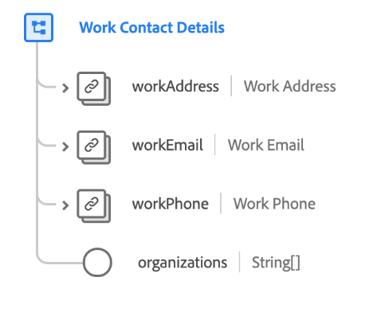

# [!UICONTROL 工作联系人] 详细信息架构字段组

>[!NOTE]
>
>多个架构字段组的名称已更改。 有关详细信息，请参阅[字段组名称更新](../name-updates.md)上的文档。

[!UICONTROL 工作联系] 人详细信息类的标准架构字 [[!DNL XDM Individual Profile] 段组](../../classes/individual-profile.md)。现场组提供了多个字段，用于捕获有关个人的职业信息，例如工作地址、工作电子邮件、工作电话号码以及该个人所属的组织。

| 属性 | 数据类型 | 描述 |
| --- | --- | --- |
| `workAddress` | [邮政地址](../../data-types/postal-address.md) | 描述人员的工作地址。 |
| `workEmail` | [电子邮件地址](../../data-types/email-address.md) | 描述人员的工作电子邮件地址。 |
| `workPhone` | [电话号码](../../data-types/phone-number.md) | 描述人员的工作电话号码。 |
| `organizations` | 字符串（数组） | 自由格式字符串的数组，表示人员所属的组织。 |

{style=&quot;table-layout:auto&quot;}

有关字段组的更多详细信息，请参阅公共XDM存储库：

* [填充的示例](https://github.com/adobe/xdm/blob/master/components/mixins/profile/profile-work-details.example.1.json)
* [完整模式](https://github.com/adobe/xdm/blob/master/components/mixins/profile/profile-work-details.schema.json)
