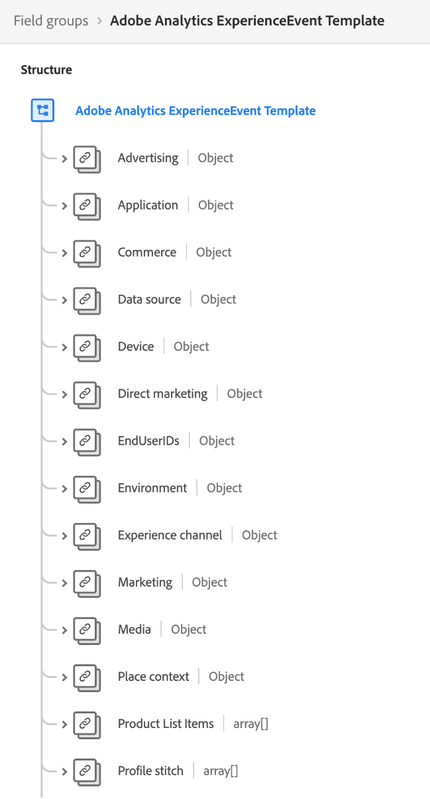

# 数据建模最佳实践

[!DNL Experience Data Model] (XDM)是一个核心框架，通过提供用于下游Adobe Experience Platform服务的通用结构和定义来标准化客户体验数据。 通过遵循XDM标准，可以将所有客户体验数据整合到通用的演示文稿中，以便您从客户操作中获得有价值的分析，通过区段定义客户受众，以及为个性化目的表达客户属性。

由于XDM具有极强的通用性和可通过设计进行自定义，因此在设计架构时务必遵循数据建模的最佳实践。 本文档介绍了在将客户体验数据映射到XDM时必须做出的关键决策和注意事项。

## 快速入门

在阅读本指南之前，请查看 [XDM系统概述](../home.md) 简要介绍XDM及其在Experience Platform中的作用。

此外，本指南专门重点介绍有关模式设计的关键注意事项。 因此，强烈建议您参考 [架构组合基础知识](./composition.md) 有关本指南中提及的各个架构元素的详细说明。

## 最佳实践摘要

设计数据模型以供在Experience Platform中使用的推荐方法可概括如下：

1. 了解数据的业务用例。
1. 确定应引入的主数据源 [!DNL Platform] 来解决这些用例。
1. 确定可能也感兴趣的任何辅助数据源。 例如，如果贵组织当前只有一个业务部门有兴趣将其数据移植到 [!DNL Platform]，则类似的业务部门将来可能也有兴趣移植类似数据。 考虑这些辅助来源有助于标准化整个组织的数据模型。
1. 为已识别的数据源创建高级实体关系图(ERD)。
1. 将高级ERD转换为 [!DNL Platform]以 — 中心ERD（包括用户档案、体验事件和查找实体）。

与确定执行业务用例所需的适用数据源相关的步骤因组织而异。 虽然本文档的其余部分侧重于在确定数据源后组织和构建ERD的后续步骤，但对该图表各个组成部分的说明可能会使您决定应该将哪些数据源迁移到 [!DNL Platform].

## 创建高级ERD

确定要引入的数据源后 [!DNL Platform]，请创建一个高级ERD来帮助指导将数据映射到XDM模式的过程。

以下示例为希望将数据导入的公司提供了一个简化的ERD [!DNL Platform]. 此图突出显示了应归类为XDM类的基本实体，包括客户帐户、酒店、地址和几个常见的电子商务事件。

## 将实体按配置文件、查找和事件类别进行排序

创建ERD以确定要引入的基本实体后 [!DNL Platform]，则这些实体必须分类为用户档案、对照和事件类别：

| 类别 | 描述 |
| --- | --- |
| 配置文件实体 | 用户档案实体表示与个人（通常是客户）相关的属性。 属于此类别的实体应由基于 **[!DNL XDM Individual Profile]类**. |
| 查找实体 | 查找实体表示可与个人相关的概念，但不能直接用于识别个人。 属于此类别的实体应由基于的架构表示 **自定义类**. |
| 事件实体 | 事件实体表示与客户可以执行的操作、系统事件或您希望跟踪随时间变化的任何其他概念相关的概念。 属于此类别的实体应由基于 **[!DNL XDM ExperienceEvent]类**. |

{style=&quot;table-layout:auto&quot;}

### 有关实体排序的注意事项

以下各节就如何将实体按上述类别进行排序提供了进一步指导。

#### 可变和不可变数据

实体类别之间排序的主要方式是捕获的数据是否可变。

属于用户档案或查找实体的属性通常可变。 例如，客户的偏好可能会随时间而改变，并且订阅计划的参数可能会根据市场趋势而更新。

相反，事件数据通常不可更改。 由于事件附加到特定时间戳，因此事件提供的“系统快照”不会发生更改。 例如，事件可在客户结帐购物车时捕获客户的首选项，即使客户的首选项稍后发生更改也不会更改。 事件数据在记录后无法更改。

总之，用户档案和查找实体包含可变属性并表示有关他们捕获的主题的最新信息，而事件是系统在特定时间的不可变记录。

#### 客户属性

如果实体包含任何与单个客户相关的属性，则很可能是用户档案实体。 客户属性的示例包括：

* 个人详细信息，如姓名、出生日期、性别和帐户ID。
* 位置信息，如地址和GPS信息。
* 联系信息，如电话号码和电子邮件地址。

#### 随时间跟踪数据

如果要分析实体中某些属性随时间的变化情况，事件实体很可能是。 例如，将产品项目添加到购物车可作为 [!DNL Platform]:

| 客户 ID | 类型 | 产品 ID | 数量 | 时间戳 |
| --- | --- | --- | --- | --- |
| 1234567 | Add | 275098 | 2 | 10月1日，上午10点32分 |
| 1234567 | 删除 | 275098 | 1 | 10月1日，上午10点33分 |
| 1234567 | 添加 | 486502 | 1 | 10月1日，上午10点41分 |
| 1234567 | 添加 | 910482 | 5 | 10月3日，下午2:15 |

{style=&quot;table-layout:auto&quot;}

#### 分段用例

在对实体进行分类时，请务必考虑要构建的受众区段，以解决您的特定业务用例。

例如，某公司希望了解其忠诚度计划中所有“黄金”或“白金”会员，这些会员在过去一年中购买了超过五次产品。 根据这一分段逻辑，可以就如何表示相关实体得出以下结论：

* “金牌”和“白金”表示适用于个人客户的忠诚度状态。 由于区段逻辑仅与客户的当前忠诚度状态有关，因此此数据可以建模为用户档案架构的一部分。 如果您希望跟踪忠诚度状态随时间的变化，则还可以为忠诚度状态更改创建其他事件架构。
* 购买是指在特定时间发生的事件，区段逻辑与指定时间范围内的购买事件有关。 因此，应将此数据建模为事件模式。

#### 激活用例

除了与分段用例相关的注意事项外，您还应检查这些区段的激活用例，以确定其他相关属性。

例如，公司已根据以下规则构建了受众区段： `country = US`. 然后，在将该区段激活到某些下游目标时，公司希望根据家庭状态过滤所有导出的用户档案。 因此， `state` 属性也应在适用的配置文件实体中捕获。

#### 汇总值

根据数据的用例和粒度，您应确定某些值在包含到用户档案或事件实体中之前是否需要预先汇总。

例如，某公司希望根据购物车购买次数构建一个区段。 您可以选择以最低粒度合并此数据，方法是将每个带有时间戳的购买事件作为其自己的实体。 但是，这有时可能会以指数级方式增加已记录事件的数量。 要减少摄取的事件数，您可以选择创建聚合值 `numberOfPurchases` 一周或一个月。 MIN和MAX等其他集合函数也适用于这些情况。

>[!CAUTION]
>
>Experience Platform当前不执行自动值聚合，不过计划在将来的版本中进行此操作。 如果您选择使用聚合值，则必须在外部执行计算后才能将数据发送到 [!DNL Platform].

#### 基数

在ERD中建立的基数也可以提供一些关于如何对实体进行分类的线索。 如果两个实体之间存在一对多关系，则表示“多”的实体可能是事件实体。 但是，在某些情况下，“许多”是一组查找实体，它们作为数组提供在配置文件实体中。

>[!NOTE]
>
>由于没有通用的方法来适合所有用例，因此在根据基数对实体进行分类时，必须考虑每种情况的利弊。 请参阅 [下一部分](#pros-and-cons) 以了解更多信息。

下表概述了一些常见的实体关系以及可从这些关系派生的类别：

| 关系 | 基数 | 实体类别 |
| --- | --- | --- |
| 客户和购物车结账 | 一对多 | 单个客户可能拥有许多购物车结账，这些事件可在一段时间内进行跟踪。 因此，客户将是用户档案实体，而购物车结账将是事件实体。 |
| 客户和忠诚度帐户 | 一对一 | 单个客户只能拥有一个忠诚帐户，反之亦然。 由于此关系是一对一的，因此客户和忠诚度帐户都表示用户档案实体。 |
| 客户和订阅 | 一对多 | 单个客户可能有许多订阅。 由于公司仅关注客户的当前订阅，因此客户是用户档案实体，而订阅是查询实体。 |

{style=&quot;table-layout:auto&quot;}

### 不同实体类的利弊 {#pros-and-cons}

虽然上一节提供了一些决定如何对实体进行分类的一般准则，但务必要了解在选择一个实体类别而不是另一个实体类别时通常会有利弊。 以下案例研究旨在说明在这些情况下如何考虑您的选项。

公司跟踪其客户的活动订阅，其中一个客户可以拥有许多订阅。 该公司还希望为分段用例包含订阅，例如查找所有订阅活跃的用户。

在这种情况下，公司有两个潜在的选项来代表客户在其数据模型中的订阅：

1. [使用配置文件属性](#profile-approach)
1. [使用事件实体](#event-approach)

#### 方法1:使用配置文件属性 {#profile-approach}

第一种方法是在客户的配置文件实体中包含一组作为属性的订阅。 此数组中的对象将包含 `category`, `status`, `planName`, `startDate`和 `endDate`.

 

**优点**

* 对预期用例进行分段是可行的。
* 该架构将仅保留客户的最新订阅记录。

**缺点**

* 每当阵列中的任何字段发生更改时，必须重述整个阵列。
* 如果不同的数据源或业务部门将数据馈送到阵列中，那么保持最新更新的阵列在所有渠道之间同步将变得极具挑战性。

#### 方法2:使用事件实体 {#event-approach}

第二种方法是使用事件模式来表示订阅。 这要求获取与第一种方法相同的订阅字段，以及订阅ID、客户ID和发生订阅事件时的时间戳。

 

**优点**

* 分段规则可以更加灵活（例如，查找过去30天内更改了订阅的所有客户）。
* 当客户的订阅状态发生更改时，您不再需要更新客户配置文件属性中一个可能非常复杂的长数组。 如果客户的订阅列表同时发生来自多个来源的更改，则此功能特别有用。

**缺点**

* 对于原始预期用例，分段变得更加复杂（确定客户最近订阅的状态）。 该区段现在需要其他逻辑来标记客户的最后一个订阅事件，以检查其状态。
* 事件自动过期和从用户档案存储中清除的风险较高。 请参阅 [体验事件过期](../../profile/event-expirations.md) 以了解更多信息。

## 根据分类的实体创建架构

将实体排序到用户档案、查询和事件类别后，您便可以开始将数据模型转换为XDM架构。 出于演示目的，前面显示的示例数据模型在下图中已分类为相应的类别：

 

实体在下排序的类别应确定其架构所基于的XDM类。 重申：

* 用户档案实体应使用 [!DNL XDM Individual Profile] 类。
* 事件实体应使用 [!DNL XDM ExperienceEvent] 类。
* 查找实体应使用由贵组织定义的自定义XDM类。

>[!NOTE]
>
>虽然事件实体几乎总是由不同的架构来表示，但配置文件或对照类别中的实体可能会在单个XDM架构中组合在一起，具体取决于其基数。
>
>例如，由于客户实体与LoyatyAccounts实体具有一对一关系，因此客户实体的架构还可以包含 `LoyaltyAccount` 对象，以包含每个客户的相应忠诚度字段。 但是，如果关系是一对多的关系，则表示“多”的实体可以由单独的架构或配置文件属性数组来表示，具体取决于其复杂性。

以下各节提供了有关基于ERD构建模式的一般指导。

### 采用迭代建模方法

的 [模式演化规则](./composition.md#evolution) 指示在架构实施后，只能对其进行无损的更改。 换言之，在向架构添加字段且已针对该字段摄取数据后，便无法再删除该字段。 因此，在首次创建架构时，必须采用迭代建模方法，首先是简化的实施，该实施会随着时间的推移逐步增加复杂性。

如果您不确定是否需要将特定字段包含在架构中，最佳做法是将其排除在外。 如果稍后确定该字段是必需的，则始终可以在架构的下一个小版本中添加该字段。

### 标识字段

在Experience Platform中，标记为身份的XDM字段用于拼合有关来自多个数据源的各个客户的信息。 虽然架构可以具有多个标记为标识的字段，但必须定义单个主标识，才能在中启用该架构 [!DNL Real-time Customer Profile]. 请参阅 [身份字段](./composition.md#identity) 有关这些字段用例的更多详细信息，请参阅架构组合基础知识。

在设计架构时，关系数据库表中的任何主键都可能是主标识的候选项。 适用身份字段的其他示例包括客户电子邮件地址、电话号码、帐户ID和 [ECID](../../identity-service/ecid.md).

### Adobe应用程序架构字段组

Experience Platform提供了几个现成的XDM模式字段组，用于捕获与以下Adobe应用程序相关的数据：

* Adobe Analytics
* Adobe Audience Manager
* Adobe Campaign
* Adobe Target

例如， [[!UICONTROL Adobe Analytics ExperienceEvent模板] 字段组](https://github.com/adobe/xdm/blob/master/extensions/adobe/experience/analytics/experienceevent-all.schema.json) 允许您映射 [!DNL Analytics]特定于XDM架构的字段。 根据您正在使用的Adobe应用程序，您应该在架构中使用这些Adobe提供的字段组。

 

Adobe应用程序字段组通过使用 `identityMap` 字段，系统生成的只读对象，可映射单个客户的标准标识值。

对于Adobe Analytics,ECID是默认的主标识。 如果客户未提供ECID值，则主标识将默认使用AAID。

>[!IMPORTANT]
>
>使用Adobe应用程序字段组时，不应将其他字段标记为主标识。 如果有其他属性需要标记为标识，则需要将这些字段指定为辅助标识。

## 后续步骤

本文档介绍了设计数据模型以进行Experience Platform的一般准则和最佳实践。 总结如下：

* 在构建架构之前，请使用自上而下的方法，将数据表按用户档案、查找和事件类别进行排序。
* 在设计用于不同目的的架构时，通常有多种方法和选项。
* 您的数据模型应支持您的业务用例，如分段或客户历程分析。
* 使您的架构尽可能简单，并且仅在绝对必要时添加新字段。

准备就绪后，请在 [在UI中创建架构](../tutorials/create-schema-ui.md) 有关如何创建架构的分步说明，请为实体分配相应的类，并添加要将数据映射到的字段。
