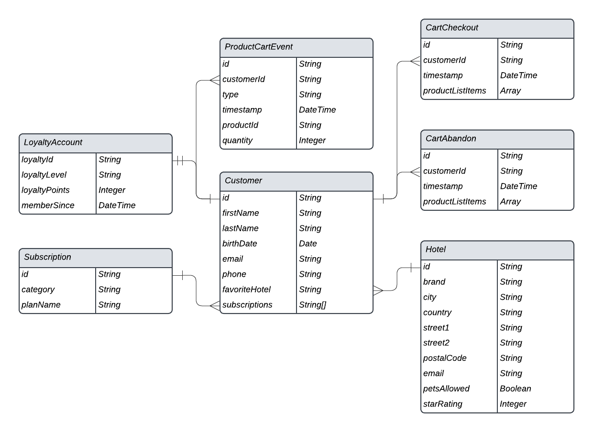

# 数据建模的最佳实践

[!DNL Experience Data Model] (XDM)是核心框架，通过提供在下游Adobe Experience Platform服务中使用的通用结构和定义来标准化客户体验数据。 通过遵守XDM标准，所有客户体验数据都可以合并到一个通用表示中，并用于从客户操作中获得有价值的见解、定义客户受众以及表达客户属性以进行个性化。

由于XDM极其通用并且可通过设计进行自定义，因此，在设计架构时遵循数据建模的最佳实践至关重要。 本文档介绍了在将客户体验数据映射到XDM时必须做出的关键决策和注意事项。

## 快速入门

在阅读本指南之前，请查看[XDM系统概述](../home.md)，详细了解XDM及其在Experience Platform中的角色。

由于本指南专门侧重于架构设计方面的关键注意事项，因此强烈建议您阅读架构组合的[基础知识](./composition.md)，以了解本指南中提到的各个架构元素的详细解释。

## 最佳实践摘要 {#summary}

设计数据模型以用于Experience Platform的推荐方法可概括如下：

1. 了解数据的业务用例。
1. 确定应引入Experience Platform的主要数据源，以解决这些用例。
1. 确定可能还感兴趣的任何辅助数据源。 例如，如果贵组织中目前只有一个业务部门有兴趣将其数据移植到Experience Platform，则类似的业务部门将来也可能会有兴趣移植类似的数据。 考虑这些次要源有助于在整个组织中标准化数据模型。
1. 为已识别的数据源创建高级实体关系图(ERD)。
1. 将高级ERD转换为以Experience Platform为中心的ERD（包括用户档案、体验事件和查找实体）。

与确定实施业务用例所需的适用数据源相关的步骤因组织而异。 虽然本文档中的其他部分侧重于确定数据源后组织和构建ERD的后面步骤，但图表各个组件的解释可能会指导您决定应将哪些数据源迁移到Experience Platform。

## 创建高级ERD {#create-an-erd}

确定要引入Experience Platform的数据源后，请创建一个高级ERD以帮助指导将数据映射到XDM架构的过程。

以下示例为希望将数据导入Experience Platform的公司提供了一个简化的ERD。 该图表突出显示应分类为XDM类的基本实体，包括客户帐户、酒店和几个常见的电子商务事件。

## 按配置文件、查找和事件类别对实体进行排序 {#sort-entities}

创建ERD以标识要引入Experience Platform中的基本实体后，必须将这些实体分类为配置文件、查找和事件类别：

| 类别 | 描述 |
| --- | --- |
| 配置文件实体 | 用户档案实体表示与个人（通常是客户）相关的属性。 属于此类别的实体应该由基于&#x200B;**[!DNL XDM Individual Profile]类**&#x200B;的架构表示。 |
| 查找实体 | 查找实体表示可能与个人相关的概念，但不能直接用于识别个人。 属于此类别的实体应该由基于&#x200B;**自定义类**&#x200B;的架构表示，并通过[架构关系](../tutorials/relationship-ui.md)链接到配置文件和事件。 |
| 事件实体 | 事件实体表示与客户可以采取的操作、系统事件或您可能希望随时间跟踪更改的任何其他概念相关的概念。 属于此类别的实体应该由基于&#x200B;**[!DNL XDM ExperienceEvent]类**&#x200B;的架构表示。 |

{style="table-layout:auto"}

### 实体排序的注意事项 {#considerations}

以下各节提供了有关如何将实体分类为上述类别的进一步指导。

#### 可变和不可变数据 {#mutable-and-immutable-data}

实体类别之间的主要排序方式是捕获的数据是否可变。

属于配置文件或查找实体的属性通常可变。 例如，客户的偏好可能会随着时间的推移而改变，订阅计划的参数可以根据市场趋势进行更新。

相反，事件数据通常不可变。 由于事件附加到特定的时间戳，因此事件提供的“系统快照”不会更改。 例如，事件可在客户结账购物车时捕获其偏好设置，即使客户的偏好设置以后最终发生更改，事件也不会更改。 事件数据在记录后无法更改。

总而言之，配置文件和查找实体包含可变属性，并代表它们捕获的主题的最新信息，而事件在特定时间是系统的不可变记录。

#### 客户属性 {#customer-attributes}

如果实体包含与单个客户相关的任何属性，则它很可能为用户档案实体。 客户属性的示例包括：

* 个人详细信息，例如姓名、出生日期、性别和帐户ID。
* 位置信息，如地址和GPS信息。
* 联系信息，如电话号码和电子邮件地址。

#### 随时间跟踪数据 {#track-data}

如果要分析实体中的某些属性如何随时间变化，则很可能是事件实体。 例如，可以将产品项目添加到购物车作为Experience Platform中的添加到购物车事件进行跟踪：

| 客户ID | 类型 | 产品ID | 数量 | 时间戳 |
| --- | --- | --- | --- | --- |
| 1234567 | Add | 275098 | 2 | 10月1日上午10:32 |
| 1234567 | 删除 | 275098 | 1 | 10月1日上午10:33 |
| 1234567 | Add | 486502 | 1 | 10月1日上午10:41 |
| 1234567 | Add | 910482 | 5 | 10月3日，下午2:15 |

{style="table-layout:auto"}

#### 分段用例 {#segmentation-use-cases}

在对实体进行分类时，请务必考虑您可能希望构建的受众以解决特定业务用例。

例如，一家公司希望了解其忠诚度计划中的所有“黄金”或“白金”会员，这些会员去年购买了5次以上。 基于此分段逻辑，可以得出以下关于应如何表示相关实体的结论：

* “金级”和“白金级”表示适用于单个客户的忠诚度状态。 由于分段逻辑仅与客户当前的忠诚度状态有关，因此该数据可以建模为用户档案模式的一部分。 如果您希望跟踪忠诚度状态随时间的变化，还可以为忠诚度状态更改创建其他事件架构。
* 购买是在特定时间发生的事件，分段逻辑涉及指定时间窗口中的购买事件。 因此，此数据应建模为事件架构。

#### 激活用例 {#activation-use-cases}

除了有关分段用例的注意事项外，您还应查看这些受众的激活用例，以确定其他相关的属性。

例如，某公司已根据`country = US`规则构建受众。 然后，在将该受众激活到某些下游目标时，公司想要根据主页状态筛选所有导出的用户档案。 因此，还应在适用的配置文件实体中捕获`state`属性。

#### 聚合值 {#aggregated-values}

根据用例和数据粒度，您应当决定是否需要在包含到用户档案或事件实体中之前预先聚合某些值。

例如，公司希望根据购物车购买次数构建受众。 您可以选择以最低的粒度合并此数据，方法是将每个带有时间戳的购买事件包含为自己的实体。 但是，这有时可能会使记录的事件数呈指数增长。 要减少摄取的事件数，您可以选择在为期一周或一个月的时段内创建聚合值`numberOfPurchases`。 其他聚合函数(如MIN和MAX)也可以应用于这些情况。

>[!CAUTION]
>
>Experience Platform目前不执行自动值聚合，不过计划在将来的版本中执行此操作。 如果选择使用聚合值，则在将数据发送到Experience Platform之前，必须在外部执行计算。

#### 基数 {#cardinality}

在ERD中建立的基数还可以提供有关如何对实体进行分类的一些线索。 如果两个实体之间存在一对多关系，则表示“多个”的实体很可能是一个事件实体。 但是，在某些情况下，“许多”是一组查找实体，这些实体在配置文件实体中作为数组提供。

>[!NOTE]
>
>由于没有适合所有用例的通用方法，因此根据基数对实体进行分类时，必须考虑每种情况的利弊。 有关详细信息，请参阅[下一节](#pros-and-cons)。

下表概述了一些常见的实体关系以及可从这些关系派生的类别：

| 关系 | 基数 | 实体类别 |
| --- | --- | --- |
| 客户和购物车结账 | 一对多 | 单个客户可能会有多个购物车结账，这些事件可以随时间进行跟踪。 因此，客户将成为用户档案实体，而购物车结账将成为事件实体。 |
| 客户和忠诚度帐户 | 一对一 | 单个客户只能有一个忠诚度帐户，一个忠诚度帐户只能属于一个客户。 由于关系是一对一的，因此客户和忠诚度帐户都表示用户档案实体。 |
| 客户和订阅 | 一对多 | 单个客户可能具有多个订阅。 由于公司仅关注客户的当前订阅，因此客户是用户档案实体，而订阅是查找实体。 |

{style="table-layout:auto"}

### 不同实体类的优缺点 {#pros-and-cons}

虽然上一节提供了一些确定实体分类的一般准则，但务必要了解，选择一个实体类别通常有利有弊。 以下案例研究旨在说明在这些情况下如何考虑您的选项。

公司跟踪其客户的活跃订阅，一个客户可以有多个订阅。 该公司还希望将订阅纳入分段用例，例如查找具有活动订阅的所有用户。

在此方案中，公司有两个潜在选项，用于在客户的数据模型中表示客户的订阅：

1. [使用配置文件属性](#profile-approach)
1. [使用事件实体](#event-approach)

#### 方法1：使用用户档案属性 {#profile-approach}

第一种方法是在“客户”的配置文件实体中包含`subscriptionID`的数组。

**优点**

* 分段适用于预期用例。
* 架构仅保留客户的最新订阅记录。

**缺点**

* 每次对数组中的任何字段发生更改时，必须重述整个数组。
* 如果不同的数据源或业务单位将数据馈送到阵列，则要在所有通道上保持最新更新的阵列同步将变得非常困难。

#### 方法2：使用事件实体 {#event-approach}

第二种方法是使用事件架构来表示订阅事件。 这将包括订阅ID以及客户ID，还包括订阅事件发生的时间戳。

**优点**

* 分段规则可以更灵活（例如，查找过去30天内更改了订阅的所有客户）。
* 当客户的订阅状态发生变化时，您不必再更新客户配置文件属性中冗长、可能复杂的阵列。 如果同时从多个来源对客户的订阅列表进行更改，此功能会特别有用。

**缺点**

* 对于原始预期用例（确定客户最近订阅的状态），分段会变得更加复杂。 受众现在需要其他逻辑来标记客户的上一个订阅事件，以检查其状态。
* 事件自动过期并从配置文件存储区中清除的风险更高。 有关详细信息，请参阅[体验事件过期日期](../../profile/event-expirations.md)指南。

## 根据已分类的实体创建架构 {#schemas-for-categorized-entities}

将实体分类为配置文件、查找和事件类别后，即可开始将数据模型转换为XDM架构。 出于演示目的，前面显示的示例数据模型已在下图中被分类为相应的类别：

实体已在其下排序的类别应该确定您确定其架构所基于的XDM类。 再次重申：

* 配置文件实体应使用[!DNL XDM Individual Profile]类。
* 事件实体应使用[!DNL XDM ExperienceEvent]类。
* 查找实体应使用由您的组织定义的自定义XDM类。 然后，配置文件和事件实体可以通过架构关系引用这些查找实体。

>[!NOTE]
>
>虽然事件实体几乎总是由单独的架构表示，但配置文件或查找类别中的实体可以在一个XDM架构中组合在一起，具体取决于其基数。
>
>例如，由于客户实体与LoyaltyAccount实体存在一对一的关系，因此客户实体的架构还可以包含一个`LoyaltyAccount`对象，以包含每个客户的相应忠诚度字段。 但是，如果关系是一对多，则代表“多”的实体可能由单独的架构或配置文件属性数组表示，具体取决于其复杂性。

以下部分提供了有关根据ERD构建架构的一般指导。

### 采用迭代建模方法 {#iterative-modeling}

架构演变[的](./composition.md#evolution)规则规定，一旦实施架构，只能对架构进行非破坏性更改。 换言之，一旦您将字段添加到架构并且已根据该字段摄取数据，则无法再移除该字段。 因此，在首次创建架构时，务必要采用迭代建模方法，从随着时间推移逐渐增加复杂性的简化实施开始。

如果您不确定某个特定字段是否必须包含在架构中，最佳实践是将其排除在外。 如果之后确定该字段是必需的，则始终可以将该字段添加到架构的下一个迭代中。

### 身份标识字段 {#identity-fields}

在Experience Platform中，标记为身份的XDM字段用于拼合来自多个数据源的各个客户的信息。 尽管架构可以具有多个标记为标识的字段，但必须定义一个主标识才能使架构在[!DNL Real-Time Customer Profile]中使用。 有关这些字段用例的更多详细信息，请参阅架构组合基础知识中有关[标识字段](./composition.md#identity)的部分。

在设计架构时，关系数据库表中的任何主键都可能是主标识的候选。 适用标识字段的其他示例包括客户电子邮件地址、电话号码、帐户ID和[ECID](../../identity-service/features/ecid.md)。

### Adobe应用程序架构字段组 {#adobe-application-schema-field-groups}

Experience Platform提供了多个现成的XDM架构字段组，用于捕获与以下Adobe应用程序相关的数据：

* Adobe Analytics
* Adobe Audience Manager
* Adobe Campaign
* Adobe Target

例如，您可以使用[[!UICONTROL Adobe Analytics ExperienceEvent Template]字段组](https://github.com/adobe/xdm/blob/master/extensions/adobe/experience/analytics/experienceevent-all.schema.json)将特定于[!DNL Analytics]的字段映射到您的XDM架构。 根据您使用的Adobe应用程序，您应在架构中使用这些Adobe提供的字段组。

![ [!UICONTROL Adobe Analytics ExperienceEvent Template].](../images/best-practices/analytics-field-group.png)的架构图

Adobe应用程序字段组通过使用`identityMap`字段自动分配默认主标识，该字段是系统生成的只读对象，用于映射单个客户的标准标识值。

对于Adobe Analytics，ECID是默认的主标识。 如果客户未提供ECID值，则主要标识将默认为AAID。

>[!IMPORTANT]
>
>使用Adobe应用程序字段组时，不应将任何其他字段标记为主标识。 如果有其他属性需要标记为标识，则必须将这些字段指定为辅助标识。

## 数据验证字段 {#data-validation-fields}

将数据摄取到数据湖中时，仅对约束字段强制执行数据验证。 要在批量摄取期间验证特定字段，您必须在XDM架构中将字段标记为受约束。 要防止错误数据进入Experience Platform，请在创建架构时定义验证要求。

>[!IMPORTANT]
>
>验证不适用于嵌套列。 如果字段格式位于数组列中，则不会验证数据。

要对字段设置约束，请在架构编辑器中选择该字段以打开&#x200B;**[!UICONTROL Field properties]**&#x200B;侧栏。 有关可用字段的精确说明，请参阅有关[特定类型的字段属性](../ui/fields/overview.md#type-specific-properties)的文档。

![在[!UICONTROL Field properties]侧边栏中突出显示约束字段的架构编辑器。](../images/best-practices/data-validation-fields.png)

### 维护数据完整性的提示 {#data-integrity-tips}

以下建议可帮助您在创建架构时保持数据完整性。

* **考虑主标识**：对于Web SDK、移动SDK、Adobe Analytics和Adobe Journey Optimizer等Adobe产品，`identityMap`字段通常用作主标识。 避免将其他字段指定为该架构的主标识。
* **确保`_id`未用作标识**： Experience Event架构中的`_id`字段不能用作标识，因为它用于记录唯一性。
* **设置长度约束**：最佳做法是在标记为标识的字段上设置最小和最大长度。 如果您尝试将自定义命名空间分配给身份字段，但不满足最小和最大长度约束，则会触发警告。 这些限制有助于保持一致性和数据质量。
* **为一致值应用模式**：如果您的标识值遵循特定模式，请使用&#x200B;**[!UICONTROL Pattern]**&#x200B;设置强制实施约束。 此设置可以包括仅数字、大写或小写或特定字符组合等规则。 使用正则表达式匹配字符串中的模式。
* **在Analytics架构中限制eVar**：通常，一个Analytics架构应仅将一个eVar指定为标识。 如果您打算使用多个eVar作为身份，则应仔细检查数据结构是否可以优化。
* **确保所选字段的唯一性**：与架构中的主标识相比，您选择的字段应该是唯一的。 如果不是，请不要将其标记为标识。 例如，如果多个客户可以提供相同的电子邮件地址，则该命名空间不是合适的身份。 此原则也适用于其他身份命名空间，如电话号码。 将非唯一字段标记为标识可能会导致不需要的用户档案折叠。
* **验证最小字符串长度**：所有字符串字段的长度应至少为一个字符，因为字符串值绝不应为空。 但是，可接受非必填字段的空值。 默认情况下，新字符串字段的最小长度为1。

## 管理启用配置文件的架构 {#managing-profile-enabled-schemas}

本节介绍如何管理已为Real-time Customer Profile启用的架构。 启用架构后，无法禁用或删除该架构。 您必须确定如何防止进一步使用以及如何管理无法删除的数据集。

为配置文件启用架构后，配置将无法撤销。 如果某个模式不再使用，请将其重命名以阐明其状态，并创建一个具有正确结构和身份配置的替换模式。 这有助于防止在用户创建新数据集或配置摄取工作流时意外重用已弃用的架构。

系统数据集有时与启用实时客户个人资料的架构一起显示。 无法删除系统数据集，即使关联的架构已被弃用。 要防止意外使用，请重命名已弃用的启用配置文件的架构，并确认没有任何摄取工作流指向保留不变的系统数据集。

使用以下最佳实践以防止意外重用已弃用的启用配置文件的架构：

* 在弃用架构时，请使用明确的命名约定。 包括诸如“已弃用”、“请勿使用”或版本标记之类的标签。
* 停止根据要弃用的架构将数据摄取到任何数据集中。
* 使用正确的结构、身份配置和命名模式创建新架构。
* 审查无法删除的系统数据集，并确认没有摄取工作流引用这些数据集。
* 在内部记录更改，以便其他用户了解架构被弃用的原因。

>[!TIP]
>
>有关启用配置文件的架构和相关限制的其他指导，请参阅[XDM疑难解答指南](../troubleshooting-guide.md#delete-profile-enabled)。

## 后续步骤

本文档介绍了为Experience Platform设计数据模型的一般准则和最佳实践。 总结一下：

* 在构建架构之前，将数据表按配置文件、查找和事件类别排序。
* 当您针对不同用例设计架构时，请评估多种方法。
* 确保您的数据模型支持分段或客户历程目标。
* 保持架构尽可能简单。 仅在必要时添加新字段。

准备就绪后，请参阅有关[在UI](../tutorials/create-schema-ui.md)中创建架构的教程，以了解有关架构创建、类分配和字段映射的分步说明。
