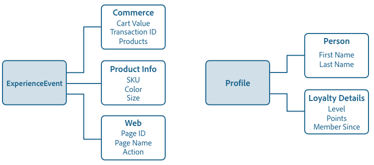

# 模式合成基础

本文档介绍了Experience Data Model(XDM)模式，以及构成要在Adobe Experience Platform中使用的模式的构件块、原则和最佳做法。 有关XDM及其在平台中的使用方式的一般信息，请参阅 [XDM系统概述](../home.md)。

## 了解模式

模式是表示和验证数据结构和格式的一组规则。 从高度上讲，模式提供了真实对象（如人）的抽象定义，并勾勒了该对象的每个实例中应包含哪些数据（如名、姓、生日等）。

除了描述数据结构外，模式还对数据应用约束和期望，以便在系统之间移动时验证它。 这些标准定义允许一致地解释数据，而不考虑来源，并且无需跨应用程序进行翻译。

Experience Platform通过使用模式来保持这种语义规范化。 模式是描述Experience Platform中数据的标准方式，它允许符合模式的所有数据可重用，而不会在组织之间发生冲突，甚至可以在多个组织之间共享。

### 关系表与嵌入式对象

在使用关系数据库时，最佳实践是标准化数据，或将实体分成若干离散部分，然后在多个表中显示。 要整体读取数据或更新实体，必须使用JOIN在多个单独的表中进行读写操作。

XDM模式通过嵌入式对象的使用，可以直接表示复杂的数据并存储在具有层次结构的自包含文档中。 此结构的主要优点之一是它允许您查询数据，而不必通过昂贵的连接到多个非规范化表来重建实体。

### 模式和大数据

现代数字系统生成大量的行为信号（交易数据、网络日志、物联网、显示等）。 这一大数据为优化体验提供了绝佳的机会，但由于数据的规模和种类繁多，使用起来极具挑战。 为了从数据中获得价值，其结构、格式和定义必须标准化，以便能够一致、高效地处理数据。

模式通过允许从多个来源整合数据、通过通用结构和定义标准化并跨解决方案共享数据来解决这一问题。 这使得后续过程和服务能够回答任何类型的数据问题，从传统的数据建模方法转向数据建模方法，在该方法中，将要询问的数据的所有问题都预先知道，并且数据建模以符合这些期望。

### Experience Platform中基于模式的工作流

标准化是Experience Platform的一个关键概念。 XDM由Adobe推动，旨在实现客户体验数据标准化并定义客户体验管理的标准模式。

构建Experience Platform的基础架构（称为XDM系统）简化了基于模式的工作流，包括模式注册表、模式编辑器、模式元数据和服务消费模式。 See the [XDM System overview](../home.md) for more information.

## 规划模式

构建模式的第一步是确定您试图在模式中捕获的概念或真实对象。 一旦您确定了要描述的概念，您就可以开始规划模式，考虑数据类型、潜在身份字段以及模式在未来的发展。

### Experience Platform中的数据行为

计划在Experience Platform中使用的数据分为两种行为类型：

* **记录数据**:提供有关主题属性的信息。 主题可以是组织或个人。
* **时间序列数据**:提供记录主体直接或间接采取操作时系统的快照。

所有XDM模式都描述可以分类为记录或时间序列的数据。 模式的数据行为由模式的类定义 ****，该类在模式首次创建时被分配给。 本文档后面对XDM类进行了更详细的介绍。

记录和时间序列模式都包含身份映射(`xdm:identityMap`)。 此字段包含主题的标识表示形式，该表示形式取自标为“标识”的字段，如下一节所述。

### 身份

模式用于将数据引入Experience Platform。 此数据可以跨多个服务使用，以创建单个实体的单一统一视图。 因此，在考虑模式时，必须考虑“身份”以及哪些字段可用于识别主题（无论数据来自何处）。

要帮助处理此过程，关键字段可标为“标识”。 在获取数据时，这些字段中的数据将插入该个人的“标识图”中。 然后，实时客户用户档案和其 [他Experience Platform服务可以访问图形数据](../../profile/home.md) ，为每位客户提供拼接视图。

通常标为“标识”的字段包括：电子邮件地址、电话号码、 [Experience Cloud ID(ECID)](https://marketing.adobe.com/resources/help/en_US/mcvid/)、CRM ID或其他唯一ID字段。 您还应考虑特定于贵组织的任何唯一标识符，因为它们可能也是良好的“身份”字段。

在模式规划阶段考虑客户身份非常重要，以帮助确保整合数据以尽可能构建最强大的用户档案。 请参阅 [Identity Service概述](../../identity-service/home.md) ，进一步了解身份信息如何帮助您向客户提供数字体验。

### 模式进化原则 {#evolution}

随着数字体验的性质不断演变，用来代表数字体验的模式也必须如此。 因此，设计良好的模式能够根据需要调整和演变，而不会对模式的先前版本造成破坏性的变化。

由于保持向后兼容性对模式的发展至关重要，Experience Platform强制实施纯附加的版本控制原则，以确保对模式的任何修订只会导致无损的更新和更改。 换句话说，不 **支持中断更改。**

| 支持的更改 | 中断更改（不支持） |
|------------------------------------|---------------------------------|
| <ul><li>向现有模式添加新字段</li><li>使必填字段成为可选字段</li></ul> | <ul><li>删除以前定义的字段</li><li>引入新的必填字段</li><li>重命名或重新定义现有字段</li><li>删除或限制以前支持的字段值</li><li>将属性移到树中的其他位置</li></ul> |

>[!NOTE] 如果尚未使用模式将数据引入Experience Platform，您可能会对该模式做出突破性的更改。 但是，一旦在平台中使用了该模式，它就必须遵守附加的版本控制策略。

### 模式和数据摄取

要将数据摄取到Experience Platform中，必须先创建数据集。 数据集是用于 [Catalog Service的数据转换和跟踪的构件块](../../catalog/home.md)，通常表示包含摄取的数据的表或文件。 所有数据集都基于现有的XDM模式，它们为摄取的数据应包含的内容及其结构提供约束。 有关详细信息，请参 [阅Adobe Experience Platform数据摄取概述](../../ingestion/home.md) 。

## 模式积木

Experience Platform采用组合方法，将标准构件块组合在一起以创建模式。 这种方法促进了现有组件的可重用性，并推动了整个行业的标准化，以支持平台中的供应商模式和组件。

模式使用以下公式组成：

**类+ Mixin&amp;ast;= XDM模式**

&amp;ast;模式由类和零个或多 _个混音组成_ 。 这意味着您可以构建数据集模式，而无需使用mixin。

### 类

编写模式从指定类开始。 类定义模式将包含的数据的行为方面（记录或时间序列）。 除此之外，类还描述了所有基于该类的模式需要包含和提供合并多个兼容数据集的方法的最小公共属性数。

类还决定哪些混音符合在模式中使用的条件。 下面的mixin部分将更详细地 [讨论](#mixin) 此问题。

每次集成Experience Platform（称为“行业”类）时都提供标准类。 行业级别是公认的行业标准，适用于各种使用案例。 行业类的示例包括Adobe提供的XDM个人用户档案和XDM ExperienceEvent类。

Experience Platform还允许“供应商”类，这些类是Experience Platform合作伙伴定义的类，并提供给在平台中使用该供应商服务或应用程序的所有客户。

还有一些类用于描述平台内单个组织的更具体的使用案例，称为“客户”类。 当没有可用于描述唯一用例的行业类或供应商类时，客户类由组织定义。

例如，代表忠诚度项目成员的模式描述个人的记录数据，因此可以基于XDM个人用户档案类（Adobe定义的标准行业类）。

### Mixin {#mixin}

混音是可重用的组件，它定义一个或多个字段，这些字段实现某些功能，如个人详细信息、酒店首选项或地址。 混音将作为实现兼容类的模式的一部分包含在内。

混音根据它们所表示数据的行为（记录或时间序列）定义它们兼容的类。 这意味着并非所有混音都可用于所有类。

混合的范围和定义与类相同：有行业混合、供应商混合和客户混合由使用平台的单个组织定义。 Experience Platform包括许多标准的行业混音，同时允许供应商为其用户定义混音，并允许个人用户为自己的特定概念定义混音。

例如，要为“忠诚会员”模式捕获诸如“名字”和“家庭地址”等详细信息，您可以使用定义这些常见概念的标准混音。 但是，特定于较不常见的使用案例(如“忠诚度项目级别”)的概念通常没有预定义的混音。 在这种情况下，您必须定义自己的混音才能捕获此信息。

请记住，模式由“零个或多个”混音组成，因此这意味着您可以构建有效的模式，而无需使用任何混音。

### 数据类型 {#data-type}

数据类型与基本文字字段的用法相同，在类或模式中用作引用字段类型。 关键区别在于数据类型可以定义多个子字段。 与混音类似，数据类型允许多字段结构的一致使用，但比混音具有更大的灵活性，因为通过将数据类型添加为字段的“数据类型”，可以将数据类型包括在模式中的任意位置。

Experience Platform作为模式注册表的一部分提供了许多常见数据类型，以支持使用标准模式描述常见的数据结构。 这在“模式注册表”教程中有更详细的说明，当您遍历定义数据类型的步骤时，该教程将变得更加清晰。

### 字段

字段是模式最基本的构件。 字段通过定义特定数据类型提供与它们可包含的数据类型相关的约束。 这些基本数据类型定义单个字段，而之前提到的数 [据类型](#data-type) ，允许您定义多个子字段，并在各种模式中重复使用相同的多字段结构。 因此，除了将字段的“数据类型”定义为注册表中定义的数据类型之一外，Experience Platform还支持以下基本标量类型：

* 字符串
* 整数
* 数值
* Boolean
* 阵列
* 对象

这些标量类型的有效范围可以进一步限制为某些模式、格式、最小值／最大值或预定值。 使用这些约束，可以表示各种更具体的字段类型，包括：

* Enum
* 长
* 短
* 字节
* 日期
* 日期时间
* 地图

>[!NOTE] “映射”字段类型允许键值对数据，包括单个键的多个值。 映射只能在系统级别定义，这意味着您可能会在行业或供应商定义的模式中遇到映射，但该映射不可用于您定义的字段。 模式注 [册表API开发人员指南中包含有关定义字段类型的更多信息](../api/getting-started.md) 。

下游服务和应用程序使用的某些数据操作强制对特定字段类型进行限制。 受影响的服务包括但不限于：

* [实时客户资料](../../profile/home.md)
* [标识服务](../../identity-service/home.md)
* [区段](../../segmentation/home.md)
* [查询服务](../../query-service/home.md)
* [数据科学工作区](../../data-science-workspace/home.md)

在创建用于下游服务的模式之前，请查看这些服务的相应文档，以便更好地了解该模式所针对的数据操作的现场要求和限制。

### XDM字段

除了基本字段和定义您自己的数据类型的能力之外，XDM还提供一套标准的字段和数据类型集，这些字段和数据类型被Experience Platform服务隐含地理解，并且当跨平台组件使用时提供更一致性。

这些字段（如“名字”和“电子邮件地址”）包含基本标量字段类型之外的附加含义，告知平台共享相同XDM数据类型的所有字段将以相同的方式行事。 无论数据来自何处或使用数据的平台服务，都可以相信此行为是一致的。

有关可 [用XDM字段的完整列表](field-dictionary.md) ，请参阅XDM字段词典。 建议尽可能使用XDM字段和数据类型，以支持跨Experience Platform的一致性和标准化。

## 合成示例

模式代表将被引入平台的数据的格式和结构，并使用合成模型构建。 如前所述，这些模式由类和零个或多个与该类兼容的混合组成。

例如，描述在零售商店购买的模式可能称为“商店交易”。 该模式实施XDM ExperienceEvent类，该类与标准Commerce mixin和用户定义的Product Info mixin组合。

另一个跟踪网站流量的模式可称为“Web访问”。 它还实现了XDM ExperienceEvent类，但这次合并了标准Web混音。

下图显示了这些模式和每个混音贡献的字段。 它还包含两个基于XDM个人用户档案类的模式，包括本指南中前面提到的“忠诚会员”模式。

### 合并 {#union}

Experience Platform允许您针对特定用例编写模式，还允许您查看特定类类型的模式的“合并”。 上图显示了两个基于XDM ExperienceEvent类的模式和两个基于XDM Individual用户档案类的模式。 该合并如下所示，聚合共享同一类的所有模式的字段(分别为XDM ExperienceEvent和XDM单个用户档案)。

通过启用模式以与实时客户用户档案一起使用，该合并将包含在该类型的中。 用户档案提供强大、集中的客户属性用户档案，以及客户在与平台集成的任何系统中拥有的每个事件的加盖时间戳的帐户。 用户档案使用合并视图来表示此数据并提供每个客户的整体视图。

有关使用用户档案的更多信息，请参 [阅实时客户用户档案概述](../../profile/home.md)。

## 将数据文件映射到XDM模式

所有被引入Experience Platform的数据文件都必须符合XDM模式的结构。 有关如何设置数据文件格式以符合XDM层次结构（包括示例文件）的更多信息，请参阅示例 [ETL转换文档](../../etl/transformations.md)。 有关将数据文件引入Experience Platform的一般信息，请参阅批 [量摄取概述](../../ingestion/batch-ingestion/overview.md)。

## 后续步骤

现在，您已经了解了模式构图的基础知识，便可开始使用模式注册表构建模式。

模式注册表用于访问Adobe Experience Platform中的模式库，并提供用户界面和RESTful API，从中可访问所有可用的库资源。 模式库包含Adobe定义的行业资源、Experience Platform合作伙伴定义的供应商资源以及组织成员组成的类、混音、数据类型和模式。

要开始使用UI编写模式，请按照 [模式编辑器教程](../tutorials/create-schema-ui.md) ，构建本文档中提到的“忠诚会员”模式。

要开始使用模式注册表API，请阅读模式注册表API开发 [人员指南进行开始](../api/getting-started.md)。 阅读开发人员指南后，请按照教程中介绍的使用 [模式注册表API创建模式的步骤操作](../tutorials/create-schema-api.md)。
