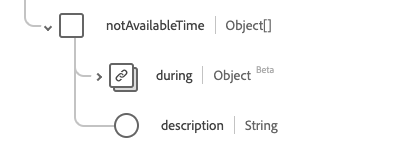

# [!UICONTROL 可用性]数据类型

[!UICONTROL 可用性]是描述项目的可用性数据的标准体验数据模型(XDM)数据类型。 此数据类型是根据HL7 FHIR Release 5规范创建的。

| 显示名称 | 属性 | 数据类型 | 描述 |
| --- | --- | --- | --- |
| [!UICONTROL 可用时间] | `availableTime` | 对象数组 | 项目可用的时间。 有关详细信息，请参阅下面[&#128279;](#available-time)的部分。 |
| [!UICONTROL 不可用时间] | `notAvailableTime` | 字符串 | 项目不可用的时间，并提供原因。 有关详细信息，请参阅下面[&#128279;](#not-available-time)的部分。 |

有关数据类型的更多详细信息，请参阅公共XDM存储库：

* [填充示例](https://github.com/adobe/xdm/blob/master/extensions/industry/healthcare/fhir/datatypes/availability.example.1.json)
* [完整架构](https://github.com/adobe/xdm/blob/master/extensions/industry/healthcare/fhir/datatypes/availability.schema.json)

## `availableTime` {#available-time}

`availableTime`作为对象数组提供。 每个对象的结构如下所述。

| 显示名称 | 属性 | 数据类型 | 描述 |
| --- | --- | --- | --- |
| [!UICONTROL 全天] | `allDay` | 布尔值 | 布尔值，指示该项是否始终可用。 |
| [!UICONTROL 可用结束时间] | `availableEndTime` | 字符串 | 项目在一天中停止可用的时间。 如果`allDay`为`true`，则忽略此项。 |
| [!UICONTROL 可用开始时间] | `availableStartTime` | 字符串 | 项目在一天中开始可用的时间。 如果`allDay`为`true`，则忽略此项。 |
| 一周中的[!UICONTROL 天] | `daysOfWeek` | 字符串数组 | 一个字符串数组，详细说明可用日期。 此属性的值必须等于以下一个或多个已知枚举值。 <li> `mon` </li> <li> `tues` </li> <li> `wed` </li> <li> `thurs`</li>  <li> `fri` </li> <li> `sat`</li> <li> `sun`</li> |

## `notAvailableTime` {#not-available-time}

`notAvailableTime`作为对象数组提供。 每个对象的结构如下所述。

| 显示名称 | 属性 | 数据类型 | 描述 |
| --- | --- | --- | --- |
| [!UICONTROL 期间] | `during` | [[!UICONTROL 周期]](../data-types/period.md) | 项目停止可用的时间段。 |
| [!UICONTROL 描述] | `description` | 字符串 | 项目不可用的原因。 |
