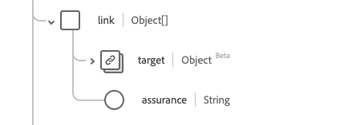

# [!UICONTROL 人员]数据类型

[!UICONTROL 人员]是提供有关一般人员记录的标准的体验数据模型(XDM)数据类型。 此数据类型是根据HL7 FHIR Release 5规范创建的。

| 显示名称 | 属性 | 数据类型 | 描述 |
| --- | --- | --- | --- |
| [!UICONTROL 地址] | `address` | [[!UICONTROL 地址]](../data-types/address.md)的数组 | 人员的一个或多个地址。 |
| [!UICONTROL 通信] | `communication` | 对象数组 | 可用于与个人沟通有关其健康情况的语言。 有关详细信息，请参阅下面[&#128279;](#communication)的部分。 |
| [!UICONTROL 标识符] | `identifier` | [[!UICONTROL 标识符]](../data-types/identifier.md)的数组 | 此人员的人类标识符。 |
| [!UICONTROL 个人链接详细信息] | `link` | 对象数组 | 与同一实际人员相关的资源链接。 有关详细信息，请参阅下面[&#128279;](#link)的部分。 |
| [!UICONTROL 管理组织] | `managingOrganization` | [[!UICONTROL 引用]](../data-types/reference.md) | 患者记录的保管机构。 |
| [!UICONTROL 婚姻状况] | `maritalStatus` | [[!UICONTROL 可编码的概念]](../data-types/codeable-concept.md) | 一个人的婚姻（或民事）状况 |
| [!UICONTROL 名称] | `name` | [[!UICONTROL 人工名称]](../data-types/human-name.md)的数组 | 与人员关联的名称。 |
| [!UICONTROL 联系人详细信息] | `telecom` | [[!UICONTROL 联系点]]的数组 | 联系人员时所使用的联系详细信息。 |
| [!UICONTROL 处于活动状态] | `active` | 布尔值 | 指示人员的记录是否正在使用中。 |
| [!UICONTROL 出生日期] | `birthDate` | 日期 | 人员的出生日期。 |
| [!UICONTROL 已死亡的指示器] | `deceasedBoolean` | 布尔值 | 指示人员是否已死亡。 |
| [!UICONTROL 已死亡的日期时间] | `deceasedDateTime` | 日期时间 | 如果人员已死亡，则为死亡日期和时间。 |
| [!UICONTROL 性别] | `gender` | 字符串 | 人员的性别身份。 此属性的值必须等于以下已知枚举值之一。 <li> `female` </li> <li> `male` </li> <li> `other` </li> <li> `unknown`</li> |

有关数据类型的更多详细信息，请参阅公共XDM存储库：

* [填充示例](https://github.com/adobe/xdm/blob/master/extensions/industry/healthcare/fhir/datatypes/identifier.example.1.json)
* [完整架构](https://github.com/adobe/xdm/blob/master/extensions/industry/healthcare/fhir/datatypes/identifier.schema.json)

## `communication` {#communication}

`communication`作为对象数组提供。 每个对象的结构如下所述。

| 显示名称 | 属性 | 数据类型 | 描述 |
| --- | --- | --- | --- |
| [!UICONTROL 语言] | `language` | [[!UICONTROL 可编码的概念]](../data-types/codeable-concept.md) | 可用于与个人沟通有关其健康的语言。 |
| [!UICONTROL 是首选语言] | `preferred` | 布尔值 | 指示语言是否为他们的首选语言。 |

## `link` {#link}

`link`作为对象数组提供。 每个对象的结构如下所述。

| 显示名称 | 属性 | 数据类型 | 描述 |
| --- | --- | --- | --- |
| [!UICONTROL Target] | `target` | [[!UICONTROL 引用]](../data-types/reference.md) | 此实际人员关联的资源。 |
| [!UICONTROL Assurance] | `assurance` | 字符串 | 与链接关联的保证级别。 此属性的值必须等于以下一个或多个已知枚举值。 <li> `level1` </li> <li> `level2` </li> <li> `level3` </li> <li> `level4` </li> |
