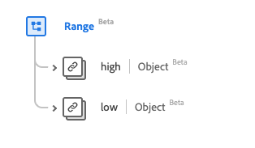

# [!UICONTROL 范围]数据类型

[!UICONTROL 范围]是一个标准体验数据模型(XDM)数据类型，它提供一组由低值和高值绑定的值。 此数据类型是根据HL7 FHIR Release 5规范创建的。

| 显示名称 | 属性 | 数据类型 | 描述 |
| --- | --- | --- | --- |
| [!UICONTROL 高] | `high` | [[!UICONTROL 简单数量]](../data-types/simple-quantity.md) | 最高限制。 |
| [!UICONTROL 低] | `low` | [[!UICONTROL 简单数量]](../data-types/simple-quantity.md) | 最低限制。 |

有关数据类型的更多详细信息，请参阅公共XDM存储库：

* [填充示例](https://github.com/adobe/xdm/blob/master/extensions/industry/healthcare/fhir/datatypes/range.example.1.json)
* [完整架构](https://github.com/adobe/xdm/blob/master/extensions/industry/healthcare/fhir/datatypes/range.schema.json)
