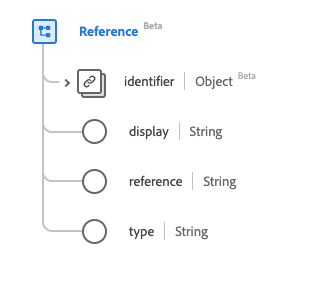

# [!UICONTROL 引用]数据类型

[!UICONTROL 引用]是一种标准的体验数据模型(XDM)数据类型，它提供了从一个资源到另一个资源的引用。 此数据类型是根据HL7 FHIR Release 5规范创建的。

| 显示名称 | 属性 | 数据类型 | 描述 |
| --- | --- | --- | --- |
| [!UICONTROL 标识符] | `identifier` | [[!UICONTROL 标识符]](../data-types/identifier.md) | 当文本引用未知时的逻辑引用。 |
| [!UICONTROL 显示区] | `display` | 字符串 | 引用的替换文本。 |
| [!UICONTROL 引用] | `reference` | 字符串 | 字面引用、相对URL、内部URL或绝对URL。 |
| [!UICONTROL 类型] | `type` | 字符串 | 引用引用的类型，表示为URI。 |

有关数据类型的更多详细信息，请参阅公共XDM存储库：

* [填充示例](https://github.com/adobe/xdm/blob/master/extensions/industry/healthcare/fhir/datatypes/reference.example.1.json)
* [完整架构](https://github.com/adobe/xdm/blob/master/extensions/industry/healthcare/fhir/datatypes/reference.schema.json)
