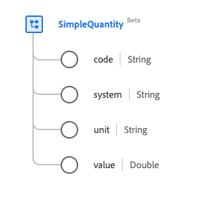

# [!UICONTROL 简单数量]数据类型

[!UICONTROL 简单数量]是提供测量或可测量数量的标准体验数据模型(XDM)数据类型。 此数据类型是根据HL7 FHIR Release 5规范创建的。

| 显示名称 | 属性 | 数据类型 | 描述 |
| --- | --- | --- | --- |
| [!UICONTROL 代码] | `code` | 字符串 | 单位的编码形式。 |
| [!UICONTROL 系统] | `system` | 字符串 | 定义编码单位形式的系统，表示为URI。 |
| [!UICONTROL 单位] | `unit` | 字符串 | 单位的表示形式。 |
| [!UICONTROL 值] | `value` | 两次 | 数值。 |

有关数据类型的更多详细信息，请参阅公共XDM存储库：

* [填充示例](https://github.com/adobe/xdm/blob/master/extensions/industry/healthcare/fhir/datatypes/simplequantity.example.1.json)
* [完整架构](https://github.com/adobe/xdm/blob/master/extensions/industry/healthcare/fhir/datatypes/simplequantity.schema.json)
