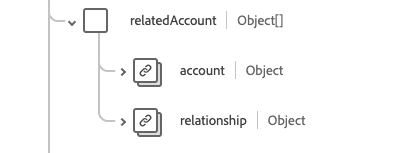

# [!UICONTROL 帐户]架构字段组

[!UICONTROL 帐户]是[[!DNL XDM Individual Profile] 类](../../../classes/individual-profile.md)和[[!DNL Provider class]](../../../classes/provider.md)的标准架构字段组。 它提供单个对象类型字段`healthcareAccount`，用于记录与向患者或个人组提供的医疗保健服务相关的事务、服务和其他财务信息（例如，出于保单或计费目的）。

| 显示名称 | 属性 | 数据类型 | 描述 |
| --- | --- | --- | --- |
| [!UICONTROL 余额] | `balance` | 对象数组 | 由财务系统计算和处理的帐户余额。 有关详细信息，请参阅下面的[部分](#balances)。 |
| [!UICONTROL 记帐状态] | `billingStatus` | [[!UICONTROL 可编码的概念]](../data-types/codeable-concept.md) | 这通过计费过程跟踪账户的生命周期。 它指示在将交易记录分配给帐户时如何处理这些交易记录。 |
| [!UICONTROL 覆盖范围] | `coverage` | 对象数组 | 负责支付此账户费用的各方以及应按何种顺序适用这些费用。 有关详细信息，请参阅下面[&#128279;](#coverage)的部分。 |
| [!UICONTROL 货币] | `currency` | [[!UICONTROL 可编码的概念]](../data-types/codeable-concept.md) | 帐户的默认货币。 |
| [!UICONTROL 诊断] | `diagnosis` | 对象数组 | 与帐单相关的诊断集合存储在此帐户中，以便能够在处理之前对它们进行适当的排序以产生申请。 有关详细信息，请参阅下面[&#128279;](#diagnosis)的部分。 |
| [!UICONTROL 担保人] | `guarantor` | 对象数组 | 如果其他付款选项不足，则负责平衡帐户的交易方。 有关详细信息，请参阅下面[&#128279;](#guarantor)的部分。 |
| [!UICONTROL 标识符] | `identifier` | [[!UICONTROL 标识符]](../data-types/identifier.md)的数组 | 用于引用帐户的唯一标识符。 该卡可能用于人，也可能不用于人（如信用卡号）。 |
| [!UICONTROL 所有者] | `owner` | [[!UICONTROL 引用]](../data-types/reference.md) | 指示服务区域、医院、部门等。 负责管理帐户。 |
| [!UICONTROL 过程] | `procedure` | 对象数组 | 与开票相关的一组程序存储在此处的帐户中，以便能够在处理索赔之前对它们进行适当的排序。 有关详细信息，请参阅下面[&#128279;](#procedure)的部分。 |
| [!UICONTROL 相关帐户] | `relatedAccount` | 对象数组 | 与此帐户相关的其他关联帐户。 有关详细信息，请参阅下面[&#128279;](#related-account)的部分。 |
| [!UICONTROL 服务时段] | `servicePeriod` | [[!UICONTROL 周期]](../data-types/period.md) | 与此帐户关联的服务的日期范围。 |
| [!UICONTROL 主题] | `subject` | [[!UICONTROL 引用]](../data-types/reference.md)的数组 | 标识产生费用的实体。 虽然直接接受服务或货物的实体可能与账户主体有关，但费用最终由账户主体承担。 |
| [!UICONTROL 类型] | `type` | [[!UICONTROL 可编码的概念]](../data-types/codeable-concept.md) | 对帐户进行分类，以便进行报告和搜索。 |
| [!UICONTROL 计算时间：] | `calculatedAt` | 日期时间 | 计算余额的时间。 |
| [!UICONTROL 描述] | `description` | 字符串 | 提供有关帐户跟踪内容及其使用方式的其他信息。 |
| [!UICONTROL 名称] | `name` | 字符串 | 帐户名称。 |
| [!UICONTROL 状态] | `status` | 字符串 | 帐户的状态。 此属性的值必须等于以下已知枚举值之一。 <li> `active` </li> <li> `inactive` </li> <li> `entered-in-error` </li> <li> `on-hold` </li> <li> `unknown`</li> |

有关字段组的更多详细信息，请参阅公共XDM存储库：

* [填充示例](https://github.com/adobe/xdm/blob/master/extensions/industry/healthcare/fhir/fieldgroups/account.example.1.json)
* [完整架构](https://github.com/adobe/xdm/blob/master/extensions/industry/healthcare/fhir/fieldgroups/account.schema.json)

## `balances` {#balances}

`balances`作为对象数组提供。 每个对象的结构如下所述。

| 显示名称 | 属性 | 数据类型 | 描述 |
| --- | --- | --- | --- |
| [!UICONTROL 聚合] | `aggregate` | [[!UICONTROL 可编码的概念]](../data-types/codeable-concept.md) | 谁来支付这部分余额。 |
| [!UICONTROL 金额] | `amount` | [[!UICONTROL 钱]](../data-types/money.md) | 为期限属性中定义的期限计算的实际余额。 |
| [!UICONTROL 术语] | `term` | [[!UICONTROL 可编码的概念]](../data-types/codeable-concept.md) | 帐户的期限。 |
| [!UICONTROL 估计] | `estimate` | 布尔值 | 如果金额为预计值。 |

## `coverage` {#coverage}

`coverage`作为对象数组提供。 每个对象的结构如下所述。

| 显示名称 | 属性 | 数据类型 | 描述 |
| --- | --- | --- | --- |
| [!UICONTROL 覆盖范围] | `coverage` | [[!UICONTROL 引用]](../data-types/reference.md) | 负责支付此账户费用的各方以及应按何种顺序适用这些费用。 |
| [!UICONTROL 优先级] | `priority` | 整数 | 此帐户上下文中的服务范围优先级，最小值为`0`。 |

## `diagnosis` {#diagnosis}

`diagnosis`作为对象数组提供。 每个对象的结构如下所述。

| 显示名称 | 属性 | 数据类型 | 描述 |
| --- | --- | --- | --- |
| [!UICONTROL 条件] | `condition` | [[!UICONTROL 可编码引用]](../data-types/codeable-reference.md) | 诊断与帐户相关。 |
| [!UICONTROL 包代码] | `packageCode` | [[!UICONTROL 可编码概念]](../data-types/codeable-concept.md)的数组 | 包代码可用于将可能作为单个产品（例如DRG）定价或交付的诊断分组。 |
| [!UICONTROL 类型] | `type` | [[!UICONTROL 可编码概念]](../data-types/codeable-concept.md)的数组 | 此诊断与帐户相关的类型（例如，接纳、计费、解除……）。 |
| [!UICONTROL 诊断日期] | `dateOfDiagnosis` | 日期时间 | 诊断日期（编码诊断时）。 |
| [!UICONTROL 正在录取] | `onAdmission` | 布尔值 | 入院时是否诊断。 |
| [!UICONTROL 序列] | `sequence` | 整数 | 诊断排名（针对每种类型），最小值为`0`。 |

## `guarantor` {#guarantor}

`guarantor`作为对象数组提供。 每个对象的结构如下所述。

| 显示名称 | 属性 | 数据类型 | 描述 |
| --- | --- | --- | --- |
| [!UICONTROL 参与方] | `party` | [[!UICONTROL 引用]](../data-types/reference.md) | 负责实体。 |
| [!UICONTROL 周期] | `period` | [[!UICONTROL 周期]](../data-types/period.md) | 担保人对账户承担责任的时间范围。 |
| [!UICONTROL 保留] | `onHold` | 布尔值 | 担保人可以采取信用冻结或者其他方式暂缓履行担保义务。 |

## `procedure` {#procedure}

`procedure`作为对象数组提供。 每个对象的结构如下所述。

| 显示名称 | 属性 | 数据类型 | 描述 |
| --- | --- | --- | --- |
| [!UICONTROL 代码] | `code` | [[!UICONTROL 可编码引用]](../data-types/codeable-reference.md) | 与帐户相关的过程。 |
| [!UICONTROL 设备] | `device` | [[!UICONTROL 引用]](../data-types/reference.md)的数组 | 与帐户相关过程关联的任何设备。 |
| [!UICONTROL 类型] | `type` | [[!UICONTROL 可编码概念]](../data-types/codeable-concept.md)的数组 | 应如何使用过程值对帐户收费。 |
| [!UICONTROL 包代码] | `packageCode` | [[!UICONTROL 可编码概念]](../data-types/codeable-concept.md)的数组 | 包代码可用于对可能作为单个产品（例如DRG）进行定价或交付的过程进行分组。 |
| [!UICONTROL 服务日期] | `dateOfService` | 日期时间 | 使用编码过程的日期。 如果使用对过程的引用，则应使用过程的日期。 |
| [!UICONTROL 序列] | `sequence` | 整数 | 过程的排名（针对每种类型），最小值为`0`。 |

## `relatedAccount` {#related-account}

`relatedAccount`作为对象数组提供。 每个对象的结构如下所述。

| 显示名称 | 属性 | 数据类型 | 描述 |
| --- | --- | --- | --- |
| [!UICONTROL 帐户] | `account` | [[!UICONTROL 引用]](../data-types/reference.md) | 对关联帐户的引用。 |
| [!UICONTROL 关系] | `relationship` | [[!UICONTROL 可编码的概念]](../data-types/codeable-concept.md) | 关联帐户的关系。 |
