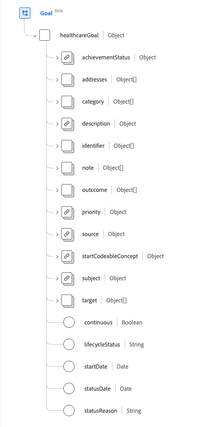
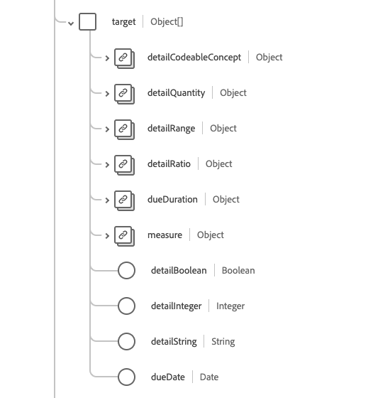

# [!UICONTROL 目标]架构字段组

[!UICONTROL 目标]是[[!DNL XDM Individual Profile] 类](../../../classes/individual-profile.md)和[[!DNL Provider class]](../../../classes/provider.md)的标准架构字段组。 它提供单个对象类型字段`healthcareGoal`，用于描述患者、组或组织护理的预期目标。

| 显示名称 | 属性 | 数据类型 | 描述 |
| --- | --- | --- | --- |
| [!UICONTROL 完成状态] | `achievementStatus` | [[!UICONTROL 可编码的概念]](../data-types/codeable-concept.md) | 描述相对于目标向目标的进展或缺少进展。 |
| [!UICONTROL 地址] | `addresses` | [[!UICONTROL 引用]](../data-types/reference.md)的数组 | 目标所要解决的条件和其他健康记录元素。 |
| [!UICONTROL 类别] | `category` | [[!UICONTROL 可编码概念]](../data-types/codeable-concept.md)的数组 | 指示目标所属的类别，例如饮食或行为。 |
| [!UICONTROL 描述] | `description` | [[!UICONTROL 可编码的概念]](../data-types/codeable-concept.md) | 描述目标的代码或文本。 |
| [!UICONTROL 标识符] | `identifier` | [[!UICONTROL 标识符]](../data-types/identifier.md)的数组 | 执行者或其他系统分配给此目标的业务标识符，当资源更新并在服务器之间传播时，这些业务标识符保持不变。 |
| [!UICONTROL 注释] | `note` | [[!UICONTROL 批注]](../data-types/annotation.md)的数组 | 有关目标的注释。 |
| [!UICONTROL 结果] | `outcome` | [[!UICONTROL 可编码引用]](../data-types/codeable-reference.md)的数组 | 标识在评估目标状态时发生的更改（或缺少更改）。 |
| [!UICONTROL 优先级] | `priority` | [[!UICONTROL 可编码的概念]](../data-types/codeable-concept.md) | 确定与实现或维持目标相关的相互商定的重要性级别。 |
| [!UICONTROL Source] | `source` | [[!UICONTROL 引用]](../data-types/reference.md) | 指示目标的来源，如患者或从业者。 |
| [!UICONTROL 开始可编码的概念] | `startCodeableConcept` | [[!UICONTROL 可编码的概念]](../data-types/codeable-concept.md) | 随后应说服目标完成的事件。 |
| [!UICONTROL 主题 |]`subject` | [[!UICONTROL 引用]](../data-types/reference.md) | 确定确定目标的建立者、患者、组或组织。 |
| [!UICONTROL Target] | `target` | 对象数组 | 指示目标中特定步骤的时间线。 有关详细信息，请参阅下面[&#128279;](#target)的部分。 |
| [!UICONTROL 连续] | `continous` | 布尔值 | 指示实现目标后是否需要持续活动以保持目标目标。 |
| [!UICONTROL 生命周期状态] | `lifecycleStatus` | 字符串 | 目标生命周期的状态。 此属性的值必须等于以下已知枚举值之一。 <li> `proposed` </li> <li> `planned` </li> <li> `accepted` </li> <li> `active` </li> <li> `on-hold` </li> <li> `completed` </li> <li> `cancelled` </li> <li> `entered-in-error` </li> <li> `rejected` </li> |
| [!UICONTROL 开始日期] | `startDate` | 日期 | 开始追求目标的日期。 |
| [!UICONTROL 状态日期] | `statusDate` | 日期 | 标识创建状态的时间。 |
| [!UICONTROL 状态原因] | `statusReason` | 字符串 | 捕获当前状态的原因。 |

有关字段组的更多详细信息，请参阅公共XDM存储库：

* [填充示例](https://github.com/adobe/xdm/blob/master/extensions/industry/healthcare/fhir/fieldgroups/goal.example.1.json)
* [完整架构](https://github.com/adobe/xdm/blob/master/extensions/industry/healthcare/fhir/fieldgroups/goal.example.1.json)

## `target` {#target}

`target`作为对象数组提供。 每个对象的结构如下所述。

| 显示名称 | 属性 | 数据类型 | 描述 |
| --- | --- | --- | --- |
| [!UICONTROL 详细可编码概念] | `detailCodeableConcept` | [[!UICONTROL 可编码的概念]](../data-types/codeable-concept.md) | 要达到的目标代码，表示目标的实现。 |
| [!UICONTROL 详细信息数量] | `detailQuantity` | [[!UICONTROL 数量]](../data-types/quantity.md) | 为表示目标完成而需达到的目标数量。 |
| [!UICONTROL 详细信息范围] | `detailRange` | [[!UICONTROL Range]](../data-types/range.md) | 达到的指标范围，表示目标的实现。 |
| [!UICONTROL 明细比率] | `detailRatio` | [[!UICONTROL 比率]](../data-types/ratio.md) | 达到的指标比率，表示达到目标。 |
| [!UICONTROL 度量值] | `measure` | [[!UICONTROL 可编码的概念]](../data-types/codeable-concept.md) | 正在跟踪作为值的参数。 |
| [!UICONTROL 详细信息布尔值] | `detailBoolean` | 布尔值 | 指示目标的实现。 |
| [!UICONTROL 详细信息整数] | `detailInteger` | 整数 | 达到的指标数，表示目标的实现。 |
| [!UICONTROL 详细信息字符串] | `detailString` | 字符串 | 实现的目标值，表示目标的实现。 |
| [!UICONTROL 到期日期] | `dueDate` | 日期 | 应实现目标的日期。 |
