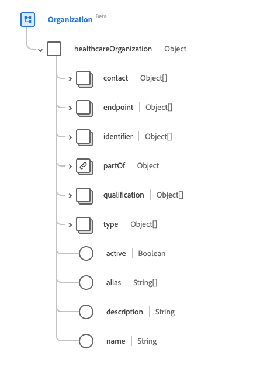

# [!UICONTROL 组织]架构字段组

[!UICONTROL 组织]是[[!DNL XDM Individual Profile] 类](../../../classes/individual-profile.md)和[[!DNL Provider class]](../../../classes/provider.md)的标准架构字段组。 它提供单个对象类型字段`healthcareOrganization`，其中包含有关具有共同目的的人员或组织分组的信息。

| 显示名称 | 属性 | 数据类型 | 描述 |
| ---| --- | --- | --- |
| [!UICONTROL 联系人详细信息] | `contact` | [[!UICONTROL 扩展联系人详细信息]](../data-types/extended-contact-detail.md)的数组 | 特定组织可用的通信设备的联系详细信息。 这可能包括地址、电话号码、传真号、手机号码、电子邮件地址和网站。 |
| [!UICONTROL 终结点] | `endpoint` | [[!UICONTROL 引用]](../data-types/reference.md)的数组 | 技术端点，用于提供对组织运营的服务的访问。 |
| [!UICONTROL 标识符] | `indentifier` | [[!UICONTROL 标识符]](../data-types/identifier.md)的数组 | 用于跨多个完全不同的系统标识组织的标识符。 |
| [!UICONTROL 组织的一部分] | `partOf` | [[!UICONTROL 引用]](../data-types/reference.md) | 此组织所属的组织。 |
| [!UICONTROL 资格] | `qualification` | 对象数组 | 授权和/或以其他方式认可本组织提供护理的正式认证、认证、培训、指定和许可证。 有关详细信息，请参阅下面[&#128279;](#qualification)的部分。 |
| [!UICONTROL 类型] | `type` | [[!UICONTROL 可编码概念]](../data-types/codeable-concept.md)的数组 | 是哪种组织。 |
| [!UICONTROL 活动] | `active` | 布尔值 | 组织的记录是否仍在使用中。 |
| [!UICONTROL 别名] | `alias` | 字符串数组 | 组织称为或过去称为的备用名称列表。 |
| [!UICONTROL 描述] | `description` | 字符串 | 组织的描述，有助于提供常规上下文以确保选择正确的组织。 |
| [!UICONTROL 名称] | `name` | 字符串 | 与组织关联的名称。 |

有关字段组的更多详细信息，请参阅公共XDM存储库：

* [填充示例](https://github.com/adobe/xdm/blob/master/extensions/industry/healthcare/fhir/fieldgroups/coverage.example.1.json)
* [完整架构](https://github.com/adobe/xdm/blob/master/extensions/industry/healthcare/fhir/fieldgroups/coverage.schema.json)

## `qualification` {#qualification}

`qualification`作为对象数组提供。 每个对象的结构如下所述。

| 显示名称 | 属性 | 数据类型 | 描述 |
| --- | --- | --- | --- |
| [!UICONTROL 代码] | `code` | [[!UICONTROL 可编码的概念]](../data-types/codeable-concept.md) | 资格的编码表示形式。 |
| [!UICONTROL 标识符] | `identifier` | [[!UICONTROL 标识符]](../data-types/identifier.md)的数组 | 分配给此组织的此资格的标识符。 |
| [!UICONTROL 颁发者] | `issuer` | [[!UICONTROL 引用]](../data-types/reference.md) | 管理和发布资格的组织。 |
| [!UICONTROL 周期] | `period` | [[!UICONTROL 周期]](../data-types/period.md) | 资格的有效期。 |
