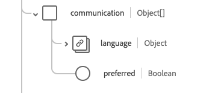

# [!UICONTROL 患者]架构字段组

[!UICONTROL 患者]是[[!DNL XDM Individual Profile] 类](../../../classes/individual-profile.md)的标准架构字段组。 它提供单个对象类型字段`healthcarePatient`，该字段捕获有关接受护理或其他健康相关服务的个人或动物的人口统计和其他管理详细信息。

| 显示名称 | 属性 | 数据类型 | 描述 |
| --- | --- | --- | --- |
| [!UICONTROL 地址] | `address` | [[!UICONTROL 地址]](../data-types/address.md)的数组 | 患者的地址信息。 |
| [!UICONTROL 通信] | `communication` | 对象数组 | 一种语言，可用于与患者沟通他们的健康状况。 有关详细信息，请参阅下面[&#128279;](#communication)的部分。 |
| [!UICONTROL 患者联系人] | `contact` | 对象数组 | 患者的联系方，如监护人、伴侣或朋友。 有关详细信息，请参阅下面[&#128279;](#contact)的部分。 |
| [!UICONTROL 普通从业者] | `generalPractioner` | [[!UICONTROL 引用]](../data-types/reference.md)的数组 | 患者的初级保健提供者。 |
| [!UICONTROL 标识符] | `identifier` | [[!UICONTROL 标识符]](../data-types/identifier.md)的数组 | 患者的标识符。 |
| [!UICONTROL 患者链接详细信息] | `link` | 对象数组 | 与同一个人相关的患者或相关人员资源的链接。 有关详细信息，请参阅下面[&#128279;](#link)的部分。 |
| [!UICONTROL 管理组织] | `managingOrganization` | [[!UICONTROL 引用]](../data-types/reference.md) | 患者记录的托管组织。 |
| [!UICONTROL 婚姻状况] | `maritalStatus` | [[!UICONTROL 可编码的概念]](../data-types/codeable-concept.md) | 患者的婚姻状况。 |
| [!UICONTROL 名称] | `name` | [[!UICONTROL 人工名称]](../data-types/human-name.md)的数组 | 与患者关联的名称。 |
| [!UICONTROL 联系人详细信息] | `telecom` | [[!UICONTROL 联系点]](../data-types/contact-point.md)的数组 | 联系详细信息，例如电话号码或电子邮件地址，可通过该联系联系联系联系患者。 |
| [!UICONTROL 处于活动状态] | `active` | 布尔值 | 指示患者的记录是否正在被使用。 |
| [!UICONTROL 出生日期] | `birthDate` | 日期 | 患者的出生日期。 |
| [!UICONTROL 已死亡的指示器] | `deceasedBoolean` | 布尔值 | 指示患者是否已死亡。 |
| [!UICONTROL 已死亡的日期时间] | `deceasedDateTime` | 日期时间 | 病人死亡的日期和时间。 |
| [!UICONTROL 性别] | `gender` | 字符串 | 人员的性别身份。 此属性的值必须等于以下已知枚举值之一。 <li> `female` </li> <li> `male` </li> <li> `other` </li> <li> `unknown`</li> |
| [!UICONTROL 是多胞胎]的一部分 | `multipleBirthBoolean` | 布尔值 | 指示患者是否为多胞胎的一员。 |
| [!UICONTROL 出生编号] | `multipleBirthInteger` | 整数 | 序列中的出生编号。 |

有关字段组的更多详细信息，请参阅公共XDM存储库：

* [填充示例](https://github.com/adobe/xdm/blob/master/extensions/industry/healthcare/fhir/fieldgroups/patient.example.1.json)
* [完整架构](https://github.com/adobe/xdm/blob/master/extensions/industry/healthcare/fhir/fieldgroups/patient.schema.json)

## `communication` {#communication}

`communication`作为对象数组提供。 每个对象的结构如下所述。

| 显示名称 | 属性 | 数据类型 | 描述 |
| --- | --- | --- | --- |
| [!UICONTROL 语言] | `language` | [[!UICONTROL 可编码的概念]](../data-types/codeable-concept.md) | 可用于与个人沟通有关其健康情况的语言。 |
| [!UICONTROL 是首选语言] | `preferred` | 布尔值 | 指示语言是否为他们的首选语言。 |

## `contact` {#contact}

`contact`作为对象数组提供。 每个对象的结构如下所述。

| 显示名称 | 属性 | 数据类型 | 描述 |
| --- | --- | --- | --- |
| [!UICONTROL 联系地址] | `address` | [[!UICONTROL 地址]](../data-types/address.md) | 联系人的地址。 |
| [!UICONTROL 联系人姓名] | `name` | [[!UICONTROL 人名]](../data-types/human-name.md) | 联系人的姓名。 |
| [!UICONTROL 联系组织] | `organization` | [[!UICONTROL 引用]](../data-types/reference.md) | 与联系人关联的组织。 |
| [!UICONTROL 联系期间] | `period` | [[!UICONTROL 周期]](../data-types/period.md) | 联系人使用或正在使用的时段。 |
| [!UICONTROL 关系&#39;] | `relationship` | [[!UICONTROL 可编码的概念]](../data-types/codeable-concept.md) | 患者和联系人之间的关系。 |
| [!UICONTROL 联系人详细信息] | `telecom` | 对象数组 | 联系人的联系详细信息。 有关详细信息，请参阅下面[&#128279;](#telecom)的部分。 |
| [!UICONTROL 性别] | `gender` | 字符串 | 人员的性别身份。 此属性的值必须等于以下已知枚举值之一。 <li> `female` </li> <li> `male` </li> <li> `other` </li> <li> `unknown`</li> |

### `telecom` {#telecom}

`telecom`作为对象数组提供。 每个对象的结构如下所述。

| 显示名称 | 属性 | 数据类型 | 描述 |
| --- | --- | --- | --- |
| [!UICONTROL 联系点] | `contactPoint` | [[!UICONTROL 联系点]](../data-types/contact-point.md) | 人员的联系人详细信息。 |

## `link` {#link}

`link`作为对象数组提供。 每个对象的结构如下所述。

| 显示名称 | 属性 | 数据类型 | 描述 |
| --- | --- | --- | --- |
| [!UICONTROL 其他] | `other` | [[!UICONTROL 引用]](../data-types/reference.md) | 与同一个人相关的患者或相关人员资源的链接。 |
| [!UICONTROL 类型] | `type` | 字符串 | 两个患者资源之间的链接类型。 |
