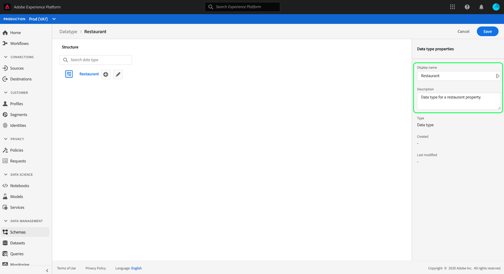

# 使用Experience PlatformUI创建和编辑数据类型

在体验数据模型(XDM)中，数据类型与基本文本字段的使用方式相同地用作类或混合中的引用类型字段，关键区别在于数据类型可以定义多个子字段。 虽然与混音类似，它们允许多字段结构的一致使用，但数据类型更灵活，因为它们可以包含在模式结构中的任何位置，而混音只能添加在根级别。

Adobe Experience Platform提供许多标准数据类型，可用于涵盖各种常见体验管理用例。 但是，您也可以定义自己的自定义数据类型以满足您独特的业务需求。

本教程介绍在平台用户界面中创建和编辑自定义数据类型的步骤。

## 先决条件

本教程需要对XDM系统有一定的了解。 有关XDM在 [Experience Platform生态系统中](../home.md) 所起作用的介绍，请参阅XDM概述，并 [介绍模式构成的基](../schema/composition.md) 础知识，了解数据类型对XDM模式的贡献。

虽然本教程不是必需的，但建议您也要按照教 [程在UI中编写模式](./-schema-ui.md) ，以熟悉该教程的各种功能 [!DNL Schema Editor]。

## 打开 [!DNL Schema Editor] 数据类型

在平台UI中，在左侧 **[!UICONTROL 导航]** 中选择模式以打开 [!UICONTROL 模式工] 作区 **[!UICONTROL ，然后选择]** 数据类型选项卡。 将显示可用列表类型的Adobe，包括由定义的数据类型以及由您的组织创建的数据类型。

从此处，您有两个选择：

* [创建新数据类型](#create)
* [选择要编辑的现有数据类型](#edit)

### 创建新数据类型 {#create}

从“数据 **[!UICONTROL 类型”选]** 项卡中，选 **[!UICONTROL 择“创建数据类型”]**。

此时 [!DNL Schema Editor] 将显示画布中新数据类型的当前结构。 在编辑器的右侧，您可以为数据类型提供显示名称和可选说明。 确保为数据类型提供唯一且简明的名称，因为在将数据类型添加到模式时，将如何识别该数据类型。

本教程创建描述餐馆属性的数据类型，因此该数据类型的显示名称为“餐馆”。

跳到下一 [节](#add-fields) ,开始向数据类型添加字段。

### 编辑现有数据类型

只能编辑您的组织定义的自定义数据类型。 要缩小显示的列表范围，请选择筛选器图标()以显示要基于所有者进行筛选的 [!UICONTROL 控件]。 选择 **[!UICONTROL 客户]** ，以仅显示您组织拥有的自定义数据类型。

从列表中选择要编辑的数据类型以打开右边栏，其中显示数据类型的详细信息。 在右边栏中选择数据类型的名称，以在中打开其结构 [!DNL Schema Editor]。

## 向数据类型添加字段 {#add-fields}

要开始将字段添加到类 **型** ，请选择画布中根级字段旁边的加号(+)图标。 下面将显示一个新字段，右边栏将更新以显示新字段的控件。

使用右边栏控件为字段 **[!UICONTROL 提供字段名]****[!UICONTROL 称、显]****[!UICONTROL 示名称]** 和类型。 请注意，字段的类型可能是基本标量类型（如字符串、整数或布尔值），也可以表示由Adobe或您的组织定义的其他多字段数据类型。

餐厅数据类型需要一个字符串字段来表示餐馆的名称。 因此，字 [!UICONTROL 段名] 称设置为“name”，类型 [!UICONTROL 设置] 为 [!UICONTROL “]字符串”。 选择 **[!UICONTROL 应用]** ，将更改应用到字段。

继续执行添加其他字段的相同过程，首先 **选择根级字段旁的加号** (+)图标，并在右边栏中提供配置详细信息。

Restaurant数据类型现在为品牌、座位容量和占地面积增加了更多字段。

除了基本字段之外，您还可以在自定义数据类型中嵌套其他数据类型。 例如，Restaurant数据类型需要一个表示属性物理地址的字段。 在此方案中，您可以添加新的“地址”字段，该字段已分配标准数据类型“[!UICONTROL 邮政地址]”。

这说明在描述数据时，数据类型的灵活性如何：数据类型可以使用字段，这些字段也是数据类型，它们本身可以包含更多数据类型，等等。 这使您能够在整个XDM模式中抽象和重复使用常见数据模式，从而更轻松地表示复杂的数据结构。

在将字段添加完数据类型后，选择 **[!UICONTROL 保存]** ，以保存更改并将数据类型添加到 [!DNL Schema Library]。

## 将数据类型添加到混音

创建数据类型后，即可在模式中使用它。 由于XDM模式由类和零个或多个混音组成，因此不能直接将数据类型提供的字段添加到模式。 相反，它们必须包含在类或混音中。

>[!NOTE]
>
>本节侧重于向混音添加数据类型，因为这是自定义数据类型最常见的模式。 但是，您也可以应用相同的步骤来将数据类型添加到类中。

您可以将数据类型添加到现有混音中，或完全创建新混音。 无论哪种情况，您都必 [!DNL Schema Editor] 须打开要向其添加新模式类型的模式，方法是从“浏览”选项卡中选择现有， **** 或者全部创建新模式。

在中打开模式后， [!DNL Schema Editor]在左边栏中选择要将数据类型添加到的混音。 如果模式没有合适的混音，请按照以下步骤 [创建新的混音](./create-schema-ui.md#define-mixin) ，然后添加到模式，并确保在左边栏中选择了混音。

选择 **模式名称旁的加号** (+)图标，为所选混音添加新字段。 为字段选 **[!UICONTROL 择]** “类型”属性时，您之前创建的数据类型的名称现在在下拉列表中可用。 您可以开始键入数据类型的名称以帮助更轻松地找到它。

从列表中选择您的数据类型，然后选择应 **[!UICONTROL 用]**。 模式字段在画布中更新，以显示数据类型提供的结构化子字段。 如果通过选择“保存”来保 **[!UICONTROL 存模式]**，则也会保存混音，这样您便可以在属于同一类的其他模式中重用混音。

>[!NOTE]
>
>Mixin只与一个类兼容。 如果要在基于不同类的其他模式中使用数据类型，则必须按照上述步骤将数据类型添加到用于扩展这些类的其他混合中。

## 后续步骤

本教程介绍了如何创建和编辑数据类型，以及如何使用将它们添加到混音中 [!DNL Schema Editor]。 要进一步了解如何在UI中使用数据类型（包括如何将多字段对象转换为数据类型），请参阅 [模式创建教程](./create-schema-ui.md#datatype)。

要了解如何使用模式注册表API创建数据类型，请参阅数据 [类型端点指南](../api/data-types.md#create)。