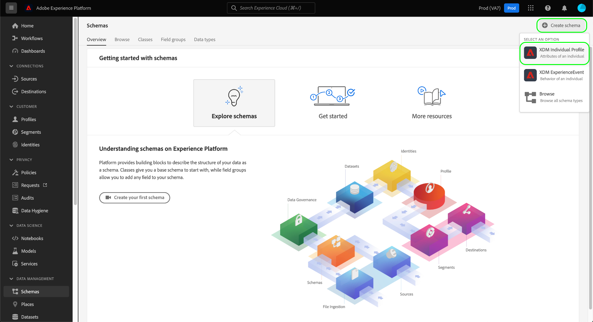
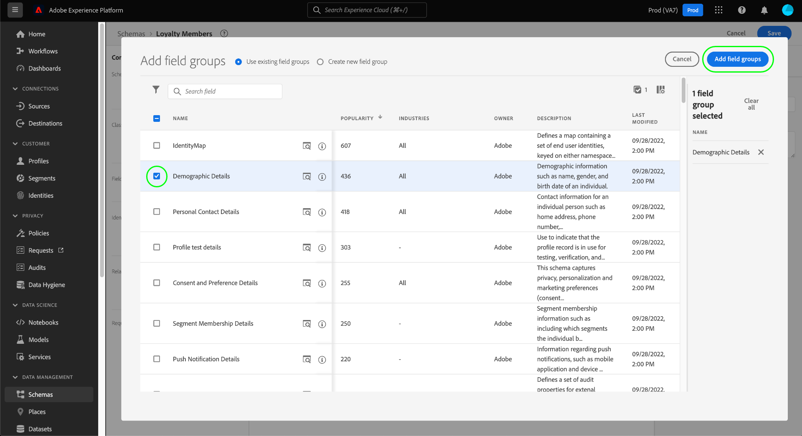
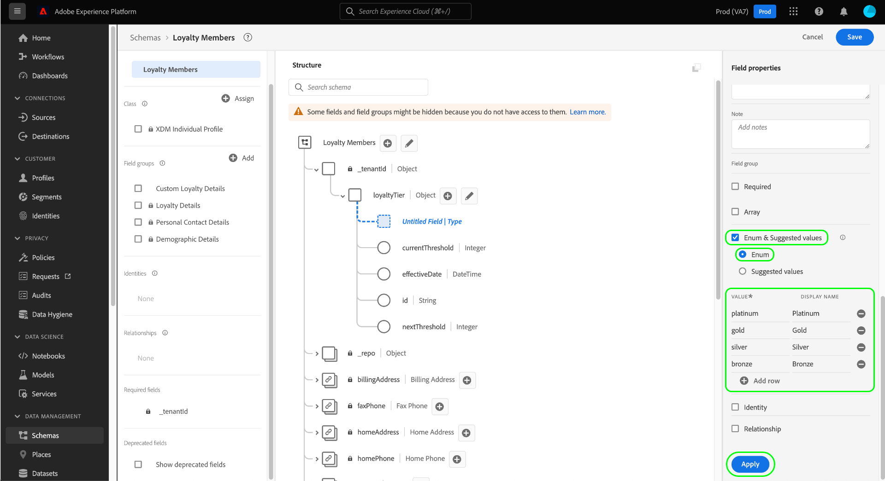

# 使用创建架构 [!DNL Schema Editor]

利用Adobe Experience Platform用户界面，可创建和管理 [!DNL Experience Data Model] (XDM)模式(位于称为 [!DNL Schema Editor]. 本教程介绍如何使用 [!DNL Schema Editor].

>[!NOTE]
>
>出于演示目的，本教程中的步骤涉及创建一个描述客户忠诚度计划成员的示例架构。 虽然您可以使用这些步骤为自己创建不同的架构，但建议您先创建示例架构，以了解 [!DNL Schema Editor].

如果您希望使用 [!DNL Schema Registry] 而是从读取 [[!DNL Schema Registry] 开发人员指南](../api/getting-started.md) 在尝试教程之前 [使用API创建模式](create-schema-api.md).

## 快速入门

本教程需要对创建架构时涉及的Adobe Experience Platform各个方面有一定的了解。 在开始本教程之前，请查看有关以下概念的文档：

* [[!DNL Experience Data Model (XDM)]](../home.md):标准化框架， [!DNL Platform] 组织客户体验数据。
   * [架构组合的基础知识](../schema/composition.md):XDM架构及其构建块的概述，包括类、架构字段组、数据类型和单个字段。
* [[!DNL Real-Time Customer Profile]](../../profile/home.md):根据来自多个来源的汇总数据提供统一的实时客户资料。

## 打开 [!UICONTROL 模式] 工作区 {#browse}

的 [!UICONTROL 模式] 工作区 [!DNL Platform] UI提供了 [!DNL Schema Library]，用于查看管理组织可用的架构。 工作区还包括 [!DNL Schema Editor]，在本教程中，您可以在画布上撰写架构。

登录后 [!DNL Experience Platform]，选择 **[!UICONTROL 模式]** 在左侧导航中打开 **[!UICONTROL 模式]** 工作区。 的 **[!UICONTROL 浏览]** 选项卡显示架构列表(表示 [!DNL Schema Library])，您可以查看和自定义。 该列表包括架构所基于的名称、类型、类和行为（记录或时间序列），以及上次修改架构的日期和时间。

请参阅 [在UI中浏览现有XDM资源](../ui/explore.md) 以了解更多信息。

## 创建和命名架构 {#create}

要开始合成架构，请选择 **[!UICONTROL 创建架构]** 的右上角 **[!UICONTROL 模式]** 工作区。 此时会出现一个下拉菜单，允许您选择在核心类之间进行选择 [!UICONTROL XDM个人配置文件] 和 [!UICONTROL XDM ExperienceEvent]. 如果这些类不适合您的目的，您还可以选择 **[!UICONTROL 浏览]** 从其他可用类中进行选择，或 [创建新类](#create-new-class).

在本教程中，请选择 **[!UICONTROL XDM个人配置文件]**.

的 [!DNL Schema Editor] 中。 这是用于构建架构的画布。 将在 **[!UICONTROL 结构]** 编辑器时显示画布的部分，以及基于该类的所有架构中包含的标准字段。 架构的分配类也列在 **[!UICONTROL 类]** in **[!UICONTROL 组合物]** 中。

>[!NOTE]
>
>您可以 [更改模式的类](#change-class) 在保存架构之前，在初始组合过程中的任何时间点，都应格外谨慎地执行此操作。 字段组仅与某些类兼容，因此更改类将重置画布和您添加的任何字段。

在 **[!UICONTROL 架构属性]**，为架构提供显示名称和可选描述。 输入名称后，画布会随之更新，以反映架构的新名称。

在决定架构的名称时，需要考虑以下几个重要事项：

* 架构名称应当简短且具有描述性，以便以后可以轻松找到架构。
* 架构名称必须是唯一的，这意味着它还应具有足够的特定性，以便将来不会重复使用。 例如，如果贵组织针对不同品牌分别实施了不同的忠诚度计划，则最好将架构命名为“品牌A忠诚度会员”，以便轻松与其他可能在以后定义的与忠诚度相关的架构区分开来。
* 您还可以使用架构描述提供有关该架构的任何其他上下文信息。

本教程将组成一个架构，用于摄取与忠诚度计划成员相关的数据，因此该架构名为“[!DNL Loyalty Members]&quot;

## 添加字段组 {#field-group}

现在，您可以通过添加字段组，开始向架构添加字段。 字段组是由一个或多个字段组成的组，这些字段通常一起用于描述特定概念。 本教程使用字段组描述忠诚度计划的成员，并捕获关键信息，如姓名、生日、电话号码、地址等。

要添加字段组，请选择 **[!UICONTROL 添加]** 在 **[!UICONTROL 字段组]** 子部分。

此时会出现一个新对话框，其中显示了可用字段组的列表。 每个字段组仅用于特定类，因此该对话框仅列出与您选择的类兼容的字段组(在本例中， [!DNL XDM Individual Profile] 类)。 如果您使用标准XDM类，则将根据使用情况的受欢迎程度对字段组列表进行智能排序。

您可以选择左边栏中的其中一个过滤器，以将标准字段组列表缩小到特定 [工业](../schema/industries/overview.md) 比如零售、金融服务和医疗保健。

从列表中选择字段组会使其显示在右边栏中。 您可以根据需要选择多个字段组，在确认之前，将每个字段组添加到右边栏的列表。 此外，当前选定字段组的右侧会显示一个图标，用于预览其提供的字段结构。

预览字段组时，右边栏中提供了字段组架构的详细描述。 您还可以在提供的画布中浏览字段组的字段。 当您选择不同的字段时，右边栏会更新，以显示有关该字段的详细信息。 选择 **[!UICONTROL 返回]** 预览完成以返回到字段组选择对话框时。

在本教程中，选择 **[!UICONTROL 人口统计详细信息]** 字段组，然后选择 **[!UICONTROL 添加字段组]**.

将重新显示架构画布。 的 **[!UICONTROL 字段组]** 部分现在列表“[!UICONTROL 人口统计详细信息]和 **[!UICONTROL 结构]** 部分包括字段组贡献的字段。 您可以在 **[!UICONTROL 字段组]** 部分来突出显示画布中提供的特定字段。

此字段组将在顶级名称下提供多个字段 `person` 数据类型为“[!UICONTROL 人员]&quot; 这组字段描述有关个人的信息，包括姓名、出生日期和性别。

>[!NOTE]
>
>请记住，字段可能使用标量类型（如字符串、整数、数组或日期），以及 [!DNL Schema Registry].

请注意， `name` 字段的数据类型为“[!UICONTROL 全名]“，这意味着它也描述了通用概念，并包含与名称相关的子字段，如名字、姓氏、礼貌标题和后缀。

选择画布中的不同字段，以显示它们对架构结构贡献的任何其他字段。

## 添加更多字段组 {#field-group-2}

您现在可以重复相同步骤以添加其他字段组。 当您查看 **[!UICONTROL 添加字段组]** 此时，请注意[!UICONTROL 人口统计详细信息]“ ”字段组呈灰显状态，其旁边的复选框无法选中。 这样可防止意外复制当前架构中已包含的字段组。

在本教程中，选择标准字段组 **[!UICONTROL 个人联系详细信息]** 和 **[!UICONTROL 忠诚度详细信息]** 从列表中，选择 **[!UICONTROL 添加字段组]** 以将其添加到架构。

画布将重新显示，并且添加的字段组列在 **[!UICONTROL 字段组]** 在 **[!UICONTROL 组合物]** 部分，以及其添加到架构结构中的复合字段。

## 定义自定义字段组 {#define-field-group}

的 [!UICONTROL 忠诚会员] 架构用于捕获与忠诚度计划成员相关的数据，以及 [!UICONTROL 忠诚度详细信息] 添加到架构的字段组提供了其中的大多数内容，包括项目类型、点、加入日期等。

但是，在某种情况下，您可能希望包含标准字段组未涵盖的其他自定义字段，以便实现用例。 添加自定义忠诚度字段时，有两个选项可用：

1. 创建新的自定义字段组以捕获这些字段。 本教程将介绍此方法。
1. 扩展标准 [!UICONTROL 忠诚度详细信息] 字段组。 这是原因 [!UICONTROL 忠诚度详细信息] 将转换为自定义字段组，并且原始标准字段组将不再可用。 请参阅 [!UICONTROL 模式] UI指南，以了解有关 [向标准字段组的结构添加自定义字段](../ui/resources/schemas.md#custom-fields-for-standard-groups).

要创建新字段组，请选择 **[!UICONTROL 添加]** 在 **[!UICONTROL 字段组]** 子部分，但此时选择 **[!UICONTROL 新建字段组]** 在显示的对话框顶部附近。 然后，系统会要求您提供新字段组的显示名称和描述。 在本教程中，将新字段组命名为“[!DNL Custom Loyalty Details]&quot;，然后选择 **[!UICONTROL 添加字段组]**.

>[!NOTE]
>
>与类名称一样，字段组名称应简短，用于描述字段组将对架构做出贡献。 这些名称也是唯一的，因此您将无法重复使用该名称，因此必须确保该名称足够具体。

&quot;[!DNL Custom Loyalty Details]“ ”现在应位于下 **[!UICONTROL 字段组]** 画布左侧，但是还没有与其关联的字段，因此在下面不会显示任何新字段 **[!UICONTROL 结构]**.

## 向字段组添加字段 {#field-group-fields}

现在，您已创建了[!DNL Custom Loyalty Details]“字段组”，则应定义字段组将对架构贡献的字段。

要开始，请选择 **加号(+)** 图标。

An &quot;[!UICONTROL 无标题字段]“占位符”将显示在画布中，并且右边栏会更新，以显示字段的配置选项。

在此方案中，架构需要有一个对象类型字段来详细描述人员的当前忠诚度等级。 使用右边栏中的控件，开始创建 `loyaltyTier` 类型为“[!UICONTROL 对象]“ ”，用于保存您的相关字段。

在 **[!UICONTROL 分配给]**，则必须选择要将字段分配到的字段组。 请记住，所有架构字段都属于类或字段组，由于此架构使用标准类，因此您的唯一选项是选择字段组。 开始键入名称“[!DNL Custom Loyalty Details]&quot; ，然后从列表中选择字段组。

完成后，选择 **[!UICONTROL 应用]**.

将应用更改并新建 `loyaltyTier` 对象。 由于这是自定义字段，因此它会自动嵌套在与贵组织的租户ID起节点的对象名称中，前面带有下划线(`_tenantId` )。

>[!NOTE]
>
>租户ID对象的存在表示您添加的字段包含在您组织的命名空间中。
>
>换言之，您添加的字段对贵组织是唯一的，并将保存在 [!DNL Schema Registry] 特定区域（仅供贵组织访问）。 必须始终将您定义的字段添加到租户命名空间中，以防止与其他标准类、字段组、数据类型和字段中的名称发生冲突。

选择 **加号(+)** 图标 `loyaltyTier` 对象以开始添加子字段。 将显示新字段占位符，并且 **[!UICONTROL 字段属性]** 区域。

每个字段都需要以下信息：

* **[!UICONTROL 字段名称]:** 字段的名称，用驼峰写成。 示例：loyatyLevel
* **[!UICONTROL 显示名称]:** 字段的名称，以标题大小写写。 示例：忠诚度级别
* **[!UICONTROL 类型]:** 字段的数据类型。 这包括在 [!DNL Schema Registry]. 示例： [!UICONTROL 字符串], [!UICONTROL 整数], [!UICONTROL 布尔值], [!UICONTROL 人员], [!UICONTROL 地址], [!UICONTROL 电话号码]等。
* **[!UICONTROL 描述]:** 字段的可选描述应包含最多200个字符。

的第一个字段 `loyaltyTier` 对象将是名为的字符串 `id`，表示忠诚会员当前层的ID。 对于每个忠诚会员，层ID将是唯一的，因为该公司会根据不同的因素为每个客户设置不同的忠诚度等级点阈值。 将新字段的类型设置为“[!UICONTROL 字符串]&quot;和 **[!UICONTROL 字段属性]** 部分会填充多个应用约束的选项，包括默认值、格式和最大长度。

自 `id` 将是随机生成的自由格式字符串，无需进一步约束。 选择 **[!UICONTROL 应用]** 以应用更改。

## 向字段组添加更多字段 {#field-group-fields-2}

现在，您已将 `id` 字段中，您可以添加其他字段以捕获忠诚度等级信息，例如：

* 当前点阈值（整数）：会员必须保持的保持在当前等级的最小忠诚点数。
* 下一层点阈值（整数）：会员必须获得的会员积分数，才能毕业到下一层。
* 生效日期（日期 — 时间）：忠诚会员加入此层的日期。

要将每个字段添加到架构，请选择 **加号(+)** 图标 `loyalty` 对象，并填写所需信息。

完成后， `loyaltyTier` 对象将包含的字段 `id`, `currentThreshold`, `nextThreshold`和 `effectiveDate`.

## 向字段组添加枚举字段 {#enum}

在 [!DNL Schema Editor]，则还可以对基本字段类型应用一些其他选项，以便对字段可包含的数据提供进一步的限制。 下表说明了这些约束的用例：

| 约束 | 描述 |
| --- | --- |
| [!UICONTROL 必需] | 表示数据摄取需要字段。 摄取时，任何上传到基于此架构且不包含此字段的数据集的数据都将失败。 |
| [!UICONTROL 数组] | 指示字段包含一个值数组，每个值都指定数据类型。 例如，在数据类型为“[!UICONTROL 字符串]&quot;指定字段将包含字符串数组。 |
| [!UICONTROL 枚举和建议值] | 枚举表示此字段必须包含枚举列表中可能值之一的值。 或者，您也可以使用此选项来仅提供字符串字段的建议值列表，而不将字段限制为这些值。 |
| [!UICONTROL 标识] | 表示此字段是标识字段。 提供了有关身份字段的更多信息 [本教程的后面部分](#identity-field). |
| [!UICONTROL 关系] | 而架构关系可以通过使用并集架构和 [!DNL Real-Time Customer Profile]，这仅适用于共享同一类的架构。 的 [!UICONTROL 关系] 约束表示此字段引用基于不同类的架构的主标识，这表示两个架构之间的关系。 请参阅 [定义关系](./relationship-ui.md) 以了解更多信息。 |

{style=&quot;table-layout:auto&quot;}

>[!NOTE]
>
>所有必需、身份或关系字段都列在左边栏中其各自的部分中，无论架构的复杂性如何，都允许您轻松定位这些字段。

在本教程中， `loyaltyTier` 架构中的对象需要一个描述层类的新枚举字段，其中的值只能是四个可能选项之一。 要将此字段添加到架构，请选择 **加号(+)** 图标 `loyaltyTier` 对象，并填写 **[!UICONTROL 字段名称]** 和 **[!UICONTROL 显示名称]**. 对于 **[!UICONTROL 类型]**，选择&quot;[!UICONTROL 字符串]&quot;

选择字段类型后，将显示其他复选框，包括的复选框 **[!UICONTROL 数组]**, **[!UICONTROL 枚举和建议值]**, **[!UICONTROL 身份]**&#x200B;和 **[!UICONTROL 关系]**.

选择 **[!UICONTROL 枚举和建议值]** 复选框，然后选择 **[!UICONTROL 枚举]**. 在此，您可以输入 **[!UICONTROL 值]** （在驼峰案例中）和 **[!UICONTROL 显示名称]** （标题大小写中的可选读者友好名称）。

完成所有字段属性后，选择 **[!UICONTROL 应用]** 添加 `tierClass` 字段 `loyaltyTier` 对象。

## 将多字段对象转换为数据类型 {#datatype}

的 `loyaltyTier` 对象现在包含多个字段，表示在其他模式中可能有用的通用数据结构。 的 [!DNL Schema Editor] 允许您通过将可重用多字段对象的结构转换为数据类型来轻松应用这些对象。

数据类型允许一致地使用多字段结构，并比字段组提供更大的灵活性，因为它们可以在架构中的任意位置使用。 可通过设置字段的 **[!UICONTROL 类型]** 值，以匹配 [!DNL Schema Registry].

要将 `loyaltyTier` 对象到数据类型，请选择 `loyaltyTier` 字段，然后选择 **[!UICONTROL 转换为新数据类型]** 在编辑器右侧的 **[!UICONTROL 字段属性]**.

此时会显示通知，确认对象已成功转换。 在画布中，您现在可以看到 `loyaltyTier` 字段现在有一个链接图标，并且右边栏指示其数据类型为“[!DNL Loyalty Tier]&quot;

在将来的架构中，您现在可以将字段分配为“[!DNL Loyalty Tier]&quot;类型，它将自动包含ID、层类、点阈值和有效日期的字段。

>[!NOTE]
>
>您还可以创建和编辑自定义数据类型，而不依赖于编辑架构。 请参阅 [创建和编辑数据类型](../ui/resources/data-types.md) 以了解更多信息。

## 搜索和筛选架构字段

除了基类提供的字段之外，您的架构现在还包含多个字段组。 使用较大的架构时，您可以选中左边栏中字段组名称旁边的复选框，以仅将显示的字段筛选为您感兴趣的字段组提供的字段。

如果您在架构中查找特定字段，则还可以使用搜索栏按名称筛选显示的字段，而不管这些字段在哪个字段组下提供。

>[!IMPORTANT]
>
>显示匹配字段时，搜索函数会考虑任何选定的字段组过滤器。 如果搜索查询未显示您预期的结果，则可能需要再次检查您是否未过滤掉任何相关字段组。

## 将架构字段设置为标识字段 {#identity-field}

架构提供的标准数据结构可用于在多个源中识别属于同一个人的数据，从而允许进行各种下游用例，如分段、报告、数据科学分析等。 要根据个人身份拼合数据，键字段必须标记为 [!UICONTROL 身份] 字段。

[!DNL Experience Platform] 通过使用 **[!UICONTROL 身份]** 复选框 [!DNL Schema Editor]. 但是，您必须根据数据的性质确定哪个字段是用作标识的最佳候选字段。

例如，可能有数千个忠诚计划成员属于相同的忠诚度级别，而有几个成员可能共享相同的实际地址。 但是，在此方案中，注册后，忠诚度计划的每个成员都会提供其个人电子邮件地址。 由于个人电子邮件地址通常由一人管理，因此字段 `personalEmail.address` (由 [!UICONTROL 个人联系详细信息] 字段组)是标识字段的好候选项。

>[!IMPORTANT]
>
>下面概述的步骤包括如何向现有架构字段添加标识描述符。 作为在架构本身的结构中定义标识字段的替代方法，您还可以使用 `identityMap` 字段来替换。
>
>如果您计划使用 `identityMap`，请记住，它将覆盖您直接添加到架构的任何主标识。 请参阅 `identityMap` 在 [架构组合基础知识指南](../schema/composition.md#identityMap) 以了解更多信息。

选择 `personalEmail.address` 字段， **[!UICONTROL 身份]** 复选框位于 **[!UICONTROL 字段属性]**. 选中方框和选项，将其设置为 **[!UICONTROL 主标识]** 中。 也选中此框。

>[!NOTE]
>
>每个架构只能包含一个主标识字段。 将架构字段设置为主标识后，如果您稍后尝试将架构中的其他标识字段设置为主标识，则会收到一条错误消息。

接下来，您必须提供 **[!UICONTROL 身份命名空间]** 从下拉列表中的预定义命名空间列表。 由于此字段是客户的电子邮件地址，请选择“[!UICONTROL 电子邮件]”。 选择 **[!UICONTROL 应用]** 以确认 `personalEmail.address` 字段。

>[!NOTE]
>
>有关标准命名空间及其定义的列表，请参阅 [[!DNL Identity Service] 文档](../../identity-service/troubleshooting-guide.md#standard-namespaces).

应用更改后， `personalEmail.address` 显示指纹符号，表示它现在是标识字段。 该字段还列在下方的左边栏中 **[!UICONTROL 标识]**.

现在，所有摄取到 `personalEmail.address` 字段，以帮助识别该个人并拼合该客户的单个视图。 了解有关在 [!DNL Experience Platform]，请查看 [[!DNL Identity Service]](../../identity-service/home.md) 文档。

## 启用架构以在中使用 [!DNL Real-Time Customer Profile] {#profile}

[[!DNL Real-Time Customer Profile]](../../profile/home.md) 利用身份数据 [!DNL Experience Platform] 提供每个客户的整体视图。 该服务可构建360°客户属性的强大配置文件，以及客户在与集成的任何系统中进行的每次交互的加盖时间戳的帐户 [!DNL Experience Platform].

为了启用架构以便与 [!DNL Real-Time Customer Profile]，则必须定义主标识。 如果在未先定义主标识的情况下尝试启用架构，您将收到一条错误消息。

启用“忠诚会员”架构以在 [!DNL Profile]，首先在画布中选择架构标题。

在编辑器的右侧，显示了有关架构的信息，包括其显示名称、描述和类型。 除此信息外，还有 **[!UICONTROL 用户档案]** 切换按钮。

选择 **[!UICONTROL 用户档案]** 此时会出现一个弹出窗口，要求您确认是否要为 [!DNL Profile].

>[!WARNING]
>
>在为 [!DNL Real-Time Customer Profile] 保存后，将无法禁用该功能。

选择 **[!UICONTROL 启用]** 以确认您的选择。 您可以选择 **[!UICONTROL 用户档案]** 如果需要，可再次切换以禁用架构，但在保存架构时 [!DNL Profile] 已启用，则无法再将其禁用。

## 后续步骤和其他资源

现在，您已完成架构的合成，接下来便可以在画布中看到完整的架构。 选择 **[!UICONTROL 保存]** 并且架构将保存到 [!DNL Schema Library]，以便供 [!DNL Schema Registry].

您的新架构现在可用于将数据摄取到 [!DNL Platform]. 请记住，一旦使用架构摄取数据，则只能进行附加更改。 请参阅 [架构组合基础知识](../schema/composition.md) 有关模式版本控制的详细信息。

您现在可以按照 [在UI中定义架构关系](./relationship-ui.md) 向“忠诚会员”架构中添加新关系字段。

“忠诚会员”架构也可使用 [!DNL Schema Registry] API。 要开始使用API，请首先阅读 [[!DNL Schema Registry API] 开发人员指南](../api/getting-started.md).

### 视频资源

>[!WARNING]
>
>的 [!DNL Platform] 以下视频中显示的UI已过期。 有关最新的UI屏幕截图和功能，请参阅上述文档。

以下视频演示了如何在 [!DNL Platform] UI。

>[!VIDEO](https://video.tv.adobe.com/v/27012?quality=12&learn=on)

以下视频旨在增强您对使用字段组和类的了解。

>[!VIDEO](https://video.tv.adobe.com/v/27013?quality=12&learn=on)

## 附录

以下各节提供了关于使用 [!DNL Schema Editor].

### 创建新类 {#create-new-class}

[!DNL Experience Platform] 提供了根据组织特有的类定义架构的灵活性。 要了解如何创建新类，请参阅 [在UI中创建和编辑类](../ui/resources/classes.md#create).

### 更改架构的类 {#change-class}

在保存架构之前，您可以在初始合成过程中的任意时刻更改架构的类。

>[!WARNING]
>
>重新分配模式的类时应格外谨慎。 字段组仅与某些类兼容，因此更改类将重置画布和您添加的任何字段。

要了解如何更改模式的类，请参阅 [在UI中管理架构](../ui/resources/schemas.md#change-class).
