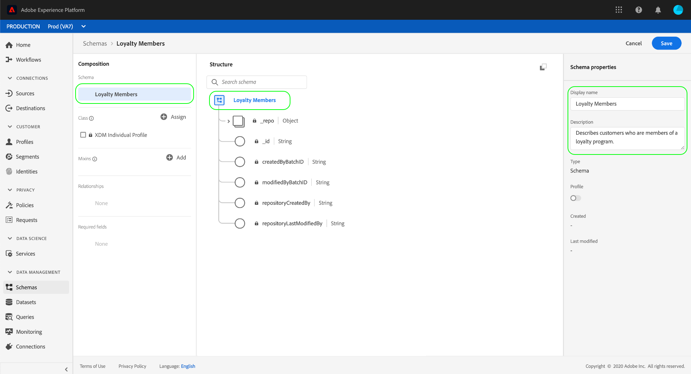

# 使用模式编辑器创建模式

模式注册表提供用户界面和RESTful API，您可以从中视图和管理Adobe Experience Platform模式库中的所有资源。 模式库包含Adobe、Experience Platform合作伙伴、您使用应用程序的供应商为您提供的资源以及您定义并保存到模式注册表的资源。

本教程介绍了在Experience Platform中使用模式编辑器创建模式的步骤。 如果您希望使用模式注册表API编写模式，请先阅读 [模式注册表开发人员指南](../api/getting-started.md) ，然后再尝试教程 [使用API创建模式](create-schema-api.md)。

本教程还包括定义 [新类的步骤](#create-new-class) ，您随后可以使用它构建模式。

## 入门指南

本教程需要对使用模式编辑器时Adobe Experience Platform的各个方面进行有效的了解。 在开始本教程之前，请查看有关以下概念的文档：

* [体验数据模型(XDM)](../home.md):平台通过标准化框架组织客户体验数据。
* [模式合成的基础知识](../schema/composition.md):XDM模式及其构建块的概述，包括类、混合、数据类型和字段。
* [实时客户用户档案](../../profile/home.md):根据来自多个来源的汇总数据提供统一、实时的消费者用户档案。

本教程要求您能够访问Experience Platform。 如果您无权访问Experience Platform中的IMS组织，请在继续操作之前与系统管理员联系。

## 在模式工作区中浏览现有模式

Experience Platform中的模式工作区提供了模式库的可视化，允许您视图和管理所有可用的模式，以及创作新的。 工作区还包括模式编辑器，在本教程中，您将在画布上创作模式。

登录Experience Platform后，单击左 **侧导航** 中的模式，您将转到模式工作区。 您将看到一列表模式(模式库的表示形式)，您可以在其中视图、管理和自定义所有可用模式。 列表包括模式所基于的名称、类型、类和行为（记录或时间序列），以及上次修改模式的日期和时间。

单击“搜索”栏旁边的筛选器图标，以对注册表中的所有资源（包括类、混合和数据类型）使用筛选功能。

## 创建和命名模式

要开始编写模式，请单 **击模式工作** 区右上角的创建模式。

将显 *示模式编辑器* 。 这是您将在其上构图模式的画布。 当您到达编辑器时，画布的“结构”部分会自动创建“无标题模式 ** ”，以便您开始自定义。

在编辑器的右侧是 *模式属性* ，您可以在其中提供模式的名称(使用显示名 **称字段** )。 输入名称后，画布会更新以反映模式的新名称。

在为您的模式确定名称时，需要考虑以下几个重要事项：

* 模式名称应为短且描述性，以便日后在库中可以轻松找到模式。
* 模式名称必须是唯一的，这意味着它也应足够具体，以便将来不再重用它。 例如，如果贵组织有针对不同品牌的单独忠诚度项目，最好将模式命名为“Brand A Loyalty Members”，以便与您稍后可能定义的其他与忠诚度相关的模式轻松区分。
* 或者，您也可以使用“说明”字段提供有关模式的其 **他信息** 。

本教程构成了一个模式，用于摄取与忠诚度项目成员相关的数据，因此该模式名为“忠诚度会员”。

## 分配类

编辑器的左侧是“合成” *部分* 。 它当前包含两个子部分： *模式* , *班级*。

现在模式有了名称，是时候分配模式将实现的类了。 单击 **“类** ”旁的“ *分配”*。

将显 *示“指定类* ”对话框。 此窗口显示所有可用类的列表，包括您的组织（所有者是“客户”）定义的任何类以及Adobe定义的标准类。

单击类名称以显示类的说明。 您还可以选择 **预览类结构** ，以查看与类关联的字段和元数据。

本教程使用XDM Individual用户档案类。 单击类旁边的单选按钮以将其选中，然后单击“ **分配类”**。

画布将重新显示。 “ *类* ”部分现在包含您选择的类(XDM单个用户档案),“结构”部分中现在可见XDM单个用户档案类贡献的字段 ** 。

字段以“fieldName”格式显示|数据类型”。 在本教程的稍后部分提供了在UI中定义模式字段的步骤。

>[!NOTE] 在保 [存模式之前](#change-class) ，您可以在初始合成过程中的任意点更改模式的类，但应当非常小心。 混音仅与某些类兼容，因此更改类将重置画布和您添加的任何字段。

## 添加混音

既然已经分配了类，“合 *成* ”部分就包含第三个子部分： *Mixins*。

您现在可以通过添加混音开始向模式添加字段。 混合是描述特定概念的一个或多个字段的组。 本教程使用mixin描述忠诚度项目的成员并捕获关键信息，如姓名、生日、电话号码、地址等。

要添加混音，请在“ **Mixins** ”子部 *分中单击* “添加”。

将出 *现“添加混音* ”对话框。 混音仅用于特定类，因此混音的列表仅显示与所选类(本例中为XDM单个用户档案类)兼容的类。

选择混音旁的单选按钮将为您提供“预览混音结构” **选项**。 选择“用户档案人详细信息”混音，然后单击“添 **加混音”**。

将重新显示模式画布。 “ *Mixins* ”部分现在列表“用户档案人详细信息”混音，“结构 ** ”部分包括混音贡献的字段。

此混音在顶级名称“person”下为数据类型“Person”的几个字段提供。 这组字段描述有关个人的信息，包括姓名、出生日期和性别。

>[!NOTE] 请记住，字段可能使用标量类型（如字符串、整数、数组或日期）作为其数据类型，以及模式注册表中的任何“数据类型”（表示通用概念的字段组）。

请注意，“姓名”字段的数据类型为“人员姓名”，这意味着该字段也描述了一个通用概念，并包含与名称相关的子字段，如名、姓和全名。

单击画布中的不同字段，查看它们为模式结构贡献的任何其他字段。

## 添加另一个混音

您现在可以重复相同的步骤来添加另一个混音。 此时，当您视图“ *添加用户档案”对话框时* ，请注意，“添加人员详细信息”混音已灰显，且其旁边的单选按钮无法被选中。 这可防止您意外复制已包含在当前模式中的混音。

您现在可以从“添加混音”对话框添加“用户档案个人详细 *信息”混音* 。

添加后，画布将重新显示。 “用户档案个人详细信息”现在列在“合成 *”部分的* Mixins下，并且“结构”下添加了用于家庭地址、手机等的字 *段***。

与“名称”字段类似，您刚添加的字段表示多字段概念。 例如，“homeAddress”的数据类型为“Address”,“mobilePhone”的数据类型为“Phone Number”。 您可以单击这些字段中的每个以展开它们，并查看数据类型中包含的其他字段。

## 定义新混音

“忠诚度会员”模式用于捕获与忠诚度项目成员相关的数据，因此它需要一些特定的忠诚度相关字段。 没有包含必要字段的标准混音，因此您需要定义一个新混音。

此时，当您打开“添加混 *音”对话框* ，选择“ **创建新混音”**。 随后将要求您为混音提 **供显示名****称和说** 明。

与类名称一样，混音名称应简短，用于描述混音对模式的贡献。 这些名称也是唯一的，因此您将无法重用该名称，因此必须确保其足够具体。

在本教程中，将新混音命名为“忠诚度详细信息”。

单 **击“添加混音** ”返回模式编辑器。 “忠诚度详细信息”现在应显示在画布左侧的 *Mixins* 下，但还没有与其关联的字段，因此在“结构”下不会显示任何新的字 *段*。

## 向混音中添加字段

现在您已创建“忠诚度详细信息”混音，是时候定义混音将对模式贡献的字段了。

要开始，请单击“混音”部分中的混 *音名* 。 执行此操作后， *Mixin属性* (Properties)将显示在编辑器的右侧，并且“结构”(Structure)下模式名称旁将显示“添加字段 **”(Add Field** )按 *钮*。

单击 **“忠诚度会员** ”旁边的“添加字段”，以在结构中创建新节点。 此节点（在本示例中称为“_tenantId”）表示您的IMS组织的租户ID，前面加下划线。 租户ID的存在表示您要添加的字段包含在单位的命名空间中。

换句话说，您要添加的字段对您的组织是唯一的，并且将保存在模式注册处的特定区域，该区域仅可供您的IMS组织访问。您定义的字段必须始终添加到您的命名空间中，以防止与其他标准类、混音、数据类型和字段的名称发生冲突。

在该命名空间节点中有一个“新字段”。 这是“忠诚度详细信息”混音的开始。

使用 *编辑器右侧的字段属性* ，通过创建类型为“Object”的“忠诚度”字段来开始，该字段将用于保存与忠诚度相关的字段。 完成后，单击“应 **用”**。

将应用更改并显示新创建的“忠诚度”对象。 单 **击对象旁边的** “添加字段”，以添加其他与忠诚度相关的字段。 将显示“新字段”, *画布的右侧将显示“字段属性* ”部分。

每个字段都需要以下信息：

* **字段名称：** 字段名称，用驼峰大小写写。 示例：loyaltyLevel
* **显示名称：** 字段的名称，以标题大小写形式编写。 示例：忠诚度级别
* **类型：** 字段的数据类型。 这包括基本标量类型和在模式注册表中定义的任何数据类型。 示例：字符串、整数、布尔值、人物、地址、电话号码等。
* **说明：** 该字段的可选描述应包含在句子中。 （最多200个字符。）

Loyalty对象的第一个字段将是一个名为“loyaltyId”的字符串。 将新字段的类型设置为“字符串”时，“字段属性”窗口将填充多个用于应用约束的选项，包括 *Default Value* 、 **Format**&#x200B;和 ******** Maximum LengthProperties。

根据所选的数据类型，可以使用不同的约束选项。 由于“loyaltyId”将是电子邮件地址，因此请从“格式”下拉菜单中选择“ **email** ”。 选择 **应用** ，以应用更改。

## 添加更多字段以混音

现在，您已添加“loyaltyId”字段，可添加其他字段以捕获与忠诚度相关的信息，例如：

* 点（整数）
* 会员自（日期）

通过单击忠诚度对象上 **的添加字段** ，然后填写所需信息，可添加每个字段。

完成后，忠诚度对象将包含以下字段：忠诚度ID、积分和会员。

## 添加“enum”字段以混音

在模式编辑器中定义字段时，您可以将一些其他选项应用于基本字段类型，以便对字段可包含的数据提供进一步约束。

此示例为“忠诚度级别”字段，其中的值只能是四个可能选项之一。 要将此字段添加到模式，请单击“ **loyalty** ”对象旁边的“添加字段” *，然后在“字段属性”下填写必*&#x200B;填字段。

对于 **类型**，选择“字符串”，您将看到Array **、Enum**、 **Identity的其他复选******&#x200B;框。

选中 **Enum** 复选框以打开以 *下Enum Values* 部分。 在此，您可以为每个可 **接受的忠诚度级别输入Value** （在camelCase中）和 **Label** （在Title Case中为Reader友好的可选名称）。

完成所有字段属性后，单 **击“应用** ”,“loyaltyLevel”字段将添加到“loyalty”对象。

有关可用的其他约束的更多信息：

* **必需：** 指示该字段是数据摄取必需的。 在摄取时，任何基于此模式上传到数据集且不包含此字段的数据都将失败。
* **阵列：** 指示字段包含一组值，每个值都指定了数据类型。 例如，选择“字符串”的数据类型并选中“数组”复选框表示字段将包含字符串数组。
* **枚举：** 指示此字段必须包含来自可能值的枚举列表的值之一。
* **身份：** 指示此字段是标识字段。 有关标识字段的更多信息将在本 [教程的稍后部分提供](#identity-field)。

## 将多字段对象转换为数据类型

添加多个特定于忠诚度的字段后，“loyalty”对象现在包含一个公共数据结构，该结构可能在其他模式中有用。

当您认为多字段结构可以重复使用，并且希望能够灵活地在其他位置使用相同的数据结构时，模式编辑器可以将该结构转换为数据类型。

数据类型允许一致地使用多字段结构，并提供比混音更灵活的方式，因为它们可以在模式内的任何位置使用。 通过将混合中字段的 **Type** （类型）设置为注册表中定义的任何数据类型，即可完成此操作。

要将“loyalty”对象转换为数据类型，请单击“ *Structure* ”下的“loyalty”字段，然后在“Field Properties”（字段属性）下选择编辑器右侧的“Convert to New Data Type **”（转换为新数据类型）****。 出现一个小的绿色弹出窗口，确认“对象已转换为数据类型”。

现在，当您查看“ *Structure*”下时，您会发现“loyalty”字段的数据类型为“Loyalty”，并且字段旁边有小的锁图标，表明它们不再是单个字段，而是多字段结构的一部分。

在将来的模式中，您现在可以为字段分配“忠诚度 **** ”的类型，并自动包括“忠诚度级别”、“积分”、“成员开始”和“忠诚度ID”字段。

## 将模式字段设置为标识字段 {#identity-field}

模式用于将数据引入Experience Platform，数据最终用于识别个人并整合来自多个来源的信息。 要帮助处理此过程，关键字段可标记为“标识”字段。

Experience Platform通过使用模式编辑器中的“标识”复选框，可以轻松地 **指示标识字段** 。

例如，可能有数千个忠诚度项目成员属于同一“级别”，但忠诚度项目的每个成员都有唯一的“loyaltyId”（在此例中为单个成员的电子邮件地址）。 “loyaltyId”是每个成员的唯一标识符，这一事实使它成为标识字段的最佳候选者，而“level”则不是。

在编辑 *器的* “结构”部分，单击您创建的“loyaltyId”字段，您将看到“字段属性”下方的“标识 **”复选框** 出现 **。 选中该框，您将可以选择将其设置为主 **标识**。 同时选中该框。

接下来，您必须提供一 **个标识名称空间**。 有几个预定义的命名空间，但“loyaltyId”是会员的电子邮件地址，因此请从下拉式列表中选择“电子邮件”。 您现在可以单 **击应用** ，以确认对“loyaltyId”字段的更新。

现在，收录到“loyaltyId”字段的所有数据都将用于帮助识别该个人并拼凑该客户的单个视图。

>[!NOTE] 将模式字段设置为主标识后，如果稍后尝试将模式中的其他字段设置为主标识，您将收到一条错误消息。 每个模式只能包含一个主标识字段。

要了解有关使用身份的更多信息，请查阅 [Identity Service文档](../../identity-service/home.md) 。

<!-- ## Relationship

Schemas define a static view of a concept, but do not provide specific details on how data based on these schemas (datasets, etc) may relate to one another. Adobe Experience Platform allows you to describe these relationships through the **Relationship** checkbox in the schema editor. 

In order to define a relationship, click on the field and check the **Relationship** checkbox on the right-side of the canvas. 

More information about relationships and other schema metadata can be found in the [Schema Registry API Developer Guide](../schema_registry_developer_guide.md). -->

## 启用模式以用于实时客户用户档案 {#profile}

模式编辑器允许模式与实时客户 [用户档案一起使用](../../profile/home.md)。 用户档案为每位客户提供了全面视图，通过构建可靠的360°客户属性用户档案以及客户在与Experience Platform集成的任何系统中进行的每次交互的时间戳帐户，来全面每位客户。

要使模式能够与实时客户用户档案一起使用，它必须定义主标识。 如果您尝试在未先定义主标识的情况下启用模式，则会收到“缺少主标识”错误消息。

要启用“忠诚会员”模式在用户档案中使用，请首先单击编辑器“结构”部分中的“忠诚 *会员* ”。

在编辑器的右侧的“ *模式属性*”下，将显示有关模式的信息，包括其显示名称、说明和类型。 除此信息外，还有一个名为 **用户档案的切换按钮**。

单 **击用户档案** ，然后出现一个弹出窗口，要求您确认要启用模式以进行用户档案。

>[!NOTE] 模式启用“实时客户用户档案”并保存后，便无法禁用它。

## 后续步骤

现在您已完成“忠诚会员”模式的编写，您可以在编辑器的“结构”部分看 ** 到完整的模式。 单 **击“保存** ”,模式将保存到模式库中，模式注册表可访问该库。

您的新模式现在可用于将数据引入平台。 请记住，一旦使用模式来摄取数据，只能进行附加更改。 有关模式版 [本控制的更多信息](../schema/composition.md) ，请参阅模式合成的基础知识。

“忠诚会员”模式也可使用模式注册表API进行查看和管理。 要开始使用API，请阅读开始注册API开发 [人员指南进行模式](../api/getting-started.md)。

## 附录

以下信息是模式编辑器教程的补充。

### Create a new class {#create-new-class}

Experience Platform能够灵活地根据组织特有的类定义模式。

在模式编 *辑器的“类* ”部分中单击“分配 **”，打开**** “分配类”对话框。 在对话框中，选择“ **创建新类”**。

然后，您可以为新类提供 **Display Name** （该类的简短、描述性、唯一且用户友好的名称）、 **Description**（描述）和 **Behavior** （“Record”或“Time Series”），作为模式将定义的数据。

>[!NOTE] 构建实现由您的组织定义的类的模式时，请记住，混音仅可用于兼容类。 由于您定义的类是新类，因此“添加混音”对话框中没有列 *出兼容混音* 。 相反，您需要选择“创 **建新混音** ”并定义一个混音以与该类一起使用。 下次构建实现新类的模式时，将列出您定义的混音并可供使用。

### 更改模式的类 {#change-class}

在初始模式合成过程中，在保存模式之前，您可以随时更改模式所基于的类。

>[!WARNING] 在更改课程之前，请务必小心。 Mixins仅与某些类兼容，因此更改类会重置画布并删除您添加到该点的所有字段。

要更改类，请单击编 **辑器的** Composition（合成）部分中 *的* Class（类）旁边的 *Assign* （分配）。

当“分 *配类* ”对话框打开时，您可以从可用列表中选择新类。 单 **击“指定类** ”，此时会打开一个新对话框，要求您确认要指定新类。

如果确认类更改，画布将重置，并且所有合成进度都将丢失。