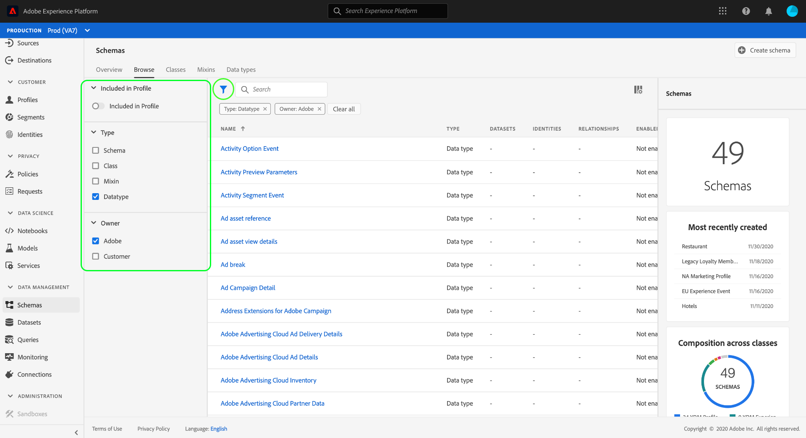

# 在UI中浏览XDM资源

在Adobe Experience Platform，所有体验数据模型(XDM)资源都存储在中， [!DNL Schema Library]包括由Adobe提供的标准资源和由您的组织定义的自定义资源。 在Experience PlatformUI中，您可以视图任何现有模式、类、混音或数据类型的结构和字段 [!DNL Schema Library]。 在规划和准备数据摄取时，此功能尤为有用，因为UI提供了有关这些XDM资源提供的每个字段的预期数据类型和使用案例的信息。

本教程介绍了在Experience PlatformUI中探索现有模式、类、混合和数据类型的步骤。

## 查找XDM资源 {#lookup}

在平台UI中，在左 **[!UICONTROL 侧导]** 航中选择模式。 模式 [!UICONTROL 工作] 区提供一个“浏览”选项卡 **[!UICONTROL ，用于浏览您组织中的所有现有XDM资源，以及用于探索Class]** 、Mixins、 ************ 数据类型的附加专用选项卡。

在“浏 [!UICONTROL 览] ”选项卡上，可以使用筛选器图标()显示左边栏中的控件，以缩小列出的结果。

例如，要列表仅显示Adobe提供的标准数据类型，请分别 **[!UICONTROL 选择]** Type和OwnerSections下的Datatype和 **[!UICONTROL Datatype]** （数据类型） **[!UICONTROL 和OwnerSections(所有]** 者)部分下 **** 的Datatype和Datatype。

通过 **[!UICONTROL “用户档案]** ”切换选项，您可以筛选结果，以仅显示在启用实时客户用户档案的模式中 [使用的资源](../../profile/home.md)。

您还可以使用搜索栏将结果缩小到名称与搜索查询匹配的资源。

找到要浏览的资源后，从列表中选择其名称，在画布中视图其结构。

## 在画布中浏览XDM资源 {#explore}

选择资源后，其结构将在画布中打开。

默认情况下，包含子属性的所有对象类型字段首次出现在画布中时都会折叠。 要显示任何字段的子属性，请选择其名称旁的图标。

### 系统生成的字段 {#system-fields}

某些模式字段以下划线为前缀，如 `_repo` 和 `_id`。 这些表示在摄取数据时系统将自动生成并分配的字段的占位符。

因此，在引入平台时，这些字段中的大多数应排除在数据结构之外，主要例外是该字段，您的组织下创建的所有XDM字 `_{TENANT_ID}` 段都必须与该字段命名。

### 数据类型 {#data-types}

对于画布中显示的每个字段，其相应的数据类型显示在其名称旁边，一览表中显示了字段需要摄取的数据类型。

附加方括号()的任何数据类`[]`型都表示该特定数据类型的数组。 例如，String\[]的 **[!UICONTROL 数据类型]表示** ，该字段需要字符串值的数组。 付款项\[] **[!UICONTROL 的数据类型]\[** ]表示一组符合付款项数据 [!UICONTROL 类型的对象] 。

如果数组字段基于对象类型，您可以在画布中选择其图标以显示每个数组项的预期属性。

### [!UICONTROL 字段属性] {#field-properties}

在画布中选择任何字段的名称时，右边栏会更新，在“字段属性”下显示该字段的 **[!UICONTROL 详细信息]**。 这可以包括字段的预期用例描述、默认值、模式、格式、字段是否必需等。

如果您正在检查的字段是枚举字段，则右边栏还将显示该字段希望接收的可接受值。

### 标识字段 {#identity}

在检查包含身份字段的模式时，这些字段会在画布中以指纹图标(指)高亮显示。 如果选择标识字段的名称，则可以视图其他信息，如 [标识命名空间](../../identity-service/namespaces.md) ，以及该字段是否是模式的主标识。

### 关系字段 {#relationship}

在画布中，关系字段也以唯一方式突出显示，显示字段引用的目标模式的名称。 如果选择关系字段的名称，则可以视图目标模式的主标识的标识命名空间。

>[!NOTE]
>
>有关在XDM模式 [中使用关系的更多信息](./create-schema-ui.md) ，请参阅有关在UI中创建关系的教程。

## 后续步骤

本文档介绍如何在Experience PlatformUI中探索现有XDM资源。 有关模式工作区和的不同功能 [!UICONTROL 的更] 多信 [!DNL Schema Editor]息，请参 [阅模式创建教程](./create-schema-ui.md)。