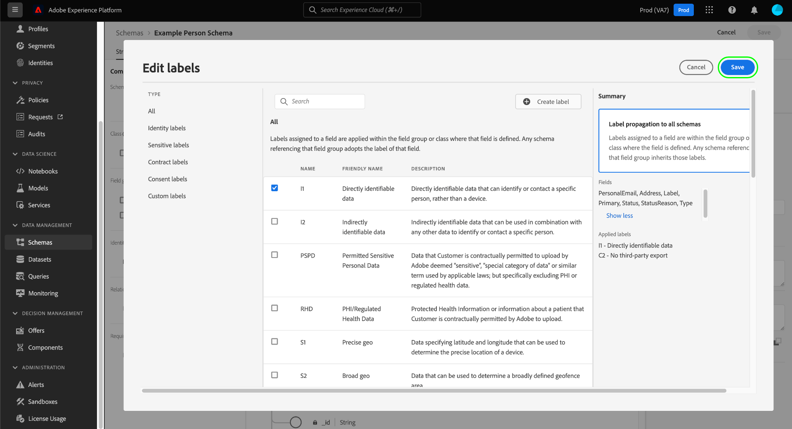

# 管理架构的数据使用标签

所有导入Adobe Experience Platform的数据都受体验数据模型(XDM)架构的限制。 贵组织或法律法规可能会对此数据设置使用限制。为此，该Experience Platform允许您通过使用[数据使用标签](../../data-governance/labels/overview.md)来限制特定数据集和字段的使用。

应用于方案字段的标签指示应用于该特定字段中包含的数据的使用策略。

标签可应用于单个架构以及这些架构中的字段。 将标签直接应用于方案时，这些标签将传播到所有现有数据集和未来基于该方案的数据集。

此外，在一个架构中添加的任何字段标签都会传播到从共享类或字段组使用相同字段的所有其他架构。 这有助于确保类似字段的使用规则在整个数据模型中保持一致。

本教程介绍使用Experience PlatformUI中的架构编辑器将标签添加到架构的步骤。

## 快速入门

本指南要求您对 Adobe Experience Platform 的以下组件有一定了解：

* [[!DNL Experience Data Model (XDM) System]](../home.md)： [!DNL Experience Platform]用于组织客户体验数据的标准化框架。
   * [架构编辑器](../ui/overview.md)：了解如何在Experience PlatformUI中创建和管理架构和其他资源。
* [[!DNL Adobe Experience Platform Data Governance]](../../data-governance/home.md)：使用定义哪些营销操作可以（或不能）对标记的数据执行的策略，提供基础结构以对Experience Platform操作强制实施数据使用限制。

## 选择要将标签添加到的架构或字段 {#select-schema-field}

>[!CONTEXTUALHELP]
>id="platform_schemas_editgovernancelabels"
>title="编辑治理标签"
>abstract="将标签应用于架构字段可指示适用于该特定字段中包含的数据的使用策略。"

若要开始添加标签，您必须先[选择要编辑的现有架构](../ui/resources/schemas.md#edit)或[创建新架构](../ui/resources/schemas.md#create)，以在架构编辑器中查看其结构。

要编辑单个字段的标签，您可以在画布中选择该字段，然后在右边栏中选择&#x200B;**[!UICONTROL Manage access]**。

>[!IMPORTANT]
>
>最多可将300个标签应用于任何架构。

您也可以选择“**[!UICONTROL Labels]**”选项卡，从列表中选择所需的字段，然后选择右边栏中的“**[!UICONTROL Apply Access and Data Governance Labels]**”。

![从[!UICONTROL Labels]选项卡中选择一个字段](../images/tutorials/labels/select-field-on-labels-tab.png)

若要编辑整个架构的标签，请在&#x200B;**[!UICONTROL Labels]**&#x200B;选项卡中，选中筛选器图标下的复选框。 这将选择架构中的每个可用字段。 接下来，选择右边栏中的&#x200B;**[!UICONTROL Apply Access and Data Governance Labels]**。

![从[!UICONTROL Labels]选项卡中选择架构名称](../images/tutorials/labels/select-schema-on-labels-tab.png)

>[!NOTE]
>
>当您首次尝试编辑架构或字段的标签时，会出现一条免责声明消息，说明标签的使用情况如何影响下游操作（取决于您组织的策略）。 选择“**[!UICONTROL Proceed]**”以继续编辑。
>
>

## 编辑架构或字段的标签 {#edit-labels}

此时会显示一个对话框，您可以在其中编辑所选字段的标签。 如果您选择了单个对象类型字段，则右边栏会列出应用标签将传播到的子字段。

>[!NOTE]
>
>如果您正在编辑整个架构的字段，则右边栏不会列出适用的字段，而是显示架构名称。

使用显示的列表选择要添加到架构或字段的标签。 选择标签后，**[!UICONTROL Applied labels]**&#x200B;部分将更新，以显示到目前为止已选择的标签。

要按类型筛选显示的标签，请在左边栏中选择所需的类别。 要创建新的自定义标签，请选择“**[!UICONTROL Create label]**”。

对所选标签感到满意后，选择&#x200B;**[!UICONTROL Save]**&#x200B;以将其应用于字段或架构。

**[!UICONTROL Labels]**&#x200B;选项卡会再次出现，显示架构已应用的标签。

## 后续步骤

本指南介绍了如何管理架构和字段的数据使用标签。 有关管理数据使用标签的信息，包括如何将其添加到特定数据集而不是架构级别，请参阅[数据使用标签UI指南](../../data-governance/labels/user-guide.md)。
